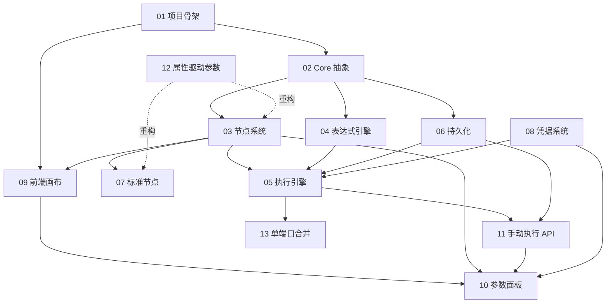

# MVP 阶段开发计划总览（plan-mvp-00-readme）

## 1. 概述

本文件是 Flow Engine MVP 阶段的入口文档，负责说明 MVP 的拆分策略、模块计划清单、依赖关系与整体验收标准。

MVP 阶段目标（来自 [roadmap.md](../../architecture/roadmap.md) §2）：验证核心引擎是否可运行——节点可注册、工作流可编排、可手动执行。

为降低单阶段风险，将 MVP 拆分为两个子阶段：

- **MVP-0（后端核心可运行）**：搭建项目骨架、Core 抽象、节点系统、表达式引擎、执行引擎、持久化、标准节点、属性驱动参数系统、手动执行 API。完成后可通过 API 触发并完成一次工作流执行。
- **MVP-1（前端编排 + 凭据）**：搭建前端画布编辑器、参数配置面板、凭据系统、手动执行 UI。完成后用户可在浏览器中拖拽编排并执行工作流。

本目录下共 14 个模块计划文档，编号 01-13 为具体模块计划，00 为总览。

## 2. 交付物清单

- 13 个 MVP 模块计划文档（本文件 + 01-12）。
- 模块依赖关系图（mermaid）。
- MVP-0 与 MVP-1 整体验收标准。
- 质量门槛（来自 [roadmap.md](../../architecture/roadmap.md) §8）。

## 3. 模块计划清单

| 编号 | 文件 | 所属子阶段 | 模块 |
|------|------|-----------|------|
| 00 | plan-mvp-00-readme.md | — | 总览 |
| 01 | plan-mvp-01-project-skeleton.md | MVP-0 | 项目骨架与解决方案 |
| 02 | plan-mvp-02-core-abstractions.md | MVP-0 | Core 层抽象与数据模型 |
| 03 | plan-mvp-03-node-system.md | MVP-0 | 节点系统与注册中心 |
| 04 | plan-mvp-04-expression-engine.md | MVP-0 | 表达式引擎基础 |
| 05 | plan-mvp-05-execution-engine.md | MVP-0 | 执行引擎主循环 |
| 06 | plan-mvp-06-persistence.md | MVP-0 | 持久化与工作流 CRUD |
| 07 | plan-mvp-07-standard-nodes.md | MVP-0 | 标准节点插件 |
| 08 | plan-mvp-08-credentials.md | MVP-1 | 凭据系统 |
| 09 | plan-mvp-09-frontend-canvas.md | MVP-1 | 前端画布编辑器 |
| 10 | plan-mvp-10-frontend-panel.md | MVP-1 | 参数配置面板 |
| 11 | plan-mvp-11-manual-execution.md | MVP-0/MVP-1 | 手动执行与结果展示（后端 API 属 MVP-0，前端 UI 属 MVP-1） |
| 12 | plan-mvp-12-property-parameters.md | MVP-0 | 属性驱动参数系统（替代 plan-03/07 中的 `ParameterDefinition` 对象方案，改为 C# 属性 + Attribute） |
| 13 | plan-mvp-13-single-port-merge.md | MVP-0 | 单端口多来源自动合并（改造路由逻辑，支持多上游连同一 input 端口时自动合并 DataBatch 后只执行一次） |

## 4. 模块依赖关系图

说明：
- 01 项目骨架是所有后续模块的前置条件。
- 02 Core 抽象为 03/04/06 提供接口与实体。
- 05 执行引擎依赖 03 节点注册、04 表达式、06 持久化、08 凭据。
- 07 标准节点依赖 03 注册中心与 02 Core。
- 11 手动执行 API 依赖 05 执行引擎与 06 持久化。
- 09 前端画布依赖 01 骨架与 03 节点类型 API。
- 10 参数面板依赖 09 画布、03 节点类型、08 凭据、11 执行 API（后端 API 在 MVP-0 完成，前端面板在 MVP-1 消费）。
- 11 手动执行的后端 API 属于 MVP-0，前端执行按钮/结果展示属于 MVP-1。
- 08 凭据系统的完整实现在 MVP-1（AES-256-GCM 加解密、CRUD API、运行时注入），但执行引擎（MVP-0）的验收标准要求 `context.Credentials` 可用。MVP-0 阶段对 `ICredentialAccessor` 采用空实现（stub，返回默认凭据），MVP-1 阶段替换为完整解密注入实现。
- **12 属性驱动参数系统** 是对 03 节点系统和 07 标准节点的重构，实施后 `INodeType.Parameters` 从接口移除，标准节点改用属性 + Attribute 声明参数。此计划不影响其他模块的依赖关系，但要求在 12 完成后更新 03 和 07 的实现。
- **13 单端口合并** 改造 `RouteOutputsAsync`，依赖 05 执行引擎的单实例改造（来自 12）。实施后任一节点只需声明一个 `input` 端口，多上游连线自动合并 Items。

## 5. 风险与待定项

| 风险/待定项 | 影响 | 应对策略 |
|------------|------|---------|
| 插件 DLL 依赖冲突导致主程序崩溃 | 节点注册失败 | 使用独立 AssemblyLoadContext 隔离加载，单插件失败仅记录警告 |
| 表达式引擎安全漏洞 | 用户通过表达式执行恶意代码 | MVP 仅实现白名单变量与基础运算，完整沙箱推迟到 Alpha 阶段强化 |
| 多输入等待实现复杂 | 循环/Join 场景出错 | 先用单元测试覆盖常见拓扑，超时与孤儿清理必须有测试 |
| 前端画布与后端节点描述协议不一致 | 渲染异常 | 节点类型 API 返回结构以 [node-system.md](../../architecture/node-system.md) 为准，前后端共用类型定义 |
| SQLite 高并发写锁 | 执行记录写入阻塞 | 启用 WAL 模式，连接字符串固定配置 |
| 凭据加密密钥管理 | 密钥泄露导致凭据被解密 | 密钥从环境变量注入，禁止硬编码，禁止落日志 |

## 6. 验收总标准

### 6.1 MVP-0 整体验收

- 后端 5 个项目（Core/Runtime/Application/Infrastructure/Host）编译通过，依赖方向符合 [overview.md](../../architecture/overview.md) §7.1。
- 放入 HTTP/Code/If 三个标准节点插件后，`GET /api/node-types` 返回 3 个类型。
- 工作流定义可保存到 SQLite 并按 ID 加载，版本号递增。
- 通过 `POST /api/v1/workflows/:id/execute` 可触发线性工作流执行并返回执行记录。
- 执行引擎支持多输入等待、If 分支路由、错误重试与取消。
- 表达式 `{{ input.id }}` 可正确求值替换，错误返回 availableFields。
- 单元测试覆盖率 ≥ 30%（核心执行路径），单机性能 ≥ 10 TPS。

### 6.2 MVP-1 整体验收

- 前端 React+TS+Vite 项目可 `npm run build`，产物输出到 Host/wwwroot。
- 画布可拖入 HTTP Request、If、Code 节点并连线，支持撤销/重做。
- 参数面板根据 ParameterDefinition 自动渲染，method=POST 时 body 字段显示，必填校验生效。
- 凭据可加密保存，API 不返回明文，HTTP 节点可通过 context.Credentials 获取解密值。
- 点击执行按钮触发后端执行，前端显示执行状态与各节点输出。
- 单元测试覆盖率 ≥ 50%，单机性能 ≥ 50 TPS。
- 完整 E2E：HTTP → If → Code 工作流可手动执行并看到输出。

## 变更记录

| 日期 | 修改人 | 修改内容 | 关联任务 |
|------|--------|----------|----------|
| 2026-06-18 | Agent | 创建 MVP 阶段总览文档 | MVP 计划编写 |
| 2026-06-18 | Agent | 调整 plan-mvp-11 子阶段归属为 MVP-0/MVP-1，明确后端 API 与前端 UI 边界 | 计划 review 修复 |
| 2026-06-19 | Agent | 新增 plan-mvp-12 属性驱动参数系统，更新模块计数与依赖说明 | 属性参数改造 |
| 2026-06-19 | Agent | 新增 plan-mvp-13 单端口合并，更新模块计数与依赖说明 | 路由改造 |
