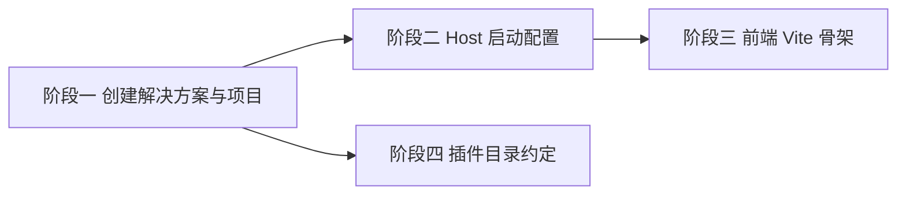

# 开发计划：项目骨架与解决方案（plan-mvp-01-project-skeleton）

## 1. 概述

搭建 Flow Engine 后端解决方案与前端骨架，确立分层项目结构、依赖方向、命名空间约定与启动配置。本模块是所有后续 MVP 模块的前置条件。

覆盖范围：
- 后端 `FlowEngine.sln` 与 5 个核心项目（Core/Runtime/Application/Infrastructure/Host）。
- 前端 `frontend/` React+TS+Vite 骨架。
- `plugins/` 插件目录约定。
- `Directory.Build.props` 统一编译属性。
- `appsettings.json` 与 `Program.cs` 基础启动配置。

不覆盖范围：具体业务逻辑实现、节点插件实现、数据库迁移内容（见后续模块计划）。

## 2. 交付物清单

- `FlowEngine.sln` 解决方案文件。
- `src/FlowEngine.Core/` 项目（最内层，零外部依赖）。
- `src/FlowEngine.Runtime/` 项目（依赖 Core）。
- `src/FlowEngine.Application/` 项目（依赖 Core + Runtime）。
- `src/FlowEngine.Infrastructure/` 项目（依赖 Core + Application）。
- `src/FlowEngine.Host/` 项目（启动项，依赖 Application + Infrastructure）。
- `frontend/` 目录（React + TypeScript + Vite 骨架）。
- `plugins/` 目录（含 README 说明放置 DLL 的约定）。
- `Directory.Build.props`（统一 TargetFramework、Nullable、LangVersion、命名空间规则）。
- `src/FlowEngine.Host/appsettings.json`（连接字符串、插件路径、CORS、日志配置）。
- `src/FlowEngine.Host/Program.cs`（DI 容器、Kestrel、日志、配置、UseStaticFiles、MapFallbackToFile、`/health` 端点、`/api/v1/` 前缀、CORS）。
- `frontend/vite.config.ts`（dev server 代理 `/api` 到后端）。

## 3. 开发阶段

### 阶段一：创建解决方案与后端项目

- 目标：建立解决方案与 5 个核心项目的空骨架。
- 核心任务：
  - 创建 `FlowEngine.sln`。
  - 使用 `dotnet new classlib` 创建 Core/Runtime/Application/Infrastructure 四个类库项目。
  - 使用 `dotnet new web` 创建 Host 项目。
  - 添加项目引用关系，严格遵循 [overview.md](../../architecture/overview.md) §7.1 依赖方向。
  - 创建 `Directory.Build.props`，统一 `TargetFramework=net8.0`、`Nullable=enable`、`LangVersion=latest`、`TreatWarningsAsErrors=true`。
- 输入：[overview.md](../../architecture/overview.md) §7 项目结构、§7.1 依赖方向、§7.2 关键约束。
- 输出：可编译的空解决方案。
- 验收标准：
  - `dotnet build FlowEngine.sln` 通过，零警告零错误。
  - 项目引用关系符合 §7.1：Host→Application/Infrastructure/Plugins；Application→Runtime/Core；Runtime→Core；Infrastructure→Application/Core；Plugins→Core。
  - 命名空间与文件夹一致（如 `src/FlowEngine.Runtime/` 对应 `namespace FlowEngine.Runtime`）。
- 依赖：无。

### 阶段二：配置 Host 启动与基础端点

- 目标：Host 可启动并暴露健康检查与静态文件托管。
- 核心任务：
  - 编写 `Program.cs`：配置 DI 容器、Kestrel、日志、配置系统。
  - 注册 `UseStaticFiles` 与 `MapFallbackToFile("index.html")`，为前端产物预留托管。
  - 添加 `GET /health` 端点，返回 200。
  - 添加 `GET /health/ready` 端点（MVP 阶段返回 200，后续模块补充依赖检查）。
  - 所有业务 API 统一前缀 `/api/v1/`。
  - 启用 CORS，默认允许前端开发域名（通过配置控制）。
  - 编写 `appsettings.json`：SQLite 连接字符串（启用 WAL）、插件路径 `./plugins`、日志级别、CORS 白名单。
- 输入：[deployment.md](../../architecture/deployment.md) §3 默认技术栈、§8 配置示例、§10.3 健康检查与 API 基础。
- 输出：可启动的 Host 进程。
- 验收标准：
  - `dotnet run --project src/FlowEngine.Host` 启动成功。
  - `GET /health` 返回 200。
  - `GET /health/ready` 返回 200。
  - 访问 `/api/v1/` 前缀路由不报 404 之外的异常。
  - CORS 响应头正确返回。
- 依赖：阶段一。

### 阶段三：前端 Vite 骨架与代理

- 目标：建立前端项目骨架，dev server 可代理后端 API。
- 核心任务：
  - 在 `frontend/` 下初始化 Vite + React + TypeScript 项目。
  - 配置 `vite.config.ts`：dev server 端口、代理 `/api` 到 `http://localhost:5000`。
  - 配置构建产物输出目录，便于后续复制到 Host/wwwroot。
  - 创建最小可运行的 App 组件。
- 输入：[deployment.md](../../architecture/deployment.md) §2 前端集成到后端、§4.1 开发环境。
- 输出：可启动的前端 dev server。
- 验收标准：
  - `npm run build` 通过，产物输出到 `frontend/dist/`。
  - `npm run dev` 启动后访问首页可加载。
  - 前端通过代理访问 `GET /api/v1/health` 透传成功。
- 依赖：阶段二（后端需提供 health 端点供代理验证）。

### 阶段四：插件目录约定

- 目标：建立 `plugins/` 目录与放置规范。
- 核心任务：
  - 创建 `plugins/` 目录。
  - 在 `plugins/README.md` 中说明：插件 DLL 放置位置、命名约定、依赖隔离要求。
  - 在 `appsettings.json` 中配置 `Plugins:Path=./plugins`。
- 输入：[overview.md](../../architecture/overview.md) §7 项目结构、[node-system.md](../../architecture/node-system.md) §3 注册流程。
- 输出：插件目录与约定文档。
- 验收标准：
  - `plugins/` 目录存在。
  - 配置中插件路径可被后续注册中心读取。
- 依赖：阶段一。

## 4. 阶段依赖图

## 5. 风险与待定项

| 风险/待定项 | 影响 | 应对策略 |
|------------|------|---------|
| 项目引用方向错误导致循环依赖 | 编译失败 | 严格按 [overview.md](../../architecture/overview.md) §7.1，Plugins 禁止引用 Application/Runtime |
| `TreatWarningsAsErrors` 导致早期开发受阻 | 编译频繁失败 | 初期可临时关闭，但 MVP 完成前必须开启 |
| 前端构建产物路径与 Host/wwwroot 不一致 | 静态文件托管失败 | 在 vite.config.ts 中明确输出目录，后续模块补充复制脚本 |
| SQLite WAL 连接字符串配置错误 | 并发写入阻塞 | 严格按 [deployment.md](../../architecture/deployment.md) §10.2 配置 |

## 6. 验收总标准

- `dotnet build FlowEngine.sln` 通过。
- `npm run build` 通过。
- `dotnet run --project src/FlowEngine.Host` 启动后 `GET /health` 返回 200。
- 5 个后端项目依赖方向符合 [overview.md](../../architecture/overview.md) §7.1。
- 前端 dev server 可代理后端 API。
- `plugins/` 目录与约定就绪。

## 变更记录

| 日期 | 修改人 | 修改内容 | 关联任务 |
|------|--------|----------|----------|
| 2026-06-18 | Agent | 创建项目骨架计划 | MVP-0 |
