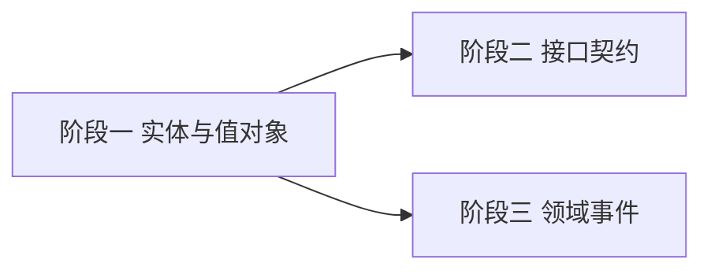

# 开发计划：Core 层抽象与数据模型（plan-mvp-02-core-abstractions）

## 1. 概述

在 `FlowEngine.Core` 项目中定义所有领域实体、值对象、接口契约与领域事件，作为整个后端的"契约中心"。Core 层零外部 NuGet 依赖，只包含 POCO 与委托。

覆盖范围：
- Entities：工作流、节点实例/定义、连接、执行记录、节点执行记录、数据批次、数据项、节点错误等。
- Abstractions：节点类型、引擎、注册中心、事件总线、凭据访问器等接口。
- Events：工作流启动、节点执行完成等领域事件。
- ValueObjects：节点定义 ID、执行 ID、凭据键等强类型标识。

不覆盖范围：接口的具体实现（在 Runtime/Infrastructure 中）、数据库映射（在 06 持久化模块中）。

## 2. 交付物清单

- `src/FlowEngine.Core/Entities/` 目录：
  - `Workflow.cs`、`NodeInstance.cs`、`NodeDefinition.cs`、`Connection.cs`、`PortInstance.cs`、`PortDefinition.cs`、`DataSchema.cs`、`ParameterDefinition.cs`、`DisplayRule.cs`、`DataBatch.cs`、`DataItem.cs`、`NodeError.cs`、`RetryPolicy.cs`、`ExecutionRecord.cs`、`NodeExecutionRecord.cs`、`NodeExecutionResult.cs`、`CredentialValue.cs`、`ToolDefinition.cs`。
- `src/FlowEngine.Core/Abstractions/` 目录：
  - `INodeType.cs`、`IEngine.cs`、`INodeRegistry.cs`、`IEventBus.cs`、`ICredentialAccessor.cs`、`IWorkflowRepository.cs`、`IExecutionStore.cs`（仓储接口定义在 Core，实现在 Infrastructure）。
- `src/FlowEngine.Core/Events/` 目录：
  - `WorkflowStartedEvent.cs`、`NodeExecutedEvent.cs`、`WorkflowCompletedEvent.cs`、`WorkflowFailedEvent.cs`、`CredentialAccessedEvent.cs`。
- `src/FlowEngine.Core/ValueObjects/` 目录：
  - `NodeDefinitionId.cs`、`ExecutionId.cs`、`CredentialKey.cs`、`WorkflowDefinitionId.cs`。
- `src/FlowEngine.Core/Enums/` 目录：
  - `ExecutionMode.cs`、`PortDirection.cs`、`PortType.cs`、`ParameterType.cs`、`ErrorStrategy.cs`、`ExecutionStatus.cs`。

## 3. 开发阶段

### 阶段一：实体与值对象

- 目标：定义所有领域实体与强类型 ID。
- 核心任务：
  - 按 [terminology.md](../../architecture/terminology.md) §5 核心数据模型实现实体类。
  - 实现值对象 `NodeDefinitionId`、`ExecutionId`、`CredentialKey`、`WorkflowDefinitionId`，使用强类型避免 ID 混淆（遵循 §9.3 ID 后缀规范）。
  - 实现枚举：`ExecutionMode`、`PortDirection`、`PortType`、`ParameterType`、`ErrorStrategy`、`ExecutionStatus`。
- 输入：[terminology.md](../../architecture/terminology.md) §5、§9 命名约定。
- 输出：Entities 与 ValueObjects 目录下的所有类。
- 验收标准：
  - Core 项目零外部 NuGet 依赖（`<PackageReference>` 为空或仅含 SDK 内置）。
  - 所有属性使用 PascalCase。
  - ID 字段带后缀（如 `NodeDefinitionId`、`ExecutionId`、`WorkflowDefinitionId`）。
  - 禁用命名（`DoWork`/`Process`/`Handle`/`Think`/`Model`/`Context` 缩写/`Error` 单独使用/`Plugin` 作为工具命名）不出现。
  - 编译通过。
- 依赖：plan-mvp-01 项目骨架。

### 阶段二：接口契约

- 目标：定义所有跨层接口。
- 核心任务：
  - 实现 `INodeType`（节点类型接口，签名见 [node-system.md](../../architecture/node-system.md) §2）。
  - 实现 `IEngine`（执行引擎入口，`StartAsync` 方法）。
  - 实现 `INodeRegistry`（节点注册中心，提供按类型名创建实例、查询元数据）。
  - 实现 `IEventBus`（事件总线，订阅与发布）。
  - 实现 `ICredentialAccessor`（凭据访问器，签名见 [credentials.md](../../architecture/credentials.md) §4）。
  - 实现仓储接口 `IWorkflowRepository`、`IExecutionStore`、`ICredentialRepository`（接口在 Core，实现在 Infrastructure）。
- 输入：[node-system.md](../../architecture/node-system.md) §2、[execution-engine.md](../../architecture/execution-engine.md) §2、[credentials.md](../../architecture/credentials.md) §4。
- 输出：Abstractions 目录下的所有接口。
- 验收标准：
  - 接口只包含方法签名，不含实现。
  - 方法命名遵循 [terminology.md](../../architecture/terminology.md) §9.2 动词分级（`Trigger`/`Schedule`/`Start`/`Execute`/`Resume`/`Capture`/`Use`）。
  - 编译通过。
- 依赖：阶段一。

### 阶段三：领域事件

- 目标：定义执行过程中产生的领域事件。
- 核心任务：
  - 实现 `WorkflowStartedEvent`、`NodeExecutedEvent`、`WorkflowCompletedEvent`、`WorkflowFailedEvent`。
  - 实现 `CredentialAccessedEvent`（签名见 [credentials.md](../../architecture/credentials.md) §6.2）。
  - 所有事件继承自基础 `IDomainEvent` 接口（含事件 ID 与时间戳）。
- 输入：[execution-engine.md](../../architecture/execution-engine.md) §10 执行记录、[credentials.md](../../architecture/credentials.md) §6.2。
- 输出：Events 目录下的所有事件类。
- 验收标准：
  - 事件为不可变记录（`record` 类型优先）。
  - 事件字段命名遵循 PascalCase。
  - 编译通过。
- 依赖：阶段一。

## 4. 阶段依赖图

## 5. 风险与待定项

| 风险/待定项 | 影响 | 应对策略 |
|------------|------|---------|
| 实体字段与架构文档不一致 | 后续模块实现偏差 | 以 [terminology.md](../../architecture/terminology.md) §5 为准，实现后交叉核对 |
| 强类型 ID 过度设计 | 开发效率降低 | MVP 阶段仅对易混淆的 ID（NodeDefinitionId/ExecutionId/WorkflowDefinitionId）使用强类型，其余用 Guid |
| 仓储接口定义过早 | 接口不稳定 | 仅定义 MVP 必需的方法（CRUD + 按状态查询），后续模块按需扩展 |

## 6. 验收总标准

- Core 项目零外部 NuGet 依赖。
- 所有命名遵循 [terminology.md](../../architecture/terminology.md) §9（PascalCase 属性、camelCase JSON、ID 后缀、禁用命名）。
- `dotnet build src/FlowEngine.Core` 通过。
- 接口签名与 [node-system.md](../../architecture/node-system.md)、[execution-engine.md](../../architecture/execution-engine.md)、[credentials.md](../../architecture/credentials.md) 一致。

## 变更记录

| 日期 | 修改人 | 修改内容 | 关联任务 |
|------|--------|----------|----------|
| 2026-06-18 | Agent | 创建 Core 层抽象计划 | MVP-0 |
