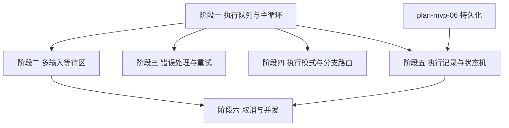

# 开发计划：执行引擎主循环（plan-mvp-05-execution-engine）

## 1. 概述

实现工作流执行引擎的核心主循环，负责加载工作流定义、识别入口节点、按 FIFO 顺序执行节点、处理多输入等待、错误策略、分支路由、执行状态机与取消支持。

覆盖范围：
- FIFO 执行队列（`Channel<T>` 单线程消费）。
- 入口节点识别（`IsEntry`/`DefaultIsEntry`）。
- 多输入等待区（线程安全、滑动窗口超时、孤儿清理、同端口合并）。
- 错误策略（终止/继续/重试 + 指数退避 jitter）。
- `ExecutionMode`（OnceForAll/OncePerItem）。
- 分支节点 `BranchIndex` 路由。
- 执行状态机（Pending→Running→Completed/Failed/Cancelled）。
- 执行记录与 `CancellationToken` 支持。

不覆盖范围：子工作流（Alpha 阶段）、WebSocket 推送（Alpha 阶段）。

## 2. 交付物清单

- `src/FlowEngine.Runtime/Executor/WorkflowExecutor.cs`（执行引擎主循环，实现 `IEngine`）。
- `src/FlowEngine.Runtime/Executor/ExecutionQueue.cs`（基于 `Channel<T>` 的 FIFO 队列）。
- `src/FlowEngine.Runtime/WaitingArea/WaitingArea.cs`（多输入等待区，签名见 [execution-engine.md](../../architecture/execution-engine.md) §5.2）。
- `src/FlowEngine.Runtime/Executor/NodeExecutionContextFactory.cs`（构造执行上下文）。
- `src/FlowEngine.Runtime/Executor/ErrorStrategyHandler.cs`（错误策略处理）。
- `src/FlowEngine.Runtime/Executor/ExecutionStateMachine.cs`（状态机）。
- 单元测试：线性工作流、Merge 等待、If 分支路由、重试、取消、超时。

## 3. 开发阶段

### 阶段一：执行队列与主循环

- 目标：实现 FIFO 执行队列与主循环骨架。
- 核心任务：
  - 实现 `ExecutionQueue`：基于 `Channel<T>`，单线程消费，保证简单与可预测性。
  - 实现 `WorkflowExecutor.StartAsync`：加载工作流定义、构建可执行图。
  - 入口节点识别：`workflowDefinition.Nodes.Where(n => n.IsEntry || registry.Get(n.TypeName).DefaultIsEntry)`（见 [execution-engine.md](../../architecture/execution-engine.md) §4）。
  - 主循环：从队列取出节点 → 创建上下文 → 解析参数 → 调用 `ExecuteAsync` → 路由到下游。
  - 节点执行完成后，根据连接将下游节点入队。
- 输入：[execution-engine.md](../../architecture/execution-engine.md) §3 整体执行循环、§4 入口节点识别。
- 输出：可执行线性工作流的主循环。
- 验收标准：
  - 线性工作流（A→B→C）可按顺序执行。
  - 入口节点正确识别（仅 `IsEntry=true` 或 `DefaultIsEntry=true` 的节点入队）。
  - 执行队列为空时主循环退出。
- 依赖：plan-mvp-02 Core 抽象、plan-mvp-03 节点系统、plan-mvp-04 表达式引擎。

### 阶段二：多输入等待区

- 目标：实现多输入节点的等待逻辑。
- 核心任务：
  - 实现 `WaitingArea`：`ConcurrentDictionary<(ExecutionId, NodeDefinitionId), Dictionary<string, DataBatch>>`。
  - 实现 `Receive`/`IsReady`/`TryTake`/`CancelWaiting` 方法（签名见 [execution-engine.md](../../architecture/execution-engine.md) §5.2）。
  - 滑动窗口超时：记录 `_lastActivityTimes`，默认 5 分钟超时，可配置。
  - 实现 `GetTimeoutKeys()` 供主循环检测超时。
  - 孤儿条目清理：后台任务定期扫描，移除已不存在对应执行实例的条目。
  - 同端口多连接合并：多个上游连接到同一输入端口时，合并 `DataBatch`，重新分配连续 `SourceIndex`。
  - 分支节点输出端口不参与合并。
  - 入队条件：单输入端口直接入队；多输入端口放入等待区，齐了再入队。
- 输入：[execution-engine.md](../../architecture/execution-engine.md) §5 多输入等待机制。
- 输出：支持 Merge/Join 节点的等待区。
- 验收标准：
  - Merge 节点等待所有输入端口到齐后才执行。
  - 超时后生成 `NodeError { Code = "InputTimeout" }` 并调用错误策略。
  - 超时后调用 `CancelWaiting` 移除条目。
  - 同端口多连接合并后 `SourceIndex` 连续。
- 依赖：阶段一。

### 阶段三：错误处理与重试

- 目标：实现节点错误策略。
- 核心任务：
  - 实现三种策略：
    - 终止：节点失败后立即停止整个执行。
    - 继续：向输出注入带错误信息的 `DataItem`，继续执行下游。
    - 重试：按指数退避 + jitter 重试 N 次，仍失败则按上述策略处理。
  - 重试逻辑：`maxRetries` 表示额外重试次数，总执行次数为 `1 + maxRetries`。
  - 退避计算：`BaseDelay` 默认 2^attempt 秒，受 `MaxDelay`（默认 60 秒）约束，加随机 jitter。
  - 节点统一返回 `NodeExecutionResult`，引擎根据 `Success` 判断。
  - 节点本身不抛异常，所有错误封装在 `NodeError` 中。
- 输入：[execution-engine.md](../../architecture/execution-engine.md) §6 错误处理策略、§6.1 重试逻辑、§6.2 继续执行模式。
- 输出：支持错误策略的执行引擎。
- 验收标准：
  - 节点失败且策略为"终止"时，执行状态变为 `Failed`。
  - 节点失败且策略为"继续"时，下游节点收到带 `Success=false` 的数据项。
  - 节点失败且策略为"重试"时，按指数退避重试，达到最大次数后按终止/继续处理。
- 依赖：阶段一。

### 阶段四：执行模式与分支路由

- 目标：支持 `ExecutionMode` 与分支节点路由。
- 核心任务：
  - `OnceForAll`：将整个 `DataBatch` 一次性传入节点。
  - `OncePerItem`：引擎对 `DataBatch` 中每条 `DataItem` 分别调用一次节点执行，`runIndex` 与数据项索引一致。
  - 分支节点路由：根据 `NodeExecutionResult.BranchIndex` 找到对应输出端口的连接，将数据入队到下游。
  - If 节点有两个输出分支（true/false），Switch 节点有多个分支。
- 输入：[node-system.md](../../architecture/node-system.md) §2 ExecutionMode、[execution-engine.md](../../architecture/execution-engine.md) §8.1 分支节点。
- 输出：支持执行模式与分支路由的引擎。
- 验收标准：
  - `OncePerItem` 节点对每条数据项分别执行。
  - If 节点根据 `BranchIndex` 路由到对应分支下游。
  - 未被选中的分支下游不入队。
- 依赖：阶段一。

### 阶段五：执行记录与状态机

- 目标：记录执行过程并维护状态机。
- 核心任务：
  - 实现 `ExecutionStateMachine`：状态转换 Pending→Running→Completed/Failed/Cancelled。
  - 每次执行生成 `ExecutionRecord`，包含 `Id`/`WorkflowDefinitionId`/`StartedAt`/`CompletedAt`/`Status`/`NodeRecords`。
  - 每个节点执行生成 `NodeExecutionRecord`，包含 `NodeDefinitionId`/`RunIndex`/`StartedAt`/`CompletedAt`/`Inputs`/`Output`/`RawParameters`/`ResolvedParameters`。
  - 执行入队前先持久化为 `Pending` 状态（依赖 plan-mvp-06 持久化）。
  - 执行完成后更新状态为 `Completed`/`Failed`/`Cancelled`。
- 输入：[execution-engine.md](../../architecture/execution-engine.md) §9 执行状态机、§10 执行记录。
- 输出：带执行记录与状态机的引擎。
- 验收标准：
  - 执行前 `ExecutionRecord` 状态为 `Pending`。
  - 执行中状态为 `Running`。
  - 执行成功状态为 `Completed`，失败为 `Failed`，取消为 `Cancelled`。
  - `NodeExecutionRecord` 记录节点输入输出与参数。
- 依赖：阶段一、plan-mvp-06 持久化。

### 阶段六：取消与并发

- 目标：支持执行取消与并发执行。
- 核心任务：
  - 支持 `CancellationToken`，用户可点击"停止"。
  - 长时间运行的节点必须定期检查 `CancellationToken.IsCancellationRequested`。
  - 取消后执行状态变为 `Cancelled`。
  - 同一工作流的多个执行可并发运行，互不影响。
  - 等待区按 `ExecutionId` 隔离。
- 输入：[execution-engine.md](../../architecture/execution-engine.md) §11 并发与取消。
- 输出：支持取消与并发的引擎。
- 验收标准：
  - 取消令牌触发后执行停止，状态为 `Cancelled`。
  - 并发执行互不干扰。
- 依赖：阶段二、阶段五。

## 4. 阶段依赖图

## 5. 风险与待定项

| 风险/待定项 | 影响 | 应对策略 |
|------------|------|---------|
| 多输入等待实现复杂 | 循环/Join 场景出错 | 单元测试覆盖常见拓扑：线性、Merge、If 分支 |
| 等待区孤儿条目堆积 | 内存泄漏 | 后台任务定期清理，超时机制兜底 |
| 重试退避计算不准 | 重试间隔异常 | 单元测试覆盖退避公式，验证 jitter 范围 |
| 单线程消费性能瓶颈 | 高并发场景 TPS 不足 | MVP 阶段单线程保证可预测性，Alpha 阶段引入多 worker |
| 执行记录写入阻塞主循环 | 执行延迟 | 持久化异步写入，或先持久化 Pending 再入队 |

## 6. 验收总标准

- 线性工作流可执行（A→B→C）。
- Merge 节点等待所有输入到齐后执行。
- If 节点按 `BranchIndex` 路由到对应分支。
- 重试按指数退避 + jitter 执行。
- 支持取消，取消后状态为 `Cancelled`。
- 执行记录包含节点输入输出与参数。
- 执行状态机转换符合 [execution-engine.md](../../architecture/execution-engine.md) §9。
- 单元测试覆盖率 ≥ 30%（核心执行路径）。

## 变更记录

| 日期 | 修改人 | 修改内容 | 关联任务 |
|------|--------|----------|----------|
| 2026-06-18 | Agent | 创建执行引擎计划 | MVP-0 |
