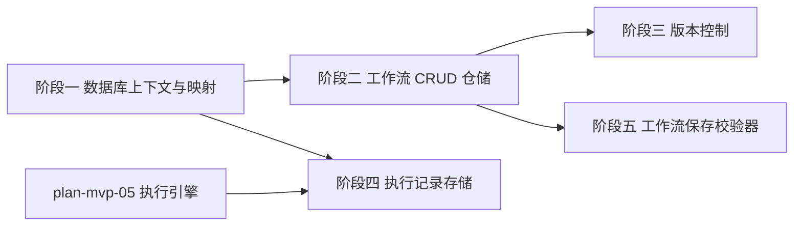

# 开发计划：持久化与工作流 CRUD（plan-mvp-06-persistence）

## 1. 概述

实现基于 SQLite 的持久化层，提供工作流定义 CRUD、版本控制、执行记录存储与工作流保存校验器。使用 EF Core 或 Dapper 作为数据访问技术，启用 WAL 模式提升并发读写性能。

覆盖范围：
- 数据库上下文与实体映射。
- 工作流定义 CRUD 仓储。
- 版本控制（Version 递增）。
- 执行记录持久化。
- SQLite WAL 模式连接字符串。
- 数据库迁移。
- 工作流保存校验器（DAG 无环检测/端口方向校验/必填参数/悬空连接）。

不覆盖范围：凭据持久化（见 plan-mvp-08）、审计日志持久化（Alpha 阶段）。

## 2. 交付物清单

- `src/FlowEngine.Infrastructure/Persistence/FlowEngineDbContext.cs`（数据库上下文）。
- `src/FlowEngine.Infrastructure/Persistence/Entities/`（数据库实体映射：`WorkflowDefinitionEntity`/`ExecutionRecordEntity`/`NodeExecutionRecordEntity`）。
- `src/FlowEngine.Infrastructure/Persistence/Configurations/`（实体配置：表名、列名、索引）。
- `src/FlowEngine.Infrastructure/Persistence/Repositories/WorkflowRepository.cs`（实现 `IWorkflowRepository`）。
- `src/FlowEngine.Infrastructure/Persistence/Repositories/ExecutionStore.cs`（实现 `IExecutionStore`）。
- `src/FlowEngine.Application/Workflows/WorkflowValidator.cs`（保存校验器）。
- `src/FlowEngine.Application/Workflows/WorkflowService.cs`（CRUD 用例编排）。
- `src/FlowEngine.Host/Controllers/WorkflowsController.cs`（工作流 CRUD API）。
- 数据库迁移脚本或 EF Core migrations。
- 选型说明文档（EF Core vs Dapper 的选择理由）。

## 3. 开发阶段

### 阶段一：数据库上下文与映射

- 目标：建立数据库上下文与实体映射。
- 核心任务：
  - 选型说明：MVP 阶段选择 EF Core（理由：实体映射直观、迁移方便、社区支持；Dapper 适合高性能查询但 MVP 阶段优先开发效率）。
  - 实现 `FlowEngineDbContext`：继承 `DbContext`，配置 SQLite 提供程序。
  - 实现数据库实体映射：
    - `workflow_definitions` 表：Id/ProjectId/Name/Version/CreatedBy/CreatedAt/UpdatedAt/IsActive/Nodes(JSON)/Connections(JSON)。
    - `executions` 表：Id/WorkflowDefinitionId/StartedAt/CompletedAt/Status/NodeRecords(JSON)。
    - `node_executions` 表：Id/ExecutionId/NodeDefinitionId/RunIndex/StartedAt/CompletedAt/Inputs(JSON)/Output(JSON)/RawParameters(JSON)/ResolvedParameters(JSON)。
  - 表名使用复数小写下划线（遵循 [terminology.md](../../architecture/terminology.md) §9.4）。
  - 列名使用 camelCase。
  - 配置索引：`workflow_definitions(Name)`、`executions(WorkflowDefinitionId)`、`executions(Status)`。
- 输入：[terminology.md](../../architecture/terminology.md) §9.4 序列化与数据库命名、[overview.md](../../architecture/overview.md) §6 持久化设计、[deployment.md](../../architecture/deployment.md) §10.2 SQLite 高并发。
- 输出：可创建数据库的上下文。
- 验收标准：
  - `dotnet ef database update` 可创建数据库与表。
  - 表名与列名符合命名规范。
  - WAL 模式连接字符串生效（`Journal Mode=WAL`）。
- 依赖：plan-mvp-02 Core 抽象、plan-mvp-01 项目骨架。

### 阶段二：工作流 CRUD 仓储

- 目标：实现工作流定义的创建、读取、更新、删除。
- 核心任务：
  - 实现 `WorkflowRepository`：
    - `CreateAsync(Workflow)`：插入新工作流，Version=1。
    - `GetByIdAsync(Guid id)`：按 ID 查询，反序列化 Nodes/Connections。
    - `UpdateAsync(Workflow)`：更新工作流，Version 递增。
    - `DeleteAsync(Guid id)`：删除工作流。
    - `ListAsync()`：返回所有工作流摘要。
  - 实现 `WorkflowService` 用例编排：调用校验器 → 调用仓储。
  - 实现 `WorkflowsController`：
    - `POST /api/v1/workflows`：创建工作流。
    - `GET /api/v1/workflows`：列表查询。
    - `GET /api/v1/workflows/:id`：按 ID 查询。
    - `PUT /api/v1/workflows/:id`：更新工作流。
    - `DELETE /api/v1/workflows/:id`：删除工作流。
- 输入：[overview.md](../../architecture/overview.md) §6 持久化设计、§4.1 编辑阶段数据流。
- 输出：可用的 CRUD API。
- 验收标准：
  - 创建工作流后 `GET` 返回完整定义。
  - 更新工作流后 Version 递增。
  - 删除后 `GET` 返回 404。
  - JSON 字段为 camelCase。
- 依赖：阶段一。

### 阶段三：版本控制

- 目标：工作流更新时版本号递增。
- 核心任务：
  - 更新工作流时，Version = 原 Version + 1。
  - 保留历史版本（MVP 阶段不删除旧版本，仅标记最新）。
  - 查询时默认返回最新版本。
  - 支持按版本号查询历史版本（`GET /api/v1/workflows/:id/versions/:version`）。
- 输入：[terminology.md](../../architecture/terminology.md) §9.1 定义阶段与运行时命名。
- 输出：支持版本控制的工作流。
- 验收标准：
  - 同一工作流更新 3 次后，Version=4。
  - 可查询历史版本。
- 依赖：阶段二。

### 阶段四：执行记录存储

- 目标：持久化执行记录与节点执行记录。
- 核心任务：
  - 实现 `ExecutionStore`：
    - `CreateAsync(ExecutionRecord)`：插入执行记录，状态为 Pending。
    - `UpdateStatusAsync(Guid executionId, ExecutionStatus status)`：更新状态。
    - `AddNodeRecordAsync(Guid executionId, NodeExecutionRecord)`：追加节点执行记录。
    - `GetByIdAsync(Guid executionId)`：查询执行记录。
    - `GetByStatusAsync(params ExecutionStatus[])`：按状态查询（供恢复使用）。
  - 执行入队前先持久化为 Pending（依赖 plan-mvp-05 执行引擎调用）。
- 输入：[execution-engine.md](../../architecture/execution-engine.md) §10 执行记录、[deployment.md](../../architecture/deployment.md) §9.1 执行恢复。
- 输出：可持久化执行记录的仓储。
- 验收标准：
  - 执行前 `executions` 表有 Pending 记录。
  - 执行完成后状态更新为 Completed/Failed。
  - 节点执行记录可追加与查询。
- 依赖：阶段一、plan-mvp-05 执行引擎。

### 阶段五：工作流保存校验器

- 目标：保存工作流前校验合法性。
- 核心任务：
  - 实现 `WorkflowValidator`，校验以下规则：
    - DAG 无环检测：工作流不能有循环依赖（使用拓扑排序或 DFS 检测环）。
    - 端口方向校验：连接的 Source 必须是输出端口，Target 必须是输入端口。
    - 必填参数校验：节点的必填参数（`Required=true`）必须提供值。
    - 悬空连接校验：连接的 Source/Target 节点必须存在。
  - 校验失败返回结构化错误信息（错误类型 + 详情）。
  - 保存 API 在校验失败时返回 400。
- 输入：[node-system.md](../../architecture/node-system.md) §2.1 端口与参数定义、§10 端口输入/输出 Schema 校验。
- 输出：工作流保存校验器。
- 验收标准：
  - 含环的工作流保存被拒，返回 400 与错误详情。
  - 端口方向错误的连接被拒。
  - 必填参数缺失被拒。
  - 悬空连接被拒。
- 依赖：阶段二。

## 4. 阶段依赖图

## 5. 风险与待定项

| 风险/待定项 | 影响 | 应对策略 |
|------------|------|---------|
| EF Core 性能不如 Dapper | 高并发场景瓶颈 | MVP 阶段优先开发效率，GA 阶段可切换 Dapper 优化热点查询 |
| JSON 列序列化/反序列化开销 | 读写延迟 | Nodes/Connections 使用 JSON 列，NodeRecords 批量写入 |
| SQLite 写锁竞争 | 并发写入阻塞 | 启用 WAL 模式，连接字符串固定配置 |
| DAG 无环检测算法实现错误 | 非法工作流被保存 | 单元测试覆盖含环/无环/自环场景 |
| 数据库迁移在生产环境失败 | 数据丢失 | MVP 阶段使用 EF Core migrations，生产环境前备份 |

## 6. 验收总标准

- 工作流可保存到 SQLite 并按 ID 加载。
- 更新工作流时 Version 递增。
- 执行记录可持久化与查询。
- SQLite WAL 模式启用。
- 含环/悬空连接/端口方向错误/必填参数缺失的工作流保存被拒。
- 表名与列名符合 [terminology.md](../../architecture/terminology.md) §9.4。
- 引用 [overview.md](../../architecture/overview.md) §6 持久化设计。

## 变更记录

| 日期 | 修改人 | 修改内容 | 关联任务 |
|------|--------|----------|----------|
| 2026-06-18 | Agent | 创建持久化计划 | MVP-0 |
