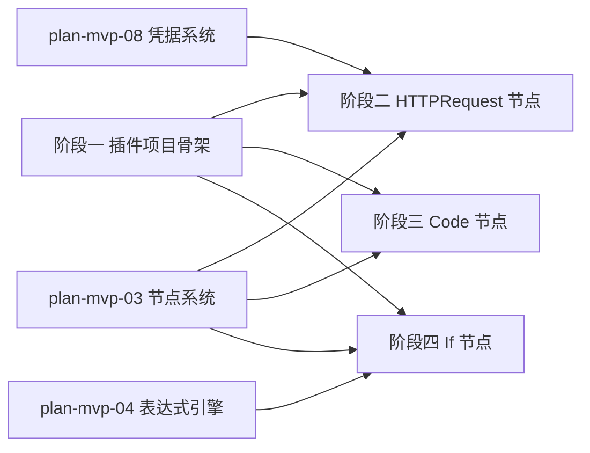

# 开发计划：标准节点插件（plan-mvp-07-standard-nodes）

## 1. 概述

实现 MVP 阶段的三个标准节点插件：HTTP Request、Code、If。插件项目只引用 `FlowEngine.Core`，编译为 DLL 放入 `plugins/` 目录，由节点注册中心扫描加载。

覆盖范围：

- `FlowEngine.Plugins.Standard` 插件项目骨架。
- HTTPRequest 节点（method/url/headers/body/认证凭据）。
- Code 节点（基础沙箱执行）。
- If 节点（条件表达式/true false 双分支输出端口）。

不覆盖范围：其他节点类型（Postgres/Redis/Agent 等，见后续阶段）、完整沙箱强化（Alpha 阶段）。

## 2. 交付物清单

- `plugins/FlowEngine.Plugins.Standard/FlowEngine.Plugins.Standard.csproj`（只引用 Core）。
- `plugins/FlowEngine.Plugins.Standard/HttpRequestNode.cs`（HTTP 请求节点）。
- `plugins/FlowEngine.Plugins.Standard/JsNode.cs`（代码执行节点）。
- `plugins/FlowEngine.Plugins.Standard/IfNode.cs`（条件分支节点）。
- 单元测试：各节点独立执行测试。

## 3. 开发阶段

### 阶段一：插件项目骨架

- 目标：建立标准节点插件项目骨架。
- 核心任务：
  - 创建 `plugins/FlowEngine.Plugins.Standard` 类库项目。
  - 添加对 `FlowEngine.Core` 的项目引用。
  - 确认不引用 Application/Runtime（遵循 [overview.md](../../architecture/overview.md) §7.2）。
  - 配置编译输出到 `plugins/` 目录（通过 csproj 的 `OutDir` 或后置复制脚本）。
- 输入：[overview.md](../../architecture/overview.md) §7 项目结构、§7.1 依赖方向。
- 输出：可编译的插件项目。
- 验收标准：
  - `dotnet build` 通过。
  - 项目引用仅包含 `FlowEngine.Core`。
  - 编译产物输出到 `plugins/` 目录。
- 依赖：plan-mvp-02 Core 抽象、plan-mvp-01 项目骨架。

### 阶段二：HTTPRequest 节点

- 目标：实现 HTTP 请求节点。
- 核心任务：
  - 实现 `HttpRequestNode : INodeType`。
  - `TypeName = "httpRequest"`，`DisplayName = "HTTP Request"`，`Category = "HTTP"`。
  - 参数定义：
    - `method`（Options: GET/POST/PUT/DELETE，默认 GET）。
    - `url`（String，必填）。
    - `headers`（Json，可选）。
    - `body`（Json，DisplayRule: method=POST 或 PUT 时显示，依赖 method）。
    - `apiCredential`（Credential，CredentialType: "apiKey"，可选）。
  - 端口定义：`input`（输入）、`output`（输出）。
  - `ExecutionMode = OnceForAll`。
  - `ExecuteAsync` 逻辑：
    - 从参数读取 method/url/headers/body。
    - 若提供凭据，通过 `context.Credentials.GetCredential` 获取并注入 Authorization 头。
    - 使用 `HttpClient` 发起请求。
    - 返回 `NodeExecutionResult`，Output 包含状态码/响应体/响应头。
    - 失败时返回 `NodeError`，不抛异常。
- 输入：[node-system.md](../../architecture/node-system.md) §2 节点接口、§4.1 参数定义示例、[credentials.md](../../architecture/credentials.md) §4 运行时注入。
- 输出：可发起 HTTP 请求的节点。
- 验收标准：
  - 节点可被注册中心加载（`GET /api/node-types` 包含 httpRequest）。
  - GET 请求返回响应数据。
  - POST 请求带 body 发送。
  - 凭据注入后 Authorization 头正确。
  - 请求失败时返回 `NodeError`，不抛异常。
- 依赖：阶段一、plan-mvp-03 节点系统、plan-mvp-08 凭据系统（凭据注入部分）。

### 阶段三：Code 节点

- 目标：实现代码执行节点（基础沙箱）。
- 核心任务：
  - 实现 `JsNode : INodeType`。
  - `TypeName = "code"`，`DisplayName = "Code"`，`Category = "Utility"`。
  - 参数定义：
    - `language`（Options: javascript，MVP 仅支持 JS）。
    - `code`（Code，必填）。
  - 端口定义：`input`（输入）、`output`（输出）。
  - `ExecutionMode = OnceForAll`。
  - `ExecuteAsync` 逻辑：
    - MVP 阶段使用基础沙箱执行 JavaScript（选型：Jint 或类似轻量 JS 引擎）。
    - 将 `input` 数据注入沙箱上下文。
    - 执行用户代码，返回结果作为 Output。
    - 限制执行时间与资源（超时、内存上限）。
    - 失败时返回 `NodeError`，不抛异常。
- 输入：[node-system.md](../../architecture/node-system.md) §2 节点接口、[overview.md](../../architecture/overview.md) §8 安全边界。
- 输出：可执行代码的节点。
- 验收标准：
  - 节点可被注册中心加载。
  - 简单 JS 代码（如 `return input;`）可执行并返回结果。
  - 超时代码（如 `while(true){}`）被终止并返回错误。
  - 代码错误返回 `NodeError`。
- 依赖：阶段一、plan-mvp-03 节点系统。

### 阶段四：If 节点

- 目标：实现条件分支节点。
- 核心任务：
  - 实现 `IfNode : INodeType`。
  - `TypeName = "if"`，`DisplayName = "If"`，`Category = "Core"`。
  - 参数定义：
    - `condition`（String，必填，表达式如 `{{ input.age }} >= 18`）。
  - 端口定义：`input`（输入）、`true`（输出分支 0）、`false`（输出分支 1）。
  - `ExecutionMode = OnceForAll`。
  - `ExecuteAsync` 逻辑：
    - 求值 condition 表达式（通过表达式引擎或节点内简单求值）。
    - 返回 `NodeExecutionResult`，`BranchIndex = 0`（true）或 `1`（false）。
    - Output 透传 input 数据。
- 输入：[node-system.md](../../architecture/node-system.md) §2.2 执行结果、[execution-engine.md](../../architecture/execution-engine.md) §8.1 分支节点。
- 输出：可按条件路由的分支节点。
- 验收标准：
  - 节点可被注册中心加载。
  - condition 为 true 时 `BranchIndex = 0`，数据路由到 true 分支。
  - condition 为 false 时 `BranchIndex = 1`，数据路由到 false 分支。
  - 未被选中的分支下游不收到数据。
- 依赖：阶段一、plan-mvp-03 节点系统、plan-mvp-04 表达式引擎。

## 4. 阶段依赖图

## 5. 风险与待定项

| 风险/待定项                            | 影响               | 应对策略                                       |
| -------------------------------------- | ------------------ | ---------------------------------------------- |
| Code 节点沙箱选型                      | 安全性与性能权衡   | MVP 使用 Jint 轻量 JS 引擎，Alpha 阶段强化沙箱 |
| HTTP 节点 HttpClient 生命周期          | 资源泄漏           | 使用 `IHttpClientFactory` 或节点内复用实例     |
| If 节点 condition 求值与表达式引擎集成 | 求值不一致         | 复用 plan-mvp-04 表达式引擎求值                |
| 插件编译产物路径                       | 注册中心找不到 DLL | 配置 csproj 输出目录或后置复制脚本             |

## 6. 验收总标准

- 三节点（HTTPRequest/Code/If）可被注册中心加载，`GET /api/node-types` 返回 3 个类型。
- HTTPRequest 节点能发请求返回结果。
- If 节点按条件路由分支。
- 插件项目只引用 `FlowEngine.Core`，不引用 Application/Runtime。
- 节点执行失败时返回 `NodeError`，不抛异常。
- 节点接口签名与 [node-system.md](../../architecture/node-system.md) §2 一致。

## 变更记录

| 日期       | 修改人 | 修改内容         | 关联任务 |
| ---------- | ------ | ---------------- | -------- |
| 2026-06-18 | Agent  | 创建标准节点计划 | MVP-0    |
