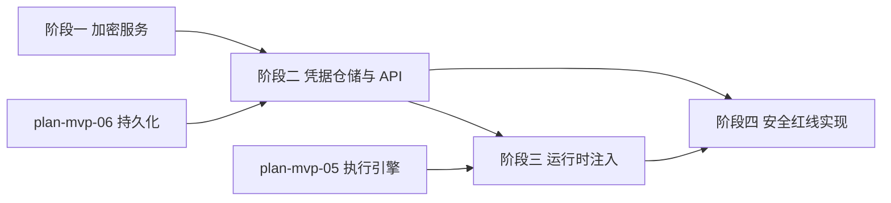

# 开发计划：凭据系统（plan-mvp-08-credentials）

## 1. 概述

实现凭据的加密存储、CRUD API、运行时解密注入与安全红线。凭据使用 AES-256-GCM 加密，加密密钥从环境变量注入，API 响应不返回明文，节点通过 `context.Credentials` 获取解密值。

> 子阶段归属说明：`ICredentialAccessor` 接口定义在 plan-mvp-02 Core 抽象中（MVP-0），但本模块的完整加解密实现属于 MVP-1。MVP-0 阶段的执行引擎对 `ICredentialAccessor` 采用空实现（stub），详见 [plan-mvp-00-readme.md](plan-mvp-00-readme.md) §4 依赖说明。

覆盖范围：
- `Credential` 实体（含 `EncryptedField`/`KeyVersion`）。
- 凭据 CRUD API。
- AES-256-GCM 加密服务（12 字节 nonce/16 字节 tag/hex 存储）。
- `ICredentialAccessor` 运行时注入。
- 加密密钥从环境变量注入。
- 凭据删除前引用检查。
- 安全红线实现（不返回明文/不落日志/不落异常）。

不覆盖范围：密钥轮换（Alpha 阶段）、凭据访问审计事件持久化（Alpha 阶段）、外部凭据 Vault（Enterprise 阶段）。

## 2. 交付物清单

- `src/FlowEngine.Core/Entities/Credential.cs`（凭据实体，含 `EncryptedField`/`KeyVersion`，签名见 [credentials.md](../../architecture/credentials.md) §2）。
- `src/FlowEngine.Infrastructure/Security/CredentialEncryptionService.cs`（AES-256-GCM 加密服务）。
- `src/FlowEngine.Infrastructure/Security/CryptoKeyProvider.cs`（从环境变量读取密钥）。
- `src/FlowEngine.Infrastructure/Persistence/Repositories/CredentialRepository.cs`（凭据仓储）。
- `src/FlowEngine.Application/Credentials/CredentialService.cs`（CRUD 用例编排）。
- `src/FlowEngine.Runtime/Credentials/CredentialAccessor.cs`（实现 `ICredentialAccessor`，运行时解密注入）。
- `src/FlowEngine.Host/Controllers/CredentialsController.cs`（凭据 CRUD API）。
- 单元测试：加密解密往返、API 不返回明文、引用检查。

## 3. 开发阶段

### 阶段一：加密服务

- 目标：实现 AES-256-GCM 加密与解密。
- 核心任务：
  - 实现 `CredentialEncryptionService`：
    - `Encrypt(string plaintext, byte[] key)`：生成 12 字节随机 nonce，使用 AES-256-GCM 加密，输出密文 + 16 字节 tag，均以 hex 存储。
    - `Encrypt(byte[] plaintext, byte[] key)`：重载，支持二进制字段（如 SSH 私钥）。
    - `Decrypt(EncryptedField field, byte[] key)`：解密并校验 tag 完整性。
  - 实现 `CryptoKeyProvider`：
    - 从环境变量 `FLOWENGINE_CRYPTO_KEY` 读取 32 字节密钥（hex 或 base64）。
    - 启动时校验密钥存在且长度正确，缺失则抛异常阻止启动。
    - 密钥不落日志。
- 输入：[credentials.md](../../architecture/credentials.md) §3 加密方案、§3.1 加密流程。
- 输出：可用的加密服务。
- 验收标准：
  - 加密后解密可还原原文。
  - nonce 为 12 字节，tag 为 16 字节。
  - 密文/nonce/tag 以 hex 存储。
  - 密钥缺失时启动失败。
  - 密钥不出现在日志中。
- 依赖：plan-mvp-02 Core 抽象。

### 阶段二：凭据仓储与 API

- 目标：实现凭据 CRUD 与 API。
- 核心任务：
  - 实现 `CredentialRepository`：
    - `CreateAsync(Credential)`：加密后存储。
    - `GetByIdAsync(Guid id)`：查询（返回加密数据）。
    - `GetDecryptedByIdAsync(Guid id)`：查询并解密（供运行时使用）。
    - `ListAsync()`：返回凭据列表（仅名称/类型/时间，不含明文）。
    - `UpdateAsync(Credential)`：更新（重新加密）。
    - `DeleteAsync(Guid id)`：删除前检查引用。
  - 实现 `CredentialService` 用例编排。
  - 实现 `CredentialsController`：
    - `POST /api/v1/credentials`：创建凭据。
    - `GET /api/v1/credentials`：列表（只返回名称/类型/时间）。
    - `GET /api/v1/credentials/:id`：详情（只返回名称/类型/时间，不返回明文）。
    - `PUT /api/v1/credentials/:id`：更新凭据。
    - `DELETE /api/v1/credentials/:id`：删除（先检查引用）。
  - API 响应只返回 `Id`/`Name`/`Type`/`CreatedAt`/`UpdatedAt`，不返回 `Data`（加密字段）。
- 输入：[credentials.md](../../architecture/credentials.md) §1 凭据模型、§5 安全红线、§6 凭据使用范围。
- 输出：可用的凭据 CRUD API。
- 验收标准：
  - 创建凭据后 `GET` 不返回明文。
  - 列表只返回名称/类型/时间。
  - 删除被引用的凭据时返回 409 Conflict。
- 依赖：阶段一、plan-mvp-06 持久化（数据库表）。

### 阶段三：运行时注入

- 目标：实现 `ICredentialAccessor`，节点执行时可获取解密凭据。
- 核心任务：
  - 实现 `CredentialAccessor`：
    - `GetCredential(Guid credentialId)`：从仓储查询并解密，返回 `CredentialValue`。
    - 解密后的凭据仅在内存中，不落日志。
  - 在 `NodeExecutionContext` 中注入 `ICredentialAccessor`（依赖 plan-mvp-05 执行引擎）。
  - 节点通过 `context.Credentials.GetCredential(credentialId)` 获取解密值。
- 输入：[credentials.md](../../architecture/credentials.md) §4 运行时注入、[execution-engine.md](../../architecture/execution-engine.md) §2 执行上下文。
- 输出：可注入节点的凭据访问器。
- 验收标准：
  - 节点可通过 `context.Credentials.GetCredential` 获取解密值。
  - 解密后的凭据不落日志。
  - 凭据访问不抛异常，失败时返回错误。
- 依赖：阶段二、plan-mvp-05 执行引擎。

### 阶段四：安全红线实现

- 目标：落实所有安全红线。
- 核心任务：
  - 凭据值不落日志：日志中只记录凭据 ID。
  - 凭据值不返回前端：API 响应过滤明文。
  - 凭据值不落入异常信息：异常消息中不得包含 API Key、密码等敏感内容。
  - 加密密钥不硬编码：密钥从环境变量注入。
  - 最小权限原则：节点只能访问自己被授权的凭据（MVP 阶段简化为按 credentialId 访问）。
  - 凭据删除前引用检查：扫描工作流定义中是否引用该凭据 ID。
- 输入：[credentials.md](../../architecture/credentials.md) §5 安全红线。
- 输出：符合安全红线的凭据系统。
- 验收标准：
  - 日志中不出现凭据明文。
  - API 响应中不出现凭据明文。
  - 异常消息中不出现凭据明文。
  - 密钥不在代码中硬编码。
  - 删除被引用凭据时被拒。
- 依赖：阶段二、阶段三。

## 4. 阶段依赖图

## 5. 风险与待定项

| 风险/待定项 | 影响 | 应对策略 |
|------------|------|---------|
| 加密密钥泄露 | 所有凭据被解密 | 密钥从环境变量注入，禁止硬编码，生产环境使用 KMS（Enterprise 阶段） |
| 凭据明文意外落日志 | 安全合规风险 | 日志中间件过滤敏感字段，代码审查重点检查 |
| 引用检查遗漏 | 删除凭据后工作流执行失败 | 扫描所有工作流定义的参数值，匹配 credentialId |
| 密钥轮换未实现 | 长期使用同一密钥风险 | MVP 阶段记录为待定项，Alpha 阶段实现（见 [credentials.md](../../architecture/credentials.md) §6.1） |

## 6. 验收总标准

- 凭据加密存储到 SQLite，密文为 hex。
- API 响应只返回名称/类型/时间，不返回明文。
- 节点可通过 `context.Credentials.GetCredential` 获取解密值。
- 加密密钥从环境变量注入，不硬编码。
- 凭据不落日志与异常。
- 删除被引用凭据时被拒。
- 加密方案与 [credentials.md](../../architecture/credentials.md) §3 一致（AES-256-GCM/12 字节 nonce/16 字节 tag/hex 存储）。

## 变更记录

| 日期 | 修改人 | 修改内容 | 关联任务 |
|------|--------|----------|----------|
| 2026-06-18 | Agent | 创建凭据系统计划 | MVP-1 |
