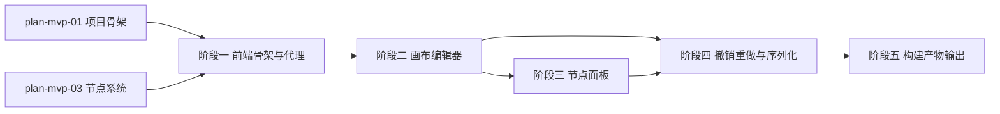

# 开发计划：前端画布编辑器（plan-mvp-09-frontend-canvas）

## 1. 概述

实现基于 React Flow 的画布编辑器，支持节点拖拽、连线、删除、撤销重做，并提供节点面板从后端拉取节点类型按分类渲染。构建产物输出到 Host/wwwroot 由后端托管。

覆盖范围：
- `frontend/` React+TS+Vite 项目（在 plan-mvp-01 骨架基础上扩展）。
- React Flow 画布编辑器。
- 节点拖拽/连线/删除/撤销重做。
- 节点面板（从 `/api/v1/node-types` 拉取按分类渲染可拖拽卡片）。
- 工作流 JSON 序列化（节点+连线）。
- Vite 代理后端 API。
- 构建产物输出到 Host/wwwroot。

不覆盖范围：参数配置面板（见 plan-mvp-10）、执行交互与结果展示（见 plan-mvp-11）。

## 2. 交付物清单

- `frontend/src/components/Canvas/WorkflowCanvas.tsx`（React Flow 画布组件）。
- `frontend/src/components/Canvas/CustomNode.tsx`（自定义节点渲染）。
- `frontend/src/components/Canvas/CustomEdge.tsx`（自定义连线渲染）。
- `frontend/src/components/NodePanel/NodePanel.tsx`（节点面板）。
- `frontend/src/components/NodePanel/NodeCard.tsx`（可拖拽节点卡片）。
- `frontend/src/hooks/useNodeTypes.ts`（拉取节点类型）。
- `frontend/src/hooks/useWorkflowHistory.ts`（撤销重做历史管理）。
- `frontend/src/services/api.ts`（API 调用封装）。
- `frontend/src/types/workflow.ts`（工作流类型定义，与后端一致）。
- `frontend/src/utils/workflowSerializer.ts`（工作流 JSON 序列化）。
- `frontend/vite.config.ts`（代理与构建产物输出配置）。

## 3. 开发阶段

### 阶段一：前端项目骨架与代理

- 目标：在 plan-mvp-01 骨架基础上完善前端项目结构与 API 代理。
- 核心任务：
  - 安装依赖：React Flow、axios（或 fetch 封装）、zustand（状态管理）。
  - 配置 `vite.config.ts`：dev server 端口、代理 `/api` 到 `http://localhost:5000`、构建产物输出目录。
  - 实现 `services/api.ts`：封装 `GET /api/v1/node-types`、`POST /api/v1/workflows`、`GET /api/v1/workflows`、`GET /api/v1/workflows/:id`、`PUT /api/v1/workflows/:id`。
  - 定义 `types/workflow.ts`：与后端实体对应的 TypeScript 类型（NodeInstance/Connection/Workflow）。
- 输入：[deployment.md](../../architecture/deployment.md) §2 前端集成到后端、§4.1 开发环境。
- 输出：可调后端 API 的前端骨架。
- 验收标准：
  - `npm run dev` 启动后可访问。
  - 前端通过代理访问 `GET /api/v1/node-types` 成功。
  - TypeScript 类型与后端实体字段一致（camelCase）。
- 依赖：plan-mvp-01 项目骨架、plan-mvp-03 节点系统（API）。

### 阶段二：画布编辑器

- 目标：实现 React Flow 画布与节点拖拽连线。
- 核心任务：
  - 实现 `WorkflowCanvas`：使用 React Flow 渲染画布。
  - 实现 `CustomNode`：渲染节点名称、类型图标、输入输出端口。
  - 实现节点拖拽：从节点面板拖拽节点卡片到画布生成节点实例。
  - 实现连线：从输出端口拖拽到输入端口创建 Connection。
  - 实现删除：选中节点或连线后按 Delete 删除。
  - 实现选中态：点击节点/连线高亮。
  - 节点位置保存到 `NodeInstance.PositionX`/`PositionY`。
- 输入：[overview.md](../../architecture/overview.md) §3.1 前端职责、[terminology.md](../../architecture/terminology.md) §5 核心数据模型。
- 输出：可拖拽连线的画布。
- 验收标准：
  - 可从节点面板拖拽节点到画布。
  - 可从输出端口拖拽到输入端口创建连线。
  - 可选中并删除节点/连线。
  - 节点位置随拖拽更新。
- 依赖：阶段一。

### 阶段三：节点面板

- 目标：实现节点面板，按分类渲染可拖拽卡片。
- 核心任务：
  - 实现 `NodePanel`：从 `/api/v1/node-types` 拉取节点类型列表。
  - 按 `Category` 分组渲染（Core/HTTP/Data/AI/Trigger/Utility）。
  - 实现 `NodeCard`：显示节点 DisplayName、Icon，支持拖拽。
  - 拖拽时传递节点类型信息（TypeName）到画布。
- 输入：[node-system.md](../../architecture/node-system.md) §5 节点分类、§6 冷启动加载流程。
- 输出：按分类渲染的节点面板。
- 验收标准：
  - 节点面板显示所有已注册节点类型。
  - 按分类分组显示。
  - 可拖拽节点卡片到画布。
- 依赖：阶段二。

### 阶段四：撤销重做与工作流序列化

- 目标：实现撤销重做与工作流 JSON 序列化。
- 核心任务：
  - 实现 `useWorkflowHistory`：维护操作历史栈，支持 undo/redo。
  - 记录的操作：添加节点、删除节点、添加连线、删除连线、移动节点。
  - 实现 `workflowSerializer`：将画布状态序列化为工作流 JSON（Nodes + Connections）。
  - 提供 `saveWorkflow` 方法：调用 `POST/PUT /api/v1/workflows`。
  - 提供 `loadWorkflow` 方法：调用 `GET /api/v1/workflows/:id` 并还原画布。
- 输入：[overview.md](../../architecture/overview.md) §4.1 编辑阶段数据流、[terminology.md](../../architecture/terminology.md) §5。
- 输出：支持撤销重做与序列化的画布。
- 验收标准：
  - 添加节点后可撤销，撤销后可重做。
  - 工作流可序列化为 JSON 并保存到后端。
  - 可从后端加载工作流并还原画布。
- 依赖：阶段二、阶段三。

### 阶段五：构建产物输出到 Host

- 目标：配置构建产物输出到 Host/wwwroot。
- 核心任务：
  - 配置 `vite.config.ts` 的 `build.outDir` 指向 `../src/FlowEngine.Host/wwwroot`。
  - 验证 `npm run build` 产物可被后端 `UseStaticFiles` 托管。
  - 验证 `MapFallbackToFile("index.html")` 生效（前端路由刷新不 404）。
- 输入：[deployment.md](../../architecture/deployment.md) §2 前端集成到后端。
- 输出：可被后端托管的前端产物。
- 验收标准：
  - `npm run build` 产物输出到 Host/wwwroot。
  - 后端启动后访问 `http://localhost:5000/` 加载前端。
  - 前端路由刷新不 404。
- 依赖：阶段四、plan-mvp-01（Host 静态文件托管）。

## 4. 阶段依赖图

## 5. 风险与待定项

| 风险/待定项 | 影响 | 应对策略 |
|------------|------|---------|
| React Flow 版本升级 API 变化 | 兼容性问题 | 锁定版本，参考官方文档 |
| 撤销重做实现复杂 | 状态管理混乱 | 使用 zustand 中间件或自实现历史栈，单元测试覆盖 |
| 前后端类型不一致 | 序列化反序列化失败 | 共用类型定义或代码生成，camelCase 统一 |
| 构建产物路径配置错误 | 后端托管失败 | vite.config.ts 明确 outDir，构建后验证文件存在 |

## 6. 验收总标准

- 可拖入节点并连线。
- 撤销重做可用。
- 节点面板按分类显示所有已注册节点类型。
- 工作流可序列化为 JSON 并保存到后端，可从后端加载还原画布。
- `npm run build` 产物可被后端 `UseStaticFiles` 托管。
- 前端类型与后端实体字段一致（camelCase）。

## 变更记录

| 日期 | 修改人 | 修改内容 | 关联任务 |
|------|--------|----------|----------|
| 2026-06-18 | Agent | 创建前端画布计划 | MVP-1 |
