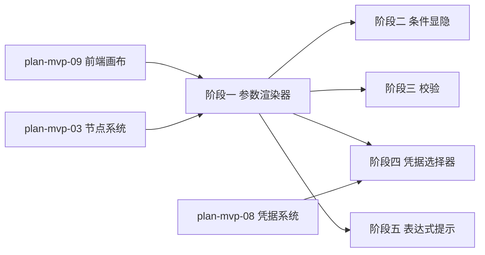

# 开发计划：参数配置面板（plan-mvp-10-frontend-panel）

## 1. 概述

实现根据节点 `ParameterDefinition` 自动渲染的参数配置面板，支持参数类型渲染映射、条件显隐、校验规则与凭据选择器。选中画布节点时显示对应参数表单。

覆盖范围：
- 根据 `ParameterDefinition` 自动渲染表单。
- 参数类型渲染映射（String/Number/Boolean/Options/Json/Code/Credential）。
- 条件显隐（`DisplayRule.Condition`/`Dependencies`）。
- 校验（`ValidationRules` 必填/正则/范围）。
- 凭据选择器（只显示名称）。
- 表达式提示。

不覆盖范围：Resource 资源选择器（Alpha 阶段）、表达式高亮与测试工具（Alpha 阶段）。

## 2. 交付物清单

- `frontend/src/components/ParameterPanel/ParameterPanel.tsx`（参数面板容器）。
- `frontend/src/components/ParameterPanel/ParameterRenderer.tsx`（参数渲染分发器）。
- `frontend/src/components/ParameterPanel/fields/StringField.tsx`。
- `frontend/src/components/ParameterPanel/fields/NumberField.tsx`。
- `frontend/src/components/ParameterPanel/fields/BooleanField.tsx`。
- `frontend/src/components/ParameterPanel/fields/OptionsField.tsx`。
- `frontend/src/components/ParameterPanel/fields/JsonField.tsx`。
- `frontend/src/components/ParameterPanel/fields/CodeField.tsx`。
- `frontend/src/components/ParameterPanel/fields/CredentialField.tsx`（凭据选择器）。
- `frontend/src/hooks/useParameterValidation.ts`（校验逻辑）。
- `frontend/src/hooks/useDisplayRule.ts`（条件显隐求值）。
- `frontend/src/utils/expressionHint.ts`（表达式提示）。

## 3. 开发阶段

### 阶段一：参数渲染器

- 目标：根据 `ParameterDefinition.Type` 渲染对应表单组件。
- 核心任务：
  - 实现 `ParameterPanel`：接收选中节点的 `ParameterDefinition` 列表，渲染表单。
  - 实现 `ParameterRenderer`：根据 `Type` 分发到具体字段组件。
  - 实现字段组件映射（遵循 [node-system.md](../../architecture/node-system.md) §4.4 前端渲染映射）：
    - `String` → 文本输入框。
    - `Number` → 数字输入框。
    - `Boolean` → 开关。
    - `Options` → 下拉选择。
    - `Json` → JSON 编辑器（使用 textarea 或轻量编辑器）。
    - `Code` → 代码编辑器（使用 textarea 或轻量编辑器）。
    - `Credential` → 凭据选择器（阶段四实现）。
  - 每个字段组件接收 `ParameterDefinition` 与当前值，回调更新。
  - 渲染 `DisplayName`、`Required` 标记。
- 输入：[node-system.md](../../architecture/node-system.md) §4 参数定义驱动 UI、§4.4 前端渲染映射、[terminology.md](../../architecture/terminology.md) §5 ParameterDefinition。
- 输出：可渲染参数表单的面板。
- 验收标准：
  - 选中节点时显示参数表单。
  - 不同参数类型渲染对应组件。
  - 参数值变更回调到画布状态。
- 依赖：plan-mvp-09 前端画布、plan-mvp-03 节点系统（节点类型 API）。

### 阶段二：条件显隐

- 目标：根据 `DisplayRule` 动态显示/隐藏参数。
- 核心任务：
  - 实现 `useDisplayRule`：求值 `DisplayRule.Condition`，返回是否显示。
  - 监听 `DisplayRule.Dependencies` 中的参数变化，重新求值。
  - 条件表达式格式：`{{ parameter.method }} == 'POST'`（复用后端表达式语法，前端简单求值）。
  - 隐藏的参数值不提交。
- 输入：[node-system.md](../../architecture/node-system.md) §4.2 条件显示规则、§4.1 参数定义示例。
- 输出：支持条件显隐的参数面板。
- 验收标准：
  - `method=POST` 时 `body` 字段显示。
  - `method=GET` 时 `body` 字段隐藏。
  - 依赖参数变化时重新求值。
- 依赖：阶段一。

### 阶段三：校验

- 目标：实现参数校验规则。
- 核心任务：
  - 实现 `useParameterValidation`：根据 `ValidationRules` 校验参数值。
  - 支持校验类型：
    - 必填（`Required=true`）。
    - 正则（`ValidationRule.Type=Regex`）。
    - 范围（`ValidationRule.Type=Range`，min/max）。
  - 校验失败时显示错误提示。
  - 保存工作流前触发全量校验，校验失败阻止保存。
- 输入：[terminology.md](../../architecture/terminology.md) §5 ParameterDefinition/ValidationRule、[node-system.md](../../architecture/node-system.md) §4.3 参数定义字段说明。
- 输出：支持校验的参数面板。
- 验收标准：
  - 必填参数为空时显示错误。
  - 正则不匹配时显示错误。
  - 范围超出时显示错误。
  - 校验失败时保存按钮禁用或提示。
- 依赖：阶段一。

### 阶段四：凭据选择器

- 目标：实现凭据选择器，只显示凭据名称。
- 核心任务：
  - 实现 `CredentialField`：从 `/api/v1/credentials` 拉取凭据列表。
  - 下拉只显示凭据 `Name`，不显示明文。
  - 选中后保存凭据 ID 到参数值。
  - 根据 `CredentialType` 过滤可选凭据（如 `CredentialType=apiKey` 只显示 apiKey 类型）。
- 输入：[credentials.md](../../architecture/credentials.md) §4 运行时注入、§5 安全红线、[node-system.md](../../architecture/node-system.md) §4.3 参数定义字段说明。
- 输出：只显示名称的凭据选择器。
- 验收标准：
  - 凭据选择器下拉只显示名称。
  - 选中后保存凭据 ID。
  - 按 `CredentialType` 过滤生效。
  - 不显示任何明文信息。
- 依赖：阶段一、plan-mvp-08 凭据系统（API）。

### 阶段五：表达式提示

- 目标：在参数输入框提供表达式提示。
- 核心任务：
  - 实现 `expressionHint`：在输入框聚焦时提示可用变量（`input`/`parameter`/`nodes` 等）。
  - MVP 阶段提供静态提示列表，不做复杂自动补全。
  - 提示文案参考 [expression-system.md](../../architecture/expression-system.md) §2.2 变量引用。
- 输入：[expression-system.md](../../architecture/expression-system.md) §2.2 变量引用、§7 前端辅助。
- 输出：带表达式提示的输入框。
- 验收标准：
  - 输入框聚焦时显示可用变量提示。
  - 提示不干扰正常输入。
- 依赖：阶段一。

## 4. 阶段依赖图

## 5. 风险与待定项

| 风险/待定项 | 影响 | 应对策略 |
|------------|------|---------|
| 前端条件表达式求值与后端不一致 | 显隐行为不一致 | MVP 阶段前端简单求值（仅 `==`/`!=`），复杂表达式推迟到 Alpha |
| Json/Code 编辑器选型 | 体积大或功能不足 | MVP 使用 textarea，Alpha 阶段引入 Monaco/CodeMirror |
| 凭据列表 API 性能 | 下拉加载慢 | 缓存凭据列表，按需刷新 |
| 参数类型扩展 | 新增类型需改渲染器 | 使用渲染映射表，便于扩展 |

## 6. 验收总标准

- 选中节点时显示参数表单。
- 不同参数类型渲染对应组件（String/Number/Boolean/Options/Json/Code/Credential）。
- `method=POST` 时 `body` 字段显示，`method=GET` 时隐藏。
- 必填校验生效，校验失败阻止保存。
- 凭据选择器只显示名称，不显示明文。
- 参数值变更同步到画布状态。
- 渲染映射与 [node-system.md](../../architecture/node-system.md) §4.4 一致。

## 变更记录

| 日期 | 修改人 | 修改内容 | 关联任务 |
|------|--------|----------|----------|
| 2026-06-18 | Agent | 创建参数面板计划 | MVP-1 |
