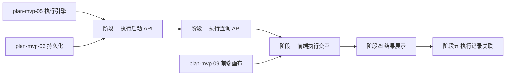

# 开发计划：手动执行与结果展示（plan-mvp-11-manual-execution）

## 1. 概述

实现手动执行工作流的 API 与前端交互。本计划跨 MVP-0 与 MVP-1：阶段一/二（执行启动 API、执行查询 API）属于 MVP-0 后端核心可运行范畴；阶段三/四/五（前端执行按钮、结果展示、执行记录关联）属于 MVP-1 前端编排范畴。执行前先持久化为 Pending 状态，确保崩溃可恢复。

覆盖范围：
- `POST /api/v1/workflows/:id/execute` 端点（执行启动）。
- `GET /api/v1/executions/:id` 端点（执行结果查询）。
- 前端执行按钮。
- 基础执行结果展示（节点输出列表/执行状态）。
- 执行记录关联。

不覆盖范围：WebSocket 实时推送（Alpha 阶段）、执行进度实时高亮（Alpha 阶段）、Dry Run 模式（Alpha 阶段）。

## 2. 交付物清单

- `src/FlowEngine.Host/Controllers/ExecutionsController.cs`（执行 API）。
- `src/FlowEngine.Application/Executions/ExecutionService.cs`（执行用例编排）。
- `frontend/src/components/ExecutionPanel/ExecutionPanel.tsx`（执行结果面板）。
- `frontend/src/components/ExecutionPanel/NodeOutputList.tsx`（节点输出列表）。
- `frontend/src/components/ExecutionPanel/ExecutionButton.tsx`（执行按钮）。
- `frontend/src/hooks/useExecution.ts`（执行交互逻辑）。
- 单元测试：执行启动、执行查询、Pending 持久化。

## 3. 开发阶段

### 阶段一：执行启动 API

- 目标：实现手动执行启动端点。
- 核心任务：
  - 实现 `POST /api/v1/workflows/:id/execute` 端点：
    - 按 ID 加载工作流定义。
    - 创建 `ExecutionRecord`，状态为 `Pending`，先持久化到数据库（依赖 plan-mvp-06）。
    - 调用 `IEngine.StartAsync` 启动执行（依赖 plan-mvp-05）。
    - 返回 `ExecutionId` 与初始状态。
  - 实现 `ExecutionService` 用例编排：加载工作流 → 持久化 Pending → 启动执行。
  - 执行启动异步：API 返回 `ExecutionId` 后执行在后台进行，前端轮询查询结果。
- 输入：[execution-engine.md](../../architecture/execution-engine.md) §1 执行引擎职责、§9 执行状态机、[deployment.md](../../architecture/deployment.md) §9.1 执行恢复。
- 输出：可触发执行的 API。
- 验收标准：
  - `POST /api/v1/workflows/:id/execute` 返回 200 与 `ExecutionId`。
  - 执行前 `executions` 表有 Pending 记录。
  - 工作流不存在时返回 404。
  - 执行在后台异步进行，API 不阻塞。
- 依赖：plan-mvp-05 执行引擎、plan-mvp-06 持久化。

### 阶段二：执行查询 API

- 目标：实现执行结果查询端点。
- 核心任务：
  - 实现 `GET /api/v1/executions/:id` 端点：
    - 按 ID 查询 `ExecutionRecord`。
    - 返回执行状态（Pending/Running/Completed/Failed/Cancelled）。
    - 返回 `NodeRecords` 列表（节点定义 ID/状态/输入/输出/参数）。
  - 支持查询执行列表：`GET /api/v1/workflows/:id/executions`（按工作流查询历史执行）。
- 输入：[execution-engine.md](../../architecture/execution-engine.md) §10 执行记录。
- 输出：可查询执行结果的 API。
- 验收标准：
  - `GET /api/v1/executions/:id` 返回执行状态与节点记录。
  - 执行不存在时返回 404。
  - 节点记录包含输入输出与参数。
- 依赖：阶段一、plan-mvp-06 持久化。

### 阶段三：前端执行交互

- 目标：实现前端执行按钮与交互。
- 核心任务：
  - 实现 `ExecutionButton`：点击触发 `POST /api/v1/workflows/:id/execute`。
  - 实现 `useExecution`：管理执行状态（idle/loading/running/completed/failed）。
  - 执行启动后轮询 `GET /api/v1/executions/:id` 查询状态（MVP 阶段轮询，Alpha 阶段 WebSocket）。
  - 轮询间隔可配置（默认 1 秒）。
  - 执行完成后停止轮询。
- 输入：[overview.md](../../architecture/overview.md) §4.2 执行阶段数据流。
- 输出：可触发执行并轮询状态的前端交互。
- 验收标准：
  - 点击执行按钮触发后端执行。
  - 执行中按钮显示 loading 状态。
  - 执行完成后停止轮询并显示结果。
  - 执行失败显示错误信息。
- 依赖：阶段二、plan-mvp-09 前端画布。

### 阶段四：结果展示

- 目标：实现执行结果展示。
- 核心任务：
  - 实现 `ExecutionPanel`：显示执行状态（Pending/Running/Completed/Failed/Cancelled）。
  - 实现 `NodeOutputList`：按节点顺序显示各节点输出。
  - 每个节点显示：节点名称、状态、输出数据（JSON）、错误信息（如有）。
  - 支持折叠/展开节点输出详情。
- 输入：[execution-engine.md](../../architecture/execution-engine.md) §10 执行记录、[terminology.md](../../architecture/terminology.md) §5 NodeExecutionRecord。
- 输出：可展示执行结果的面板。
- 验收标准：
  - 前端显示执行状态。
  - 各节点输出按顺序展示。
  - 失败节点显示错误信息。
  - 节点输出可折叠展开。
- 依赖：阶段三。

### 阶段五：执行记录关联

- 目标：确保执行记录与工作流、节点关联完整。
- 核心任务：
  - 验证 `ExecutionRecord.WorkflowDefinitionId` 正确关联工作流。
  - 验证 `NodeExecutionRecord.NodeDefinitionId` 正确关联节点定义。
  - 验证执行列表 API 可按工作流查询历史执行。
  - 前端可在工作流详情页查看历史执行列表。
- 输入：[execution-engine.md](../../architecture/execution-engine.md) §10、[terminology.md](../../architecture/terminology.md) §9.3 ID 后缀规范。
- 输出：关联完整的执行记录。
- 验收标准：
  - 执行记录关联正确的工作流 ID。
  - 节点执行记录关联正确的节点定义 ID。
  - 历史执行列表可查询。
- 依赖：阶段四。

## 4. 阶段依赖图

## 5. 风险与待定项

| 风险/待定项 | 影响 | 应对策略 |
|------------|------|---------|
| 轮询频率过高 | 服务器压力 | MVP 默认 1 秒轮询，Alpha 阶段切换 WebSocket |
| 执行长时间运行 | 前端等待体验差 | 显示 Running 状态，支持取消（依赖 plan-mvp-05 取消） |
| 执行记录数据量大 | 查询性能下降 | 节点输出 JSON 可截断显示，完整数据按需加载 |
| 执行前未持久化 Pending | 崩溃后无法恢复 | 严格保证先持久化 Pending 再入队执行 |

## 6. 验收总标准

- 点击执行按钮触发后端执行。
- 前端显示执行状态（Pending/Running/Completed/Failed/Cancelled）。
- 前端显示各节点输出列表。
- 执行记录可查询（`GET /api/v1/executions/:id`）。
- 执行前先持久化为 Pending 状态。
- 执行记录关联工作流与节点定义 ID。
- 完整 E2E：HTTP → If → Code 工作流可手动执行并看到输出。

## 变更记录

| 日期 | 修改人 | 修改内容 | 关联任务 |
|------|--------|----------|----------|
| 2026-06-18 | Agent | 创建手动执行计划 | MVP-1 |
| 2026-06-18 | Agent | 明确阶段归属：后端 API 属 MVP-0，前端 UI 属 MVP-1 | 计划 review 修复 |
