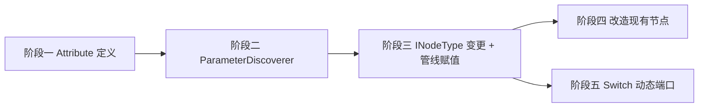
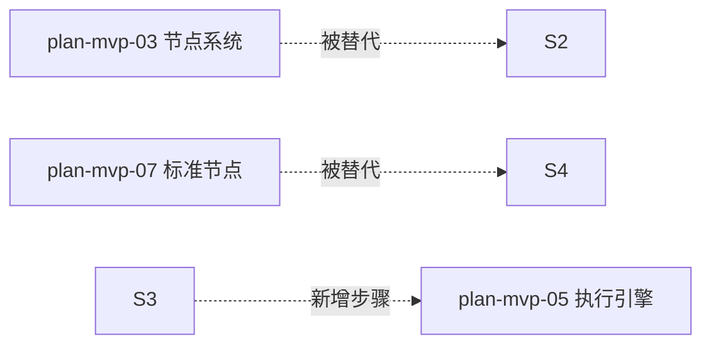

# 开发计划：属性驱动参数系统（plan-mvp-12-property-parameters）

## 1. 概述

用 C# 属性 + Attribute 方案替换当前的 `ParameterDefinition` 对象列表方案，消除 n8n 风格痕迹，充分利用 C# 类型系统和 .NET 生态。

### 核心约定

- Node 类上所有 **public get/set 实例属性** 均视为参数，除非被 `[IgnoreParameter]` 排除
- 属性 **CLR 类型** 自动映射为 `ParameterType`，**是否可空** 决定 `Required`
- 特定类型有默认 `PresentationHint` 映射（enum → ButtonGroup, string+长文本 → TextArea 等）
- **端口是属性**（`IReadOnlyList<PortDefinition>`），可访问 `this` 已注入的值实现动态端口

### 覆盖范围

- 自定义 Attribute 集合（`[DisplayCondition]` `[Credential]` `[IgnoreParameter]` `[Hint]` `[OptionsProvider]` `[Item]`）
- `ParameterDiscoverer` 服务：反射 + 生成 `ParameterDefinition[]`
- 执行管线新步骤：属性赋值（`ResolvedParameters` → 属性）
- `INodeType.Parameters` 从接口移除，拆分为可选 `IDynamicParameters` 接口
- 重写 `HttpRequestNode` `IfNode` `JSNode` 为属性驱动
- 新增 `SwitchNode` 验证动态端口场景

### 不覆盖范围

- 表达式引擎改造（`{{ }}` 求值逻辑不变）
- 前端渲染改造（`ParameterDefinition` JSON 结构不变，前端无感知）
- 凭据系统改造（`ICredentialAccessor` 不变）
- `ParameterType.Resource` 和 `ParameterType.File` 不在映射表中（属于非通用场景，后续通过 `[Hint]` 或新增规则覆盖）

> **关于 `IDynamicParameters` 接口：** 本计划定义该接口并说明其适用场景，但 MVP 阶段**无节点实现它**。详见阶段二。

## 2. 交付物清单

### 新增文件

| 文件                                           | 说明                              |
| ---------------------------------------------- | --------------------------------- |
| `Core/Attributes/DisplayConditionAttribute.cs` | 条件显隐，按属性值控制            |
| `Core/Attributes/CredentialAttribute.cs`       | 标记凭据属性，指定类型            |
| `Core/Attributes/IgnoreParameterAttribute.cs`  | 排除某属性不作为参数              |
| `Core/Attributes/HintAttribute.cs`             | 覆盖默认 PresentationHint         |
| `Core/Attributes/OptionsProviderAttribute.cs`  | 动态选项源（方法名）              |
| `Core/Attributes/ItemAttribute.cs`             | 数组子项结构指定                  |
| `Core/Abstractions/IDynamicParameters.cs`      | 可选接口，运行时动态补充参数      |
| `Runtime/Registry/ParameterDiscoverer.cs`      | 反射 → ParameterDefinition 转换器 |
| `Runtime/Registry/ParameterHydrator.cs`        | 反方向：字典 → 属性赋值           |

### 修改文件

| 文件                                              | 变更                                          |
| ------------------------------------------------- | --------------------------------------------- |
| `Core/Abstractions/INodeType.cs`                  | 移除 `Parameters` 属性                        |
| `Runtime/Registry/NodeRegistry.cs`                | 注册时调用 `ParameterDiscoverer` 生成元数据   |
| `Runtime/Executor/NodeExecutionContextFactory.cs` | 新增 `INodeType nodeInstance` 形参，内部调用 `ParameterHydrator.Hydrate`；移除内部的 `_registry.Get()` 调用 |
| `Runtime/Executor/WorkflowExecutor.cs`            | `ProcessNodeAsync` 只创建一次节点实例，贯穿 Hydrate → ExecuteNodeWithRetryAsync 全流程 |
| `Plugins.Standard/HttpRequestNode.cs`             | 属性驱动重构，移除 `GetParameter<>` 调用      |
| `Plugins.Standard/IfNode.cs`                      | 同上                                          |
| `Plugins.Standard/JSNode.cs`                      | 同上                                          |
| `Plugins.Standard/JsNode.cs`                      | 同上                                          |
| `Tests/TestPlugin/TestNode.cs`                    | 适配新接口                                    |
| `Tests/Runtime.Tests/Executor/TestNodes.cs`       | 适配新接口                                    |

### 新增节点（验证动态端口）

| 文件                             | 说明                         |
| -------------------------------- | ---------------------------- |
| `Plugins.Standard/SwitchNode.cs` | Case 列表 → 动态 output 端口 |

## 3. 开发阶段

### 阶段一：Attribute 定义

- 目标：定义全部自定义 Attribute，约定映射规则表
- 核心任务：
  - 实现 `DisplayConditionAttribute`：`[DisplayCondition(nameof(Operation), WeChatOperation.SendTemplate)]`，支持多值 OR
  - 实现 `CredentialAttribute`：`[Credential("weChatOfficial")]`，运行时凭据类型匹配
  - 实现 `IgnoreParameterAttribute`：逃生口，标记非参数属性
  - 实现 `HintAttribute`：`[Hint(PresentationHint.JsonEditor)]` 覆盖默认推断
  - 实现 `OptionsProviderAttribute`：`[OptionsProvider(nameof(GetDepartments))]` 引用实例方法。方法签名约定：`IEnumerable<Option> GetDepartments()`（无参，返回 `Option` 列表，支持 `async` 版本 `Task<IEnumerable<Option>>`）。调用时机为**注册时**（静态选项），若需动态刷新后续通过 API 端点支持
  - 实现 `ItemAttribute`：`[Item(typeof(SwitchCase))]` 指定数组子项类型

### DisplayConditionAttribute → DisplayRule 转换规则

`ParameterDefinition.DisplayRule` 是前端条件渲染的通用格式，`ParameterDiscoverer` 按以下规则转换：

```
[DisplayCondition(nameof(Method), HttpMethod.Post)]
[DisplayCondition(nameof(Method), HttpMethod.Put)]
  ↓
DisplayRule {
    Condition: "{{ $parameter.method }} == 'Post' || {{ $parameter.method }} == 'Put'",
    Dependencies: ["method"]
}
```

具体规则：
1. 每个 `[DisplayCondition(prop, value)]` → 条件片段 `"{{ $parameter.{camelProp} }} == '{value}'"`
2. 多个 `[DisplayCondition]` 用 ` || ` 拼接（OR 语义）
3. `Dependencies` = 去重后的 `camelProp` 列表
4. `camelProp` = `char.ToLowerInvariant(propertyName[0]) + propertyName[1..]`
5. 值比较统一用 `==` 字符串比较，不涉及表达式引擎

### 属性名大小写约定

- C# 属性是 PascalCase：`Url`、`Method`、`ApiCredential`
- `ParameterDefinition.Name` 统一用 **camelCase**：`url`、`method`、`apiCredential`
- 转换规则：`char.ToLowerInvariant(propertyName[0]) + propertyName[1..]`
- `ParameterHydrator` 用 `StringComparer.OrdinalIgnoreCase` 做键匹配
- `DisplayRule.Dependencies` 中也使用 camelCase
- 前端侧无需改动，一直使用 camelCase 的 `Name`

### CLR → ParameterType 映射表（完整版）

```
int / long / double / float → Number,  不可空 → Required
string                      → String,  不可空 → Required
string + [Hint(CodeEditor)] → Code,    通过 Hint 派生
string + [Hint(Secret)]     → Expression, 通过 Hint 派生
bool                        → Boolean,  hint → Toggle
enum T                      → Options,  hint → ButtonGroup (1-4 项) / Select (5+ 项)
JsonObject / JsonNode       → Json,     hint → JsonEditor
Uri / EmailAddress          → String    hint 自动选
Dictionary<string,string>   → Json,     hint → KeyValueEditor
List<T> / T[]               → Array,    ItemDefinition 反射 T
Credential?                 → Credential, 配合 [Credential] 指定类型
DateTime / DateTimeOffset   → String    hint → DateTime
```

> 注：`ParameterType.Code` 不会再被自动产生。Code 本质是 string + `[Hint(CodeEditor)]`，前端只依赖 `Hint` 做渲染，`Type` 为 `String`。`ParameterType.Resource`、`ParameterType.File`、`ParameterType.Expression` 同理——它们由 `Hint` 驱动，不在 MVP 映射表中显式声明。如未来需要，可通过 `[Hint]` 或新增规则扩展。

- 验收标准：
  - 6 个 Attribute 类定义完整，`[AttributeUsage]` 限定正确
  - 映射表在代码注释中可查
  - `DisplayCondition` → `DisplayRule.Condition` 的转换格式确认
  - 属性名 camelCase 转换规则实现正确

- 依赖：无（仅 `[AttributeUsage]` `[Attribute]` 基类）

### 阶段二：ParameterDiscoverer + IDynamicParameters

- 目标：实现从属性到 `ParameterDefinition[]` 的反射转换器
- 核心任务：
  - 实现 `ParameterDiscoverer`：
    - 扫描 `INodeType` 的 public get/set 实例属性
    - 跳过 `Ports`、被 `[IgnoreParameter]` 标记、`[JsonIgnore]` 的属性
    - 按映射表推断 `ParameterType`
    - 读取 `[Description]` `[DisplayName]`（标准 .NET）
    - 读取 `[Hint]` `[Credential]` `[DisplayCondition]` `[OptionsProvider]` `[Item]`（自定义）
    - 是否可空推断 `Required`：不可空值类型 → true；可空/引用类型 → false
    - 读取属性初始化值作为 `DefaultValue`
    - `[Item(typeof(T))]` 的递归发现：
      - `ItemDefinition` 当前是 `ParameterDefinition?` 类型（单值），**不支持多列行结构**
      - 当子类型 T 有多个属性时，约定生成的 `ItemDefinition.Type = ParameterType.Json`，并将子字段嵌入 `Description` 的提示文本中
      - 示例：`[Item(typeof(SwitchCase))]` → `ItemDefinition.Type = Json`, `ItemDefinition.Description` 包含 "Fields: Name, Label, Value"
      - 未来若需原生多列支持，需将 `ItemDefinition` 改为 `List<ParameterDefinition> Fields` 或新增嵌套结构类型
    - 缓存策略：内部以 `ConcurrentDictionary<Type, IReadOnlyList<ParameterDefinition>>` 按 Type 缓存反射结果，重复调用免反射
    - 产出 `IReadOnlyList<ParameterDefinition>`
  - 定义 `IDynamicParameters` 接口：

```csharp
public interface IDynamicParameters
{
    IReadOnlyList<ParameterDefinition> GetDynamicParameters(
        IReadOnlyDictionary<string, object> resolvedValues);
}
```

### 什么场景需要 IDynamicParameters

两种场景的区分：

| 场景 | 方案 | 例子 |
|------|------|------|
| 参数值动态，但参数**名和类型**编译时已知 | `[DisplayCondition]` 控制显隐，或 `JsonObject` 属性兜底 | SqlNode 的查询参数 → `JsonObject? Parameters` 属性；微信 Operation 切换 → `[DisplayCondition]` |
| 参数**名称/数量/类型**编译时未知，由运行时配置决定 | `IDynamicParameters` 接口 | 见下方 |

**真实场景示例：工作流子流程节点（SubWorkflowNode）**

用户选择一个已保存的工作流作为子流程调用，子流程的入口节点参数决定了 SubWorkflowNode 应该暴露哪些参数给用户填写。子流程是用户自定义的，编译时不知道它有哪几个参数。

```
SubWorkflowNode
├── SubWorkflowId: string              ← 固定属性（用 JsonObject 也行，但会让前端渲染退化为通用 JSON 编辑框）
├── [IDynamicParameters]
│   └── GetDynamicParameters({ "subWorkflowId": "..." })
│       → 查询子工作流的入口节点参数
│       → 返回 [ParameterDefinition("itemId"), ParameterDefinition("status")]
│       → 这些参数被合并到 ParameterDiscoverer 的静态结果中
│
├── itemId: (动态生成，由前端根据 Definition 渲染)
├── status: (动态生成，由前端根据 Definition 渲染)
└── ExecuteAsync 时：context.ResolvedParameters["itemId"], context.ResolvedParameters["status"]
```

> 注意：`IDynamicParameters` 不会替换 `[DisplayCondition]` 或 `JsonObject` 属性。SqlNode 只需 `JsonObject? Parameters` 就够了。只有参数**名称**本身由运行时决定时才使用 `IDynamicParameters`。MVP 阶段无节点实现此接口，但接口设计须支持上述场景。

- 节点系统集成：
  - `NodeRegistry.CreateDescriptor` 的数据源从 `nodeType.Parameters` 改为 `ParameterDiscoverer.Discover(nodeType.GetType())`
  - 如节点实现 `IDynamicParameters`：
    - `ParameterDiscoverer.Discover()` 先完成静态属性扫描
    - 然后调用 `GetDynamicParameters(resolvedValues)` 获取运行时参数
    - 与静态结果合并去重（同名以静态为准）
    - 合并后的列表作为 `NodeTypeDescriptor.Parameters`
    - 注意：动态参数依赖 `resolvedValues` 入参，意味着需要先行 Hydrate 静态属性后再调用。阶段三的 Hydrate 调用链为：`CreateInstance` → `Hydrate(静态属性)` → `GetDynamicParameters` → `Hydrate(动态参数)` → `ExecuteAsync`
  - MVP 阶段没有节点实现 `IDynamicParameters`，但流程逻辑先就位（`NodeRegistry` 判断 `is IDynamicParameters` 后调用 `GetDynamicParameters`）
  - `NodeTypeDescriptor.Parameters` 保留不变，仅数据来源改为 Discoverer
- 验收标准：
  - `ParameterDiscoverer.Discover(typeof(HttpRequestNode))` 返回匹配属性数量的 `ParameterDefinition`
  - enum 属性正确生成 `Options` 列表
  - `List<SwitchCase>` 正确生成 `Array` 类型 + `ItemDefinition`（当前为 `Type=Json` 单值，含字段提示）
  - 相同 Type 第二次调用走缓存，不触发反射
  - `DisplayCondition` → `DisplayRule.Condition` 的转换正确
  - `IDynamicParameters` 接口定义完整，`GetDynamicParameters` 入参和返回值类型合理
  - `NodeRegistry.Register` 对实现 `IDynamicParameters` 的类型走合并流程（注入假数据验证合并正确）
  - 合并流程中动态参数与静态参数冲突时以静态为准

- 依赖：阶段一

### 阶段三：INodeType 接口变更 + 执行管线属性赋值

- 目标：移除 `INodeType.Parameters`，新增属性赋值步骤
- 核心任务：
  - `INodeType` 移除 `IReadOnlyList<ParameterDefinition> Parameters { get; }`
  - 现有实现全部移除 `Parameters` 属性
  - 实现 `ParameterHydrator.Hydrate(INodeType instance, IReadOnlyDictionary<string, object> resolvedValues)`：
    - 遍历 `resolvedValues`
    - 通过属性名匹配（大小写不敏感）
    - 按**转换矩阵**执行类型转换
    - set 属性值

### ParameterHydrator 类型转换矩阵

`resolvedValues` 中每个 value 的实际运行时类型由前端序列化和表达式引擎决定，Hydrator 需要覆盖所有组合：

| 目标属性类型 | 输入值运行时类型 | 转换逻辑 |
|------------|----------------|---------|
| `string` | `string` | 直接赋值 |
| `string` | `JsonNode` / `JsonElement` | 调用 `.ToString()` 或 `GetRawText()` |
| `string` | `null` | 赋 `null`（属性可空）或跳过（不可空保持默认值） |
| `int` / `long` | `int` / `long` | 直接转换 |
| `int` / `long` | `double` | `Convert.ToInt32()` / `ToInt64()`，检查溢出 |
| `int` / `long` | `string` (`"42"`) | `int.Parse()` / `long.Parse()` |
| `int` / `long` | `JsonElement` (ValueKind=Number) | `element.GetInt32()` / `GetInt64()` |
| `double` / `float` | `int` / `long` | 隐式 widening 转换 |
| `double` / `float` | `string` (`"3.14"`) | `double.Parse()` / `float.Parse()` |
| `double` / `float` | `JsonElement` | `element.GetDouble()` |
| `bool` | `bool` | 直接赋值 |
| `bool` | `string` (`"true"` / `"false"`) | `bool.TryParse()`，不区分大小写 |
| `bool` | `int` (`0` / `1`) | `value != 0` |
| `bool` | `JsonElement` (ValueKind=True/False) | `element.GetBoolean()` |
| `enum T` | `string` (如 `"GET"`) | `Enum.Parse<T>(ignoreCase: true)` |
| `enum T` | `int` | `Enum.ToObject(typeof(T), value)` |
| `enum T` | `JsonElement` (ValueKind=String) | `element.GetString()` → `Enum.Parse<T>()` |
| `JsonObject?` | `JsonNode` / `JsonObject` | 直接赋值 |
| `JsonObject?` | `string` (JSON 文本) | `JsonObject.Parse(value)` |
| `JsonObject?` | `JsonElement` | `JsonObject.Create(element)` |
| `List<T>` / `T[]` | `JsonElement` (Array) | 反序列化 `JsonSerializer.Deserialize<List<T>>(element)` |
| `List<T>` / `T[]` | `string` (JSON 数组文本) | `JsonSerializer.Deserialize<List<T>>(value)` |
| `Credential?` | `string` (凭据 ID) | 通过 `ICredentialAccessor.GetCredentialAsync()` 获取（延迟，执行时调用） |
| `Credential?` | `null` | 赋 `null` |

精度/溢出处理规则：
- `int` 目标接收 `long` / `double` 时：值在 `[int.MinValue, int.MaxValue]` 内则 `Convert.ToInt32()`，否则取边界值并记录警告（不抛异常）
- `double` 目标接收 `decimal` 时：`double.Parse(value.ToString())`，可能丢失精度（记录日志）
- 所有 Parse/Convert 失败时：跳过该属性赋值，记录警告，继续处理下一属性

  - **关键约束：执行管线中节点实例必须是单例**。当前 `WorkflowExecutor` 调用 `_nodeRegistry.Get()` 两次（`ProcessNodeAsync` 一次 + `NodeExecutionContextFactory.Create` 内部一次），产生实例 A 和 B。属性驱动要求 Hydrate 与 ExecuteAsync 发生在同一实例上，必须消除双实例。
  - 改造方案：

```
WorkflowExecutor.ProcessNodeAsync:
    var nodeInstance = _nodeRegistry.Get(node.TypeName);   // ← 只创建一次
    
    // 将实例传入 Factory，Factory 不再自己 Get
    var context = _contextFactory.Create(
        workflow, execution, node, nodeInstance, inputs, ...);
    
    // Factory 内部：
    //   1. ResolveParameters(raw, expressionContext) → resolvedValues
    //   2. ParameterHydrator.Hydrate(nodeInstance, resolvedValues)
    //   3. 对实现 IDynamicParameters 的节点：先 Hydrate 静态 → GetDynamicParameters → 合并 → Hydrate 动态
    //   4. 构造 NodeExecutionContext { ResolvedParameters, ... }
    
    // 同一实例传到 ExecuteAsync
    var result = await ExecuteWithRetryAsync(node, nodeInstance, context, ct);
    // nodeInstance.Url / nodeInstance.Cases 全部已赋值
```

  - 具体变更：
    - `NodeExecutionContextFactory.Create` 新增 `INodeType nodeInstance` 参数，移除内部的 `_registry.Get()` 调用
    - `WorkflowExecutor.ProcessNodeAsync` 只调用一次 `_registry.Get()`，将实例传入 Factory 和 `ExecuteNodeWithRetryAsync`
    - Hydrate 后的实例属性（如 `nodeInstance.Ports`、`nodeInstance.ExecutionMode`）可直接用于执行引擎路由判断
    - `RetryableNode` 等依赖实例状态的节点，因为重试时同一实例持续使用，其内部状态（如 `_remainingFailuresByExecution`）自然保持

  - 调用时序：

```
CreateNodeInstance (单次)
    → Hydrate(静态属性)            // 从 resolvedParameters 映射所有静态属性
    → [如节点是 IDynamicParameters]
        → GetDynamicParameters(resolvedValues)  // 获取动态参数定义
        → 合并静态+动态到 NodeTypeDescriptor   // 运行时更新描述
        → Hydrate(动态参数)          // 动态参数值已含在 resolvedParameters 中
    → ExecuteAsync                 // 此时 this.Url / this.Cases / this.Condition 全部就绪
```
- 验收标准：
  - `ParameterHydrator` 将 `{ "url": "https://...", "method": "GET" }` 正确映射到 `HttpRequestNode.Url` 和 `HttpRequestNode.Method`
  - enum 类型属性支持字符串值映射
  - 缺失非可空属性不抛异常（保持默认值）
  - 已有节点移除了 `Parameters` 后编译通过

- 依赖：阶段二

### 阶段四：改造现有节点

- 目标：所有标准节点使用属性驱动，消除 `context.GetParameter<T>()` 调用
- 核心任务：
  - **HttpRequestNode**：
    - 所有参数改为 public get/set 属性
    - `HttpMethod Method` → 映射为 Options，用 `[Hint(PresentationHint.ButtonGroup)]` + converter
    - `JsonObject? Headers` `JsonObject? Body`
    - `Credential? ApiCredential` + `[Credential("apiKey")]`
    - `ExecuteAsync` 直接使用 `this.Url` `this.Method` 等
    - 移除全部 `context.GetParameter<T>()` 调用
  - **IfNode**：
    - `string Condition { get; set; }` + `[Hint(PresentationHint.TextArea)]`
    - `ExecuteAsync` 使用 `this.Condition`
  - **JSNode / JsNode**：
    - `string Language { get; set; }` 为 enum（`ScriptLanguage`）
    - `string Code { get; set; }` + `[Hint(PresentationHint.CodeEditor)]`
  - 全部移除 `Parameters` 属性
- 验收标准：
  - 三个节点均编译通过，`dotnet build` 0 errors
  - `ParameterDiscoverer.Discover<T>()` 生成的定义与重构前的手写 `Parameters` 列表语义一致
  - 节点执行功能回归正常

- 依赖：阶段三

### 阶段五：Switch 节点（动态端口验证）

- 目标：实现 Split/Switch 节点，验证 `Ports` 依赖属性值的动态场景
- 核心任务：

```csharp
public sealed class SwitchNode : INodeType
{
    public string TypeName => "switch";
    public string DisplayName => "Switch";
    public string Category => "Core";
    public string Icon => "git-branch";
    public ExecutionMode ExecutionMode => ExecutionMode.OncePerItem;

    [Description("Expression to evaluate (e.g. {{ input.category }}).")]
    public string Expression { get; set; } = string.Empty;

    [Item(typeof(SwitchCase))]
    [Description("Case list. Each case routes to a separate output port.")]
    public List<SwitchCase> Cases { get; set; } = [];

    // Ports 读取 this.Cases 动态生成
    public IReadOnlyList<PortDefinition> Ports =>
    [
        new() { Name = "input", DisplayName = "Input", Direction = PortDirection.Input, Type = PortType.Main },
        .. Cases.Select(c => new PortDefinition
        {
            Name = c.Name,
            DisplayName = c.Label,
            Direction = PortDirection.Output,
            Type = PortType.Main
        }),
        new() { Name = "default", DisplayName = "Default", Direction = PortDirection.Output, Type = PortType.Main }
    ];

    public async Task<NodeExecutionResult> ExecuteAsync(NodeExecutionContext context, CancellationToken ct)
    {
        // Expression 已由 ParameterHydrator 赋值，Hydrate 保证 this.Expression = resolved 后的值
        var match = Cases.FindIndex(c =>
            string.Equals(c.Value, Expression, StringComparison.OrdinalIgnoreCase));

        return new NodeExecutionResult
        {
            Success = true,
            Output = context.Inputs.FirstOrDefault().Value ?? new DataBatch(),
            BranchIndex = match >= 0 ? match : Cases.Count // default = last index
        };
    }
}

public sealed class SwitchCase
{
    public string Name { get; set; } = string.Empty;
    public string Label { get; set; } = string.Empty;
    public string Value { get; set; } = string.Empty;
}
```

### Ports 时序设计

Ports 在三个时机被读取，行为不同：

| 时机 | 实例状态 | 读取方 | 期望行为 |
|------|---------|--------|---------|
| 注册时 (`NodeRegistry.Register`) | 全新 `Activator.CreateInstance`，未 Hydrate | `NodeTypeDescriptor.Ports` 快照 | 返回空 Cases 的基础端口（input + default）。前端节点面板展示基础形状 |
| 执行时 (`WorkflowExecutor.ProcessNodeAsync`) | `_registry.Get(typeName)` 新实例 → `Hydrate` 后 | 执行引擎读取 `Ports` 确定路由 | 返回已填充 Cases 的完整端口列表（input + case1..N + default） |
| 工作流编辑时 | 无实例，只有 `NodeInstance.Ports` 存根 | 前端画布渲染连线 | 注册时的快照已足够，因为连线只在编辑时确定连接关系，运行时根据 `BranchIndex` 路由 |

关键结论：**注册时快照只用于前端面板展示节点有哪些端口可以连线**，执行时的实际路由由 `BranchIndex` 决定，不依赖 `Ports` 的一致性。对于 Switch 节点，注册时 Cases 为空，前端看到 input + default 两个端口，用户画好连线后，运行时根据 Cases 匹配结果决定走哪个端口。

如需在编辑时预览动态端口（如选中 Switch 节点后右侧显示当前配置的 Cases 对应的端口列表），后续可通过新增 `GET /api/v1/node-instances/:id/preview-ports` 端点实现，MVP 阶段不做。

### 实现步骤

1.  用户在前端配置 `Cases`（ArrayField 增删行）
2.  工作流保存时 `cases` 以 JSON 存入 `NodeInstance.Parameters["cases"]`
3.  `ParameterHydrator` 反序列化 JSON → `List<SwitchCase>` → set `this.Cases`
4.  系统读取 `Ports` getter → 动态生成端口列表
5.  `ExecuteAsync` 按值匹配 index → `BranchIndex`

- 验收标准：
  - Switch 节点可注册，`GET /api/node-types` 返回其参数和端口定义
  - Cases 为空时只有 input + default 两个端口
  - Cases 有 3 项时共 5 个端口（input + case1 + case2 + case3 + default）
  - 表达式值匹配 case 时路由到对应端口，不匹配时路由到 default
  - 端口名称与 case Name 一致

- 依赖：阶段三

## 4. 阶段依赖图



所有阶段上线后现有计划影响：



## 5. 风险与待定项

| 风险/待定项                                                      | 影响                   | 应对                                                                            |
| ---------------------------------------------------------------- | ---------------------- | ------------------------------------------------------------------------------- |
| **执行管线双实例（核心风险）** | Hydrate 赋值到实例 B，ExecuteAsync 跑在实例 A，属性值全为默认 | 改造 `WorkflowExecutor` 和 `NodeExecutionContextFactory`，单实例贯穿全流程（见阶段三） |
| `HttpMethod` 是 class 而非 enum，序列化/反序列化特殊             | 节点加载异常           | 自定义 `TypeConverter` 或映射为 string 属性 + converter                         |
| `JsonObject?` 属性在 `ParameterHydrator` 中类型转换              | 赋值失败               | 优先走 `JsonNode` / `JsonObject` 直接转换，退化到 string parse                  |
| 属性初始化值作为 `DefaultValue`，但 `new()` 创建时初始化器已执行 | 默认值重复             | `ParameterDiscoverer` 创建临时实例读默认值；`Activator.CreateInstance` 后读属性 |
| 前端 `DisplayCondition` 依赖属性名小写                           | 条件判断不准确         | 序列化到 `ParameterDefinition.DisplayRule` 时使用属性名（camelCase）            |
| 自定义 TypeConverter 或表达式绑定兼容性                          | 旧工作流参数格式不兼容 | MVP 阶段无历史数据，格式一致即可                                                |
| `IDynamicParameters` 在前端的动态渲染 | 子流程节点等场景需要实时刷新参数表单 | 前端在用户填写依赖字段后重新调 `GET /api/node-types` 或其他端点取合并后的参数列表 |
| Switch 类动态端口仅执行时才准确                               | 编辑时端口与运行时不一致 | 注册时快照用于画布连线，运行时 `BranchIndex` 路由，两者解耦；预览端口作为后续优化 |

## 6. 验收总标准

- `dotnet build` 0 errors
- `ParameterDiscoverer.Discover<T>()` 对所有标准节点生成语义等价的参数定义（与重构前手写列表比对验证）
- `ParameterHydrator` 反方向赋值正确，`ExecuteAsync` 中 `this.Url` 值 = `resolvedParameters["url"]`
- 标准节点 `ExecuteAsync` 不再调用 `context.GetParameter<T>()`
- Switch 节点端口随 Cases 动态变化
- 所有现有测试（`IfNode` / `HttpRequestNode` / `JSNode` / 引擎拓扑）回归通过
