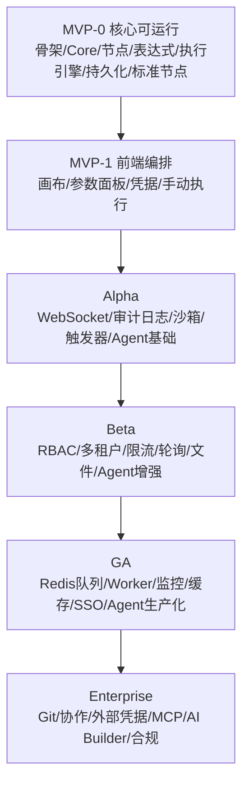
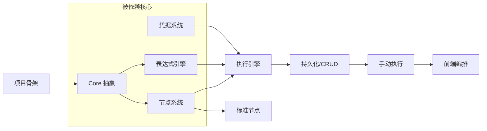

# 开发计划总览（plan-000-overview）

## 1. 概述

本文件是 Flow Engine 全量开发计划的入口与索引。项目当前处于纯文档阶段（架构概念文档已就绪，尚无源代码），需从零开始按 [roadmap.md](../architecture/roadmap.md) 划定的五个阶段逐步实施。

本总览解决三个问题：

- **做什么**：把 roadmap 的阶段目标拆解为可独立验收的模块计划。
- **怎么编号**：统一计划文档的命名与目录组织，便于检索与引用。
- **依赖关系**：明确阶段间、模块间的先后顺序，避免并行实施时出现循环依赖。

各模块计划只写"要做什么"和"怎么验收"，不重复 `docs/architecture/` 中已有的设计内容（接口签名、数据模型、流程图）。实施时遵循 [docs-rules.md](../../.agents/rules/docs-rules.md) 与 [project-rules.md](../../.agents/rules/project-rules.md)。

## 2. 阶段划分与目标

| 阶段 | 目标 | 子阶段 | 质量门槛 |
|------|------|--------|----------|
| **MVP** | 验证核心引擎可运行：节点可注册、工作流可编排、可手动执行 | MVP-0 核心可运行 / MVP-1 前端编排 | 单测 ≥30%（MVP-0）/ ≥50%（MVP-1）；单机 10→50 TPS |
| **Alpha** | 补齐触发器、审计日志、实时执行视图，引入 AI Agent 基础能力 | — | 单测 ≥60%；单机 100 TPS |
| **Beta** | 增加企业基础能力：权限、多租户、安全、文件、Agent 增强 | — | 单测 ≥70%；单机 200 TPS |
| **GA** | 支撑生产环境：队列、Worker、监控、SSO、Agent 生产化 | — | 单测 ≥75%；1000 TPS（多 Worker） |
| **Enterprise** | 服务大型企业：版本管理、协作、外部凭据、MCP、AI Builder、合规 | — | 单测 ≥80%；按客户需求 |

阶段之间存在强依赖：Alpha 的触发器/审计日志依赖 MVP 的执行引擎；Beta 的 RBAC/多租户依赖 Alpha 的用户系统；GA 的 Redis 队列/Worker 依赖 Beta 的执行稳定性；Enterprise 的协作编辑/版本管理依赖 GA 的生产化基础。

## 3. 目录结构与编号方案

```text
docs/plans/
├── plan-000-overview.md              # 本文件：总览与索引
├── mvp/                              # MVP 阶段
│   ├── plan-mvp-00-readme.md         # 阶段说明（MVP-0/MVP-1 划分、依赖、验收）
│   └── plan-mvp-NN-*.md              # 模块计划
├── alpha/                            # Alpha 阶段
│   ├── plan-alpha-00-readme.md
│   └── plan-alpha-NN-*.md
├── beta/                             # Beta 阶段
│   ├── plan-beta-00-readme.md
│   └── plan-beta-NN-*.md
├── ga/                               # GA 阶段
│   ├── plan-ga-00-readme.md
│   └── plan-ga-NN-*.md
└── enterprise/                       # Enterprise 阶段
    ├── plan-enterprise-00-readme.md
    └── plan-enterprise-NN-*.md
```

### 3.1 命名规范

- 阶段说明文件：`plan-{stage}-00-readme.md`，描述本阶段的子阶段划分、模块依赖、整体验收。
- 模块计划文件：`plan-{stage}-NN-module-name.md`，`NN` 为两位序号，`module-name` 为英文小写连字符。
- 任务记录文件：`task-NNN-*.md`，序号独立编排，按 [docs-rules.md](../../.agents/rules/docs-rules.md#22-任务文档) 第 2.2 节。

### 3.2 模块计划文档结构

每个模块计划遵循 [docs-rules.md](../../.agents/rules/docs-rules.md#3-计划文档结构) 第 3 节：

1. 概述（解决什么、覆盖范围、不覆盖范围）
2. 交付物清单
3. 开发阶段（目标、核心任务、输入、输出、验收标准、依赖）
4. 阶段依赖图
5. 风险与待定项
6. 验收总标准

**约束**：计划文档不贴完整实现代码、不重复架构文档的接口签名，通过相对链接引用架构文档。

## 4. 完整计划文档清单

### 4.1 MVP 阶段（`mvp/`）

| 文件 | 内容 | 对应架构 |
|------|------|----------|
| [plan-mvp-00-readme.md](mvp/plan-mvp-00-readme.md) | MVP-0/MVP-1 子阶段划分、模块依赖、整体验收 | roadmap §2 |
| [plan-mvp-01-project-skeleton.md](mvp/plan-mvp-01-project-skeleton.md) | 解决方案骨架、5 个核心项目+前端项目、DI/日志/配置基础 | overview §7, deployment §3 |
| [plan-mvp-02-core-abstractions.md](mvp/plan-mvp-02-core-abstractions.md) | Core 层实体、接口、值对象、领域事件 | terminology §5, node-system §2 |
| [plan-mvp-03-node-system.md](mvp/plan-mvp-03-node-system.md) | 节点注册中心、DLL 扫描、AssemblyLoadContext 隔离 | node-system §3 |
| [plan-mvp-04-expression-engine.md](mvp/plan-mvp-04-expression-engine.md) | 表达式解析器、`{{ }}` 求值、变量引用、错误提示 | expression-system §2-3 |
| [plan-mvp-05-execution-engine.md](mvp/plan-mvp-05-execution-engine.md) | 执行主循环、多输入等待区、错误策略、执行记录 | execution-engine §2-6,9-10 |
| [plan-mvp-06-persistence.md](mvp/plan-mvp-06-persistence.md) | SQLite 持久化、工作流 CRUD、版本控制、EF/Dapper 选型 | overview §6, deployment §10 |
| [plan-mvp-07-standard-nodes.md](mvp/plan-mvp-07-standard-nodes.md) | HTTP Request / Code / If 标准节点插件 | node-system §5, execution-engine §8 |
| [plan-mvp-08-credentials.md](mvp/plan-mvp-08-credentials.md) | 凭据 CRUD、AES-256-GCM 加密、运行时注入 | credentials §1-5 |
| [plan-mvp-09-frontend-canvas.md](mvp/plan-mvp-09-frontend-canvas.md) | React Flow 画布、拖拽连线、撤销重做、节点面板 | overview §3.1, node-system §4 |
| [plan-mvp-10-frontend-panel.md](mvp/plan-mvp-10-frontend-panel.md) | 参数描述驱动渲染、条件显隐、校验、凭据选择器 | node-system §4 |
| [plan-mvp-11-manual-execution.md](mvp/plan-mvp-11-manual-execution.md) | 手动执行 API、执行结果展示、基础执行视图 | overview §4.2, execution-engine §10 |

### 4.2 Alpha 阶段（`alpha/`）

| 文件 | 内容 | 对应架构 |
|------|------|----------|
| [plan-alpha-00-readme.md](alpha/plan-alpha-00-readme.md) | Alpha 阶段模块依赖与整体验收 | roadmap §3 |
| [plan-alpha-01-websocket.md](alpha/plan-alpha-01-websocket.md) | WebSocket 连接、执行进度推送、断线重连 | overview §3.1 |
| [plan-alpha-02-audit-log.md](alpha/plan-alpha-02-audit-log.md) | IEventBus、内存 Channel、NDJSON 刷盘、审计查询 | audit-log §2-7 |
| [plan-alpha-03-expression-sandbox.md](alpha/plan-alpha-03-expression-sandbox.md) | 安全沙箱强化、白名单函数、深度/超时限制、JMESPath | expression-system §4,6 |
| [plan-alpha-04-triggers.md](alpha/plan-alpha-04-triggers.md) | Schedule Trigger（Quartz）、Webhook Trigger 路由注册 | trigger-system, webhook |
| [plan-alpha-05-execution-view.md](alpha/plan-alpha-05-execution-view.md) | 执行中节点高亮、输出预览、实时事件订阅 | overview §3.1 |
| [plan-alpha-06-agent-basics.md](alpha/plan-alpha-06-agent-basics.md) | Agent 节点、工具端口、工具收集机制、迭代限制 | agent-and-tool §2,4-5 |
| [plan-alpha-07-llm-supply.md](alpha/plan-alpha-07-llm-supply.md) | LLM 供应节点、OpenAI 适配、供应端口 | agent-and-tool §3.4,4 |
| [plan-alpha-08-tool-basics.md](alpha/plan-alpha-08-tool-basics.md) | 子工作流工具、代码片段工具、HTTP 工具、Schema 推导 | agent-and-tool §6,8 |
| [plan-alpha-09-user-system.md](alpha/plan-alpha-09-user-system.md) | 用户模型、注册/登录、会话管理、认证中间件 | deployment §10 |

### 4.3 Beta 阶段（`beta/`）

| 文件 | 内容 | 对应架构 |
|------|------|----------|
| [plan-beta-00-readme.md](beta/plan-beta-00-readme.md) | Beta 阶段模块依赖与整体验收 | roadmap §4 |
| [plan-beta-01-rbac.md](beta/plan-beta-01-rbac.md) | 角色定义、Scope 枚举、中间件鉴权 | roadmap §4 |
| [plan-beta-02-multitenant.md](beta/plan-beta-02-multitenant.md) | 项目 CRUD、成员管理、工作流/凭据作用域隔离 | roadmap §4, overview §6 |
| [plan-beta-03-rate-limit.md](beta/plan-beta-03-rate-limit.md) | IP/用户限流、配置化阈值、安全中间件 | roadmap §4 |
| [plan-beta-04-poll-trigger.md](beta/plan-beta-04-poll-trigger.md) | 轮询触发器、去重策略、状态持久化、并发控制 | trigger-system §4 |
| [plan-beta-05-file-storage.md](beta/plan-beta-05-file-storage.md) | 文件上传、本地/S3 存储、二进制 DataItem 传递 | overview §6, deployment §5 |
| [plan-beta-06-execution-cleanup.md](beta/plan-beta-06-execution-cleanup.md) | 定时清理过期执行记录、保留策略 | roadmap §4 |
| [plan-beta-07-import-export.md](beta/plan-beta-07-import-export.md) | 工作流 JSON 导出导入、批量操作 | roadmap §4 |
| [plan-beta-08-agent-enhance.md](beta/plan-beta-08-agent-enhance.md) | 子 Agent 嵌套、多轮记忆、最大迭代限制、内联解析器 | agent-and-tool §9,11 |
| [plan-beta-09-agent-view.md](beta/plan-beta-09-agent-view.md) | Agent 执行视图、LLM 思考过程、tool 调用链展示 | agent-and-tool §11.2 |

### 4.4 GA 阶段（`ga/`）

| 文件 | 内容 | 对应架构 |
|------|------|----------|
| [plan-ga-00-readme.md](ga/plan-ga-00-readme.md) | GA 阶段模块依赖与整体验收 | roadmap §5 |
| [plan-ga-01-redis-queue.md](ga/plan-ga-01-redis-queue.md) | Redis 队列、入队/出队、结果回写、失败重试 | deployment §5, roadmap §5 |
| [plan-ga-02-worker.md](ga/plan-ga-02-worker.md) | 独立 Worker 进程、心跳、任务抢占、优雅关闭 | deployment §9, roadmap §5 |
| [plan-ga-03-monitoring.md](ga/plan-ga-03-monitoring.md) | Prometheus 指标、OpenTelemetry 追踪、Sentry 上报 | roadmap §5 |
| [plan-ga-04-cache.md](ga/plan-ga-04-cache.md) | 内存+Redis 缓存、TTL、失效策略 | roadmap §5 |
| [plan-ga-05-webhook-prod.md](ga/plan-ga-05-webhook-prod.md) | 动态路由、CORS、速率限制、请求校验强化 | webhook §5, roadmap §5 |
| [plan-ga-06-sso.md](ga/plan-ga-06-sso.md) | SAML 2.0 / OIDC 登录、自动建用户、角色映射 | roadmap §5 |
| [plan-ga-07-agent-prod.md](ga/plan-ga-07-agent-prod.md) | 流式响应、Fallback 模型、批处理、token 追踪 | agent-and-tool §11.2, roadmap §5 |

### 4.5 Enterprise 阶段（`enterprise/`）

| 文件 | 内容 | 对应架构 |
|------|------|----------|
| [plan-enterprise-00-readme.md](enterprise/plan-enterprise-00-readme.md) | Enterprise 阶段模块依赖与整体验收 | roadmap §6 |
| [plan-enterprise-01-git.md](enterprise/plan-enterprise-01-git.md) | 工作流导出 Git、版本对比、回滚、分支管理 | roadmap §6 |
| [plan-enterprise-02-collab.md](enterprise/plan-enterprise-02-collab.md) | Yjs CRDT、光标广播、写锁定、冲突解决 | roadmap §6, deployment §7.2 |
| [plan-enterprise-03-external-cred.md](enterprise/plan-enterprise-03-external-cred.md) | HashiCorp Vault、AWS SM、Azure Key Vault 适配 | credentials §6.1, roadmap §6 |
| [plan-enterprise-04-mcp.md](enterprise/plan-enterprise-04-mcp.md) | MCP 协议、暴露工具/资源/提示模板 | agent-and-tool §6, roadmap §6 |
| [plan-enterprise-05-ai-builder.md](enterprise/plan-enterprise-05-ai-builder.md) | 自然语言生成工作流、校验纠错循环、人工确认 | natural-language-to-dsl, roadmap §6 |
| [plan-enterprise-06-compliance.md](enterprise/plan-enterprise-06-compliance.md) | 安全扫描、违规检测、执行脱敏、合规导出 | roadmap §6, audit-log §7 |

## 5. 阶段依赖关系图



## 6. 模块依赖关系（核心层）



实施顺序建议：骨架 → Core → 节点系统 → 表达式引擎 → 执行引擎 → 持久化 → 标准节点 → 凭据 → 前端 → 手动执行。其中表达式引擎与节点系统可并行，凭据系统可在执行引擎之后插入。

## 7. 质量门槛

每个阶段实施前应先编写对应模块的 `task-NNN-*.md`，并满足下表最低标准（详见 [roadmap.md §8](../architecture/roadmap.md#8-测试与性能基准)）：

| 阶段 | 单测覆盖率 | 集成测试 | E2E | 性能目标 |
|------|-----------|---------|-----|---------|
| MVP-0 | ≥30% | 执行引擎基础拓扑 | 1 条简单工作流手动执行 | 单机 10 TPS |
| MVP-1 | ≥50% | 多输入等待、错误策略 | HTTP→If→Code 工作流 | 单机 50 TPS |
| Alpha | ≥60% | 触发器、Webhook、审计日志 | Schedule/Webhook 触发 | 单机 100 TPS |
| Beta | ≥70% | RBAC、多租户隔离 | 多用户协作编辑 | 单机 200 TPS |
| GA | ≥75% | Redis 队列+Worker | Worker 故障转移 | 1000 TPS（多 Worker） |
| Enterprise | ≥80% | MCP、外部凭据 | 完整审批流程 | 按客户需求 |

## 8. 主要风险

| 风险 | 影响 | 应对 | 相关计划 |
|------|------|------|----------|
| 节点插件依赖冲突 | 加载插件时主程序崩溃 | 独立 AssemblyLoadContext 隔离加载 | plan-mvp-03 |
| 表达式引擎安全漏洞 | 用户通过表达式执行恶意代码 | 白名单函数、沙箱、深度/超时限制 | plan-alpha-03 |
| 多输入等待实现复杂 | 循环/Join 场景出错 | 单元测试覆盖常见拓扑 | plan-mvp-05 |
| Agent 工具调用循环 | LLM 无限调用 tool | 最大迭代次数与超时 | plan-alpha-06 |
| 多租户数据隔离 | 跨租户数据泄露 | 查询强制带 projectId 过滤 | plan-beta-02 |
| SQLite 高并发写锁 | 并发执行时写阻塞 | WAL 模式；高并发切 PostgreSQL | plan-mvp-06 |

## 9. 实施流程

每个模块的实施遵循 [docs-rules.md §5](../../.agents/rules/docs-rules.md#5-新对话如何实施开发计划)：

1. 读 `AGENTS.md` 与规则文档，阅读对应 `plan-{stage}-NN-*.md`。
2. 创建 `task-NNN-*.md` 记录目标、范围、完成标准。
3. 先写测试用例（非法输入/异常复现），再写实现至用例通过。
4. 编译通过后发起 SubAgent Code Review，以任务文档与计划文档为依据。
5. 更新任务文档标记完成状态；不主动提交代码。

## 10. 变更记录

| 日期 | 修改人 | 修改内容 | 关联任务 |
|------|--------|----------|----------|
| 2026-06-18 | Agent | 创建全量开发计划总览，建立分阶段目录结构 | 计划编写 |
| 2026-06-18 | Agent | 新增 plan-alpha-09 用户系统，修正 Beta/Enterprise/MVP 边界与依赖 | 计划 review 修复 |
