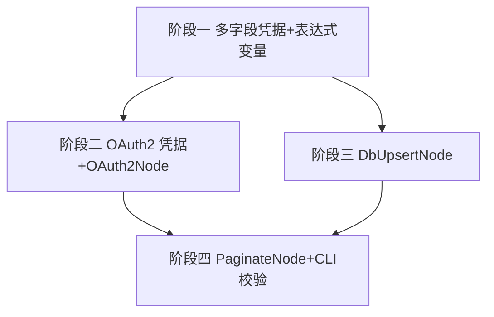

# 开发计划：集成基础能力——多字段凭据、通用 OAuth2、数据库写入（plan-004-integration-foundations）

> 关联发现记录：[`task-003-dingtalk-sync-via-cli.md`](task-003-dingtalk-sync-via-cli.md)（S1/S2/S3/S4/S5/S8/S9；其中 **S5 延迟处理**，见 §1.4）。

## 1. 概述

### 1.1 背景

通过 CLI 端到端创建「钉钉员工信息同步到指定数据库」工作流时，暴露出引擎当前不具备的关键能力（见 task-003）。本计划补齐让该流程成立的最小、通用能力集，**不绑定任何具体 SaaS 平台**。

### 1.2 目标

- 提供**通用 OAuth2 凭据/节点能力**（必须）：可配置 `tokenUrl` 的 client_credentials 授权，引擎托管令牌的获取 / 缓存 / 过期刷新 / 错误重试；兼容云端与**本地/私有化部署**端点。
- 补齐**多字段凭据容器 + 表达式变量模型**（必须前置）：使 `clientId`/`clientSecret`/`connectionString` 等多字段可在节点参数中安全引用，不硬编码进工作流 JSON。
- 提供**通用数据库写入节点 `DbUpsertNode`**（必须）：把任意上游数据流 upsert 进 PostgreSQL / MySQL / SQL Server。
- 提供**通用游标分页节点 `PaginateNode`**（必须，配合 OAuth2 路径做全量拉取）：反复触发上游 HTTP 直到终止条件。

### 1.3 覆盖范围

- 凭据类型注册表 + 多字段 schema + `$credentials.<name>.<field>`（含 oauth2 的 `accessToken`）表达式引用（`$` 前缀内建）。
- `oauth2` 凭据类型及其令牌生命周期管理（缓存/刷新/重试）。
- `OAuth2Node`（薄封装，把托管令牌物化为工作流变量，供 query 形态 API 使用）。
- `DbUpsertNode`、`PaginateNode`（新增于 `FlowEngine.Plugins.Standard`）。
- CLI：`credential create --type` 校验、`credential types` 列表、`workflow validate`（离线结构校验，呼应 task-003 S6/S7）。

### 1.4 不覆盖范围

- **平台专用 SDK 包装节点（如钉钉/企业微信节点）默认不实现**，留作未来扩展模板：其形态为「引用官方 SDK 程序集 + 薄封装、暴露多个 operation、一个节点匹配一个平台」。本计划仅在 §5 记录该方向，不排期。
- **S5（SetNode 不支持表达式）延迟处理**：不在本计划实现。目标流程中的简单字段映射暂用 `script` 节点完成（见 draft 的 `map-fields`）；后续单独立项补齐 SetNode 表达式支持（纳入本计划统一的「函数式 + 省略式」表达式模型），届时可用 SetNode 替代 script。
- `authorization_code` 等交互式授权、外部凭据保险库（Vault/KMS）对接——列入后续计划。

### 1.5 设计决策（供评审）

| 决策点 | 结论 | 理由 |
|--------|------|------|
| 集成主路径 | **通用 OAuth2 + httpRequest**（必须） | 本地部署的私有化端点，官方 SDK 云假设不成立，只有可配置 `tokenUrl` 的通用 OAuth2 能兜底 |
| 平台专用节点 | **默认不做，留作未来模板** | 一个节点 = 一个平台 + 一个 SDK 程序集；当前先用通用能力覆盖，避免过度膨胀 |
| 令牌生命周期归属 | 放**凭据层**（非节点内） | 天然解决「拿到 token 就不需要再请求」：令牌按 `credentialName+endpoint+scope` 持久缓存、跨运行复用，运行时不再重复请求；节点仅消费 |
| 多字段凭据 | 新增**类型注册表 + 字段 schema** | 当前 `Credential Type` 是任意字符串、只暴露 `apiKey` 单字段（task-003 S3/S8） |
| 表达式统一模型 | **`$` 前缀变量注入 + 字符启发式识别 + `return (expr)` 包裹求值**；函数式 `ctx =>` + Acornima AST 三分类为规划中未实现 | 实际落地：`ParameterResolver.IsExpression` 为字符启发式（纯字面/`s_knownIdentifiers`命中/含运算字符），`JsEngine` 统一以 `return (expr)` 包裹求值。`$` 前缀变量注入清单已落地（S9 变量部分）；AST 三分类与函数式双写法尚未实现。IfNode/FilterNode 已改走统一表达式引擎。 |

### 1.6 实施状态（截至 2026-07-09 评审6）

> 以下标记本轮**已落地**的代码改动（已构建 + 测试通过：Core 52/52、Runtime 170/170）。未标记项见 §3 仍为待实施或需核对既有提交。

- [x] **阶段一·核心任务2：`$credentials.<name>.<field>` 表达式引用（含 oauth2 `accessToken`）**
  - 工厂经 `PreloadCredentialsAsync` 逐名 `GetCredentialByNameAsync` 预加载为 `Dictionary<name, Dictionary<field,value>>`，支持 `$credentials.dingtalk.accessToken` 属性式访问。
  - 证据：`backend/FlowEngine.Runtime/Executor/NodeExecutionContextFactory.cs`、`tests/.../Expressions/ParameterResolverTests.cs`（新增 `$credentials` 属性式访问测试，断言 `tok-xxx`）。
- [x] **阶段一·核心任务3：统一表达式变量模型（顶层字段注入）——部分落地**
  - ✅ 已落地：通用核心 `$` 变量全部注入（`$json`/`$input`/`$items`/`$node`/`$workflow`/`$execution`/`$env`/`$vars`/`$now`/`$today`/`$runIndex`/`$itemIndex`/`$credentials`/`$ctx`）；`$input` 改为 n8n 式容器；`NodeExecutionContext.GlobalVariables` 供节点逐项求值复用。
  - ✅ 已落地：IfNode 删除自写 `ToBoolean`/`Compare` 解析器，改走 `ParameterResolver` 预求值；FilterNode 删除 `{{ $json }}` mustache 解析器，改走逐项 JsEngine 求值 + GlobalVariables 注入。
  - ❌ 未落地：Acornima AST 三分类（Function/Expression/Script）、函数式 `ctx =>` 双写法、`$items(name?)`/`$node['N']` 引用机制。
  - 证据：`ParameterResolver.cs`（字符启发式 `IsExpression`）、`IfNode.cs`（`ResolvedParameters`）、`FilterNode.cs`（逐项 JsEngine）、`NodeExecutionContext.cs`（`GlobalVariables`）。
- [x] **阶段一·安全修正**
  - 从 `s_forbiddenIdentifiers` 移除 `"Function"`（`new Function`/`Function()` 已由 `JsEngine.DisableStringCompilation()` 运行时封死）。
  - `ContainsWord` 重写为跳过字符串/模板字面量与注释，仅匹配真正标识符——**修复了 `"http://..."`/`"https://..."` 字面量被误判为禁止标识符、所有 URL 表达式被拒**的隐藏 bug（draft 的 `https://oapi.dingtalk.com/...` 亦受影响）。
  - 证据：`backend/FlowEngine.Runtime/Expressions/ParameterResolver.cs`、新增测试 `Resolve_UrlStringContainingHttp_IsNotBlocked`。
- [x] **节点私有变量机制（设计纠偏，替代「全部注册顶层」）**
  - 第 2 层节点特有变量**不注入工厂顶层、不硬编码**：工厂 `INodeExecutionContextFactory.CreateAsync` 新增节点无关的 `extraGlobals` 钩子（`IReadOnlyDictionary<string,object?>`），各节点在 `ExecuteAsync` 本地注入自身私有变量。工厂保持节点无关、全局不膨胀；新节点零注册（呼应「莫非每个节点变量都要注册顶层」）。
  - `s_knownIdentifiers` 仍登记节点特有名（`$cursor`/`$nextCursor`/`$page`/`$response`/`$payload`/`$tool`，第33行）以便纯引用被 `IsExpression` 识别为表达式；**实注入**走 `extraGlobals`。
  - 证据：`backend/FlowEngine.Core/Abstractions/INodeExecutionContextFactory.cs`、工厂实现、新增测试 `CreateAsync_InjectsNodeLocalExtraGlobals`。
- [x] **阶段四·核心任务1：`PaginateNode` 实现（内置 HTTP 循环 + 游标推进）**
  - 每轮迭代经 `extraGlobals` 注入 `$cursor`/`$nextCursor`/`$page`/`$response`；按 `nextCursorPath` 提取下一游标覆盖、按 `itemsPath` 抽取数组打平为单一 item 流；`terminateWhen` 含 `$nextCursor`/`$page`/`$response`；可选 Bearer/ApiKey/BasicAuth 头；POST `bodyExpression` 解析；HTTP 响应体取输出信封 `.body`。
  - 证据：`plugins/FlowEngine.Plugins.Standard/PaginateNode.cs`、新增 `tests/FlowEngine.Runtime.Tests/Plugins/PaginateNodeTests.cs`（桩 HttpMessageHandler 模拟分页，验证 3 页 × 2 条 = 6 条、游标 0→1→2 推进、`terminateWhen` 终止）。
- [x] **清理：删除死代码 `CredentialsContainer`**（工厂改用 `PreloadCredentialsAsync` 直连 `ICredentialAccessor`，`CredentialsContainer` 仅自测引用）。

- [x] **阶段一·核心任务1**：凭据类型注册表 + 字段 schema、CLI `credential create --type` 校验 / `credential types` 列举。
  - 证据：`backend/FlowEngine.Core/Credentials/CredentialTypeRegistry.cs`、`cli/src/commands/credentials.ts`。
- [x] **阶段二**：`oauth2` 凭据类型 + 令牌服务（获取/缓存/刷新/重试）+ `OAuth2Node` 薄封装。
  - 证据：`backend/FlowEngine.Runtime/Credentials/OAuth2TokenService.cs`、`plugins/FlowEngine.Plugins.Standard/OAuth2Node.cs`。
- [x] **阶段三**：`DbUpsertNode`（PG/MySQL/MSSQL 方言适配、参数化 SQL）。
  - 证据：`plugins/FlowEngine.Plugins.Standard/DbUpsertNode.cs`。
- [x] **阶段四·核心任务2**：CLI `workflow validate` 离线结构校验 / `guide` 缺口提示。
  - 证据：`cli/src/commands/workflows.ts`、`cli/src/commands/guide.ts`、`cli/src/commands/builtInNodeTypes.ts`。
- [x] **文档同步**：`credentials.md` / `expression-system.md` / `node-system.md` 补充新设计（接口签名）。
  - 证据：本轮已更新三篇文档。

## 2. 交付物清单

- 代码：
  - `backend/.../Credentials/`：凭据类型注册表、oauth2 令牌服务（获取/缓存/刷新/重试）。
  - `backend/.../Expression/`：`CredentialAccessor` 扩展支持 `$credentials.<name>.<field>` 与 `accessToken`。
  - `plugins/FlowEngine.Plugins.Standard/`：`DbUpsertNode.cs`、`PaginateNode.cs`、`OAuth2Node.cs`。
  - `cli/src/commands/`：`credential.ts`（type 校验 + `types` 子命令）、`workflows.ts`（`validate` 子命令）。
- 测试：凭据注册表、oauth2 令牌缓存/刷新（mock token 端点）、DbUpsert（测试库/SQLite）、Paginate（mock 分页 API）、CLI validate。
- 文档：更新 `docs/architecture/credentials.md`、`expression-system.md` 增加新设计（接口签名）；新增/补充 `node-system.md` 节点说明。

## 3. 开发阶段

### 阶段一：多字段凭据容器 + 表达式变量模型

- 目标：让凭据支持多字段，并能在任意节点参数表达式中引用。
- 核心任务：
  1. 定义凭据类型注册表与字段 schema；CLI `credential create --type` 按 schema 校验必填字段，`credential types` 列出已知类型。
  2. 扩展 `CredentialAccessor`，在表达式上下文注入 `$credentials.<name>.<field>`（`$` 前缀内建，见本阶段表达式模型）。
  3. 统一表达式变量模型（呼应 task-003 S9；**替代此前评审稿中虚构的 `={{ }}` 包裹语法**——引擎实际并无该包裹，见下「实现要点」）：将现状 4 套互相矛盾的约定收口为**单一表达式引擎语义**（实现于 `JsEngine` / `ParameterResolver`），规则如下：

     > **实施注记（2026-07-10）**：下方"两种写法"与"AST 三分类"为**规划目标，尚未实现**。当前实际实现为字符启发式 `IsExpression` + `return (expr)` 统一包裹。已落地部分：`$` 变量注入清单、IfNode/FilterNode 解析器统一、`NodeExecutionContext.GlobalVariables` 逐项求值复用。AST 三分类与 `ctx =>` 双写法留待后续。

     - **两种写法，同一语义**（规划中，未实现）：
       - 函数式：`ctx => <expr>` 或 `({ $json }) => <expr>`，参数 `ctx` 为上下文 bundle（属性即下方 `$` 顶层字段，如 `ctx.$json` / `ctx.$input`）；也支持 `function f(ctx){...}` / `function({ $json }){...}` 函数声明/表达式。
       - 省略式（裸式）：直接写表达式或语句，如 `({ dept_id: 1, page: $page })`、`$json.status === 'active'`、`const x = $input.first(); return x * 2`。
     - **先判函数，否则包裹运行**（规划中，未实现。当前统一走 `return (expr)` 包裹）：
       1. 解析表达式顶层 AST 节点类型：顶层为 `ArrowFunctionExpression` / `FunctionExpression` / `FunctionDeclaration` → **Function** 类；顶层为单条 `ExpressionStatement`（非函数）→ **Expression** 类；其它（多条语句、`const`/`let`/`var`、控制流、单条 `return`）→ **Script** 类。
       2. 按类选择包裹并求值：
          - Function：`const __fn = (<raw>); return typeof __fn === 'function' ? __fn(ctx) : __fn;`（自动以 `ctx` bundle 调用；误判非函数则原样返回）。
          - Expression：`return (<raw>);`（隐式 return）。
          - Script：`return (function(){ <raw> })();`（多行需手写 `return`，不写则返回 `undefined` → 经 `ToClrValue` 得 `null`）。
       3. 求值前注入 `$ctx` 全局 = 上下文 bundle，同时把 bundle 各 `$` 字段逐设为同名 `$` 全局（如 `$json`/`$input`/`$items`/`$node`…），保证省略式与函数式都能引用。
     - **顶层字段（`$` 前缀 = 引擎内建，裸名 = 用户数据）**：
       - **命名铁律**：所有 `$` 开头的变量都是引擎内建（AI 配置时可直接用，且与用户数据字段永无冲突）；表达式里**裸写**的任何名字都视为用户数据或自定义变量。本规则用于区分「参数/内建」与「用户数据」，并避免 `json`/`input` 等通用词与用户字段冲突。**不做** `$if`/`$min`/`$max`（原生 `if`/`Math.min` 已覆盖）、`$jmespath`（按需）、`$('NodeName')` 配对回溯（本轮不做，AI 用 `$items('N')`/`$node['N']` 取完整批次）。
       - 第 1 层·通用核心（所有节点恒注入，`$` 前缀）：
         - `$json`：**当前 item 数据节点**（= `DataBatch` 当前 `runIndex` 项的 `Data` JsonNode），如 `$json.userid`。采用 `$` 前缀既符合 n8n 习惯、又避免与用户数据字段冲突（不叫裸 `input`）。
         - `$input`：**n8n 式输入容器**（默认注入，提供方法，AI 认知友好）：`item()`(当前 item，等价 `$json`) / `all()`(当前节点全部输入 item 数组) / `first()` / `last()` / `params`(本节点参数) / `context`(执行上下文 `{ executionId, runIndex, ... }`)。例：`$input.item().userid`。
         - `$items(name?)`：函数式。`$items('NodeName')` 取指定节点全部 item；`$items()` 取当前节点全部输入 item（等价 `$input.all()`）。
         - `$node['NodeName']`：指定节点输出对象，含 `.json`/`.params`/`.context`/`.runIndex`（键=节点名，含所有已成功执行节点）。
         - `$workflow` / `$execution` / `$env` / `$vars`(工作流级可写状态) / `$now` / `$today`(当日 00:00) / `$runIndex` / `$itemIndex` / `$credentials`(多字段凭据容器，含 oauth2 的 `accessToken`) / `$ctx`(上下文 bundle 自身；函数式 `ctx =>` 的等价引用)。
       - 第 2 层·节点/场景特有（**仅在该节点作用域本地注入**，全 `$` 前缀）：`$cursor`/`$nextCursor`/`$page`/`$response`(PaginateNode) / `$payload`(Webhook/触发器入口) / `$tool`(Agent 工具入参)。LoopNode 当前 item 复用 `$json`、序号复用 `$itemIndex`，不另设 `$item`/`$index`。
         - **注入机制（关键，评审6 落实）**：节点私有变量**不注册到工厂顶层、不由工厂硬编码**。工厂 `NodeExecutionContextFactory.CreateAsync` 提供节点无关的 `extraGlobals` 钩子（`IReadOnlyDictionary<string,object?>`），各节点在 `ExecuteAsync` 中把自身私有变量（如 PaginateNode 每轮迭代的 `$cursor`/`$nextCursor`/`$page`/`$response`）作为 `extraGlobals` 传入，工厂在注入第 1 层通用核心后再注入这些本地变量。效果：工厂保持节点无关、全局不膨胀；新增节点照此办理、零注册（呼应「莫非每个节点变量都要注册顶层」）。`s_knownIdentifiers` 仍登记这些节点特有名（第33行）以便纯引用被 `IsExpression` 识别为表达式，但**实注入**走 `extraGlobals`。
       - **冲突策略**：用户数据项若含与内建同名（裸）字段，内建 `$` 变量不受影响（前缀隔离）；裸写的同名标识符指向用户数据。`$` 清单见文档。
     - **安全修正（必须）**：`ParameterResolver.s_forbiddenIdentifiers` 含 `"Function"`，而 `ContainsWord` 为 `OrdinalIgnoreCase`，会误杀小写 `function` 关键字（所有函数声明/表达式被 `SecurityViolationException` 拒绝）。修复：从静态禁止列表移除 `"Function"`（真正的 `new Function`/`Function()` 构造器已由 `JsEngine` 的 `o.DisableStringCompilation()` 在运行时封死），或细化为「值用法」匹配。
     - **兼容与迁移**：`IsExpression` 启发式保留（`function`/`=>`/`(` 等已能识别函数为表达式）；旧式 `input.name`、`input.status == 'active'` 等不含 `=>` 的表达式走 Expression/Script 类自然兼容，不立即 break 存量流程。
     - **统一落点**：`httpRequest` 的 url/header/body、`DbUpsert` 的 `connection`/`columns`、`IfNode`/`FilterNode` 条件，全部走同一表达式引擎；**已删除 `IfNode` 自写 `==` 解析器（改走 `ParameterResolver` 预求值）与 `FilterNode` 的 `{{ $json }}` 解析器（改走逐项 JsEngine 求值 + `GlobalVariables` 注入）**。`SetNode`(S5 后续) 待补齐。
- 输入：`CredentialService`、`FlowConstants.CredentialFields`、`CredentialAccessor`、`ParameterHydrator`。
- 输出：多字段凭据可建、可在表达式中引用；CLI 有类型校验与列举。
- 验收标准：
  - 单测：注册表按 type 返回字段 schema；未知 type 被拒；`$credentials.db.connectionString` 在表达式（`$` 前缀内建）中正确解析。
  - CLI：`credential create --type connectionString` 缺 `connectionString` 字段时报错；`credential types` 输出含 `connectionString`/`oauth2` 及其字段。
- 依赖：无（基础能力）。

### 阶段二：通用 OAuth2 凭据类型 + OAuth2Node

- 目标：提供可配置 `tokenUrl` 的 client_credentials 授权，引擎托管令牌生命周期。
- 核心任务：
  1. `oauth2` 凭据类型：`tokenUrl`/`clientId`/`clientSecret`/`scope`/`grant`，新增 **`tokenPath`**（响应 JSON 中取令牌的路径，默认 `access_token`，兼容非标准响应结构，如 `result.access_token`）。
  2. 令牌服务：首次获取 → 按 `credentialName+endpoint+scope` **持久缓存** → 过期前 N 秒**刷新** → 对 5xx/超时**指数退避重试**；支持 refresh_token 续期。
  3. 表达式暴露 `$credentials.<name>.accessToken`（`$` 前缀内建，见 §3 阶段一），覆盖「Bearer 形态」（`httpRequest` 的 `auth: credential=<oauth2>`）与「query 形态」（`Url` 表达式内拼接 `?access_token=` + `$credentials.x.accessToken`）。
  4. `OAuth2Node`：**仅作薄封装**——把凭据层已托管（已缓存/刷新）的令牌物化为工作流变量（供显式控制或 `?access_token=` 这类 query 形态使用），**底层复用同一凭据缓存，绝不每运行都重新请求 token**（呼应 task-003 S2「方案 B」，非独立 token 获取节点）。
  5. 定义 `httpRequest` 请求体格式规范：`bodyExpression` 统一为 JS 表达式（按 §3 阶段一的表达式引擎求值，结果作为请求体对象）；支持函数式 `ctx => ({...})` 与省略式 `({...})`/`$json.x` 两种写法，无需包裹前缀。明确 `method`/`url`/`headers` 的表达式解析规则（呼应 task-003 S9 与 §3 阶段一）。
- 输入：阶段一的多字段凭据与表达式变量；`HttpRequestNode` 的 `Authentication` 枚举。
- 输出：oauth2 凭据可建并自动维护令牌；HTTP 节点可消费。
- 验收标准：
  - 单测（mock token 端点）：首次调用发请求；第二次在有效期内**不发请求**直接复用缓存（验证「不重复请求」）；快过期时触发刷新；5xx 返回时按退避重试且最终成功。
  - 集成：用 mock OAuth 端点 + `httpRequest` 跑通「取令牌 → 带令牌请求受保护资源」。
- 依赖：阶段一。

### 阶段三：DbUpsertNode

- 目标：通用数据库 upsert。
- 核心任务：
  1. 参数：`connection`（引用 `$credentials.db.connectionString` `$` 前缀内建）、`table`、`mode`(upsert/insert/update)、`keyColumns`、`columns` 映射。
  2. 方言适配（PG/MySQL/MSSQL）经 connection 字符串或 `dialect` 参数区分；参数化 SQL，禁止字符串拼接字段名。
  3. 入参为上游 `DataBatch`，逐行 upsert，输出受影响行数/成功数。
- 输入：阶段一的多字段凭据（connectionString）；`DataBatch`/`DataItem` 模型。
- 输出：`DbUpsertNode` 可执行并通过测试库验证。
- 验收标准：
  - 单测（SQLite 或测试库）：首次 upsert 插入、二次 upsert 更新（按 `keyColumns`）；字段值经参数化绑定、无注入。
  - `connection` 通过表达式引用凭据，不出现在工作流明文。
- 依赖：阶段一。

### 阶段四：PaginateNode + CLI 离线校验

- 目标：支撑全量拉取（cursor 分页），并补齐 CLI 建流程前的本地校验。
- 核心任务：
  1. **PaginateNode 采用「内置 HTTP 循环」架构**（架构决策见下）：节点自身持有 HTTP 请求配置，内部反复发起请求、提取下一页游标、汇聚结果，直到终止条件。 draft 不再保留独立的 `list-users`(httpRequest) 节点，分页与取数由 PaginateNode 一体内化。
     - **为什么不是引擎级子流程回环**：当前 `LoopNode` 仅对已有 `DataBatch` 分批，不会重调上游（task-003 S4）；在连接引擎层增加「回环到某节点并重注入参数」成本高，且与现有端口模型冲突。把分页循环收敛进节点内部、复用既有 HTTP 客户端与 oauth2 凭据，实现最简最稳。
     - **游标推进机制（关键）**：PaginateNode 在每次迭代向请求表达式作用域注入 `$cursor` 全局（初值 = `cursorInitial`，类型由 `cursorType` 决定：number/string）；`url`/`bodyExpression` 通过 `$cursor` 引用它。响应返回后按 `nextCursorPath` 提取下一游标并覆盖，直至 `terminateWhen`（表达式，作用域含 `$nextCursor`/`$page`/`$response` 全局）为真。**下一轮请求必然携带更新后的游标，不再恒为初值 0。**
     - **关键参数（接口签名）**：
       ```csharp
       public class PaginateNodeParameters {
           public string Url { get; set; }            // 支持 $credentials... / $cursor 全局（§3 阶段一表达式引擎）
           public string Method { get; set; } = "GET";
           public string? BodyExpression { get; set; } // JS 表达式（§3 阶段一引擎），作用域含 $cursor 全局；无需包裹前缀
           public string? CredentialName { get; set; } // 复用 oauth2 凭据（Bearer 或供表达式取 token）
           public string CursorInitial { get; set; } = "0";
           public string CursorType { get; set; } = "string"; // number | string（实现默认 string）
           public string NextCursorPath { get; set; }  // 响应中下一游标路径，如 result.next_cursor
           public string ItemsPath { get; set; }       // 响应中本页数组路径，如 result.list
           public string TerminateWhen { get; set; }   // 表达式（§3 阶段一引擎），作用域含 $nextCursor/$page/$response 全局
       }
       ```
     - **输入/输出语义（澄清）**：`PaginateNode` **不是对已有 `DataBatch` 做分批**（那是 `LoopNode` 职责），而是**对「内置 HTTP 请求」做循环拉取**——每次迭代用当前 `$cursor` 发请求、取回一页、按 `itemsPath` 抽取数组、**将所有页的数组元素打平（flatten）为单一 item 流**。
     - **输出端口**：`Output` 汇聚后发出**一个 `DataBatch`，其中每个 `DataItem` = 某页 `itemsPath` 数组的一个元素（整体打平）**，全量拉取完成后发一次 → 接 `map-fields` 等映射/落库节点。~~可选 `Page`（每页一次）~~——原计划声明但未实现，已删除空悬端口定义，后续按需补回。例：DingTalk `result.list[]` 跨页打平后，每个 item 即一个 `userid/name/dept_id` 用户对象，故 `map-fields` 用 `$input.item().userid` 取值（`$input` 为 n8n 式输入容器，见 §3 阶段一；等价于 `$json.userid`）。
  2. CLI `workflow validate <file>`：基于已缓存/内置节点 schema 本地校验节点类型、端口、连接图（呼应 task-003 S6/S7）；`--dry-run` 增加基础结构校验；`guide` 在 `incomplete` 时显式提示能力缺口。
- 输入：阶段二（OAuth2 + httpRequest）、阶段三（DbUpsert）；CLI 现有 `node-types`/`workflows`/`guide` 命令。
- 输出：可用 `PaginateNode` 跑通「OAuth2 取令牌 → 带令牌分页拉全量 → 落库」；CLI 建流程前可本地发现非法节点/缺口。
- 验收标准：
  - 集成（mock 分页 API）：`PaginateNode` 按 `nextCursorPath` 推进游标、循环直到 `terminateWhen`，汇聚全部页；**断言下一轮请求确实携带递增/更新的游标（不再恒为初值 0）**。
  - CLI：`workflow validate` 对含不存在节点类型的草稿报错；`guide` 离线时提示「未连接后端，节点清单不可用 / 已知缺口」。`workflow create --dry-run` 至少校验节点类型存在。
- 依赖：阶段二、阶段三。

## 4. 阶段依赖图



## 5. 风险与待定项

| 风险/待定 | 影响 | 应对 |
|-----------|------|------|
| 平台专用节点形态（未来） | 一个节点 = 一个 SDK 程序集 + 薄封装、暴露多方法 | 本计划不排期；后续单独立项，复用阶段一/二的凭据与表达式基础设施 |
| OAuth2 本地部署端点差异 | 私有化 host / 自签证书 | `tokenUrl` 可配置；预留跳过证书校验开关（安全评审） |
| 令牌缓存持久化位置（介质待定） | **设计意图是跨运行复用**（首次获取后缓存、过期前刷新）；待定的是*介质*：内存 / 文件 / Redis，需避免多实例冲突 | 先内存+可选持久化，多实例用共享缓存；与 task-003 S2 方案A「持久缓存」不矛盾（意图一致，仅介质未定） |
| 方言 SQL 差异 | upsert 语法不同 | 方言策略模式；单测覆盖三种方言关键路径 |
| CLI 离线 schema 来源 | `validate` 需节点 schema | 后端不可用时回退内置/缓存 schema，并提示缺口 |

## 6. 验收总标准

- 端到端（用 mock OAuth + mock 分页 API + 测试库）：`manualTrigger → PaginateNode(内部 OAuth2 取令牌 + 带令牌游标分页拉全量) → 字段映射(script 节点，S5 延迟期用此) → DbUpsertNode 落库` 跑通，凭据无明文硬编码；验证下一轮请求确实携带更新的游标（不再恒为初值）。
- 单元/集成测试覆盖：凭据注册表、oauth2 令牌缓存/刷新/重试、DbUpsert 幂等、Paginate 终止。
- CLI：`credential types`/`create --type` 校验、`workflow validate` 离线校验均工作。
- 文档：`credentials.md`、`expression-system.md` 已补充新设计（接口签名），与代码一致。

## 7. 变更记录

| 日期 | 修改人 | 修改内容 | 关联任务 |
|------|--------|----------|----------|
| 2026-07-09 | Agent | 创建集成基础能力计划：OAuth2（必须）+ 多字段凭据 + DbUpsert + Paginate；平台专用 SDK 节点列为未来模板 | task-003 |
| 2026-07-09 | Agent | 评审1 修复：S5 纳入关联并声明延迟；PaginateNode 改为「内置 HTTP 循环」架构并明确游标推进机制；统一 `={{ }}` 表达式前缀；oauth2 增 `tokenPath`；定义 bodyExpression 格式；Done 端口改为 Output→映射；验收补映射步骤。同步 draft | 评审1 |
| 2026-07-09 | Agent | 评审2（修改前评审）复核：PaginateNode 输出形态/打平语义澄清；OAuth2Node 定位强化为薄封装复用缓存（呼应 task-003 S2 方案B）；§1.2 括号笔误修正；§5 缓存意图/介质矛盾澄清；task-003 S2/S4/S9 交叉引用；draft 占位符改 `<...>` | 评审2 |
| 2026-07-09 | Agent | 评审3：删除虚构的 `={{ }}` 包裹语法（与引擎实际不符）；统一表达式模型改为「函数式 `ctx =>` + 省略式双写法、Acornima AST 分类、无包裹前缀、两分法顶层字段」；同步修正 §1.3/§1.5 的 `$credentials`→`credentials`、阶段二/四的 `={{ }}`/`$cursor`/`$nextCursor`/`$page`/`$response`/`$input` 引用；同步 workflows/dingtalk-sync-draft.json（去 `={{ }}`/`$` 前缀、对象字面量包 `()`）；补安全修正（移除禁止列表 `Function`）；IfNode/FilterNode 解析器统一收口。**实现注意**：须把全套 `$` 前缀内建变量（`$json`/`$input`/`$items`/`$node`/`$workflow`/`$execution`/`$env`/`$vars`/`$now`/`$today`/`$runIndex`/`$itemIndex`/`$credentials`/`$ctx` 及节点特有 `$cursor`/`$nextCursor`/`$page`/`$response`/`$payload`/`$tool`）补入 `ParameterResolver.s_knownIdentifiers`，否则 `$credentials.x`/`$input.item()` 这类纯引用因无运算符字符不会被 `IsExpression` 识别为表达式 | 评审3 |
| 2026-07-09 | Agent | 评审5：命名规则改为「`$` 前缀 = 引擎内建、裸名 = 用户数据」（用户决策：AI 配置流程，需符合 AI 认知 + 避免 `json`/`input` 等通用词与用户字段冲突）；通用核心变量全面 `$` 前缀化（`$json`/`$input`+方法/`$items()`/`$node`/`$workflow`/`$execution`/`$env`/`$vars`/`$now`/`$today`/`$runIndex`/`$itemIndex`/`$credentials`/`$ctx`），砍掉裸 `input`/`items`/`nodes`/`workflow`/`credentials` 等；节点特有变量也 `$` 前缀（`$cursor`/`$nextCursor`/`$page`/`$response`/`$payload`/`$tool`），Loop 复用 `$json`+`$itemIndex`；兼容 `$input` 方法（AI 认知，n8n Code 节点高频）；不做 `$if`/`$min`/`$max`/`$jmespath`/`$('N')` 配对回溯；同步 workflows/dingtalk-sync-draft.json（`credentials`→`$credentials`、`cursor`→`$cursor`、`nextCursor`→`$nextCursor`）；评审3 实现注意补全套 `$` 清单 | 评审5 |
| 2026-07-09 | Agent | 评审4：新增 n8n 式 `$input` 输入容器（默认注入），提供 `item()`/`all()`/`first()`/`last()`/`params`/`context` 方法，与裸 `input`（当前 item 数据节点，无方法）共存；draft 的 `map-fields.code` 改回 `$input.item().userid` 演示 n8n 习惯，§3 阶段四输出端口示例同步；§7 评审3 实现注意补 `$input` 入 `s_knownIdentifiers` | 评审4 |
| 2026-07-09 | Agent | 评审6（实施标记）：本轮代码已落地——阶段一 `$credentials.<name>.<field>` 属性式注入（含 oauth2 `accessToken`）、统一表达式顶层字段（`$json`/`$input`/`$items`/`$node`/`$workflow`/`$execution`/`$env`/`$vars`/`$now`/`$today`/`$runIndex`/`$itemIndex`/`$credentials`/`$ctx`）、`$input` camelCase 方法容器、安全修正（移除禁止列表 `Function` + `ContainsWord` 跳过字符串/模板字面量修复 `https://` 误杀）、节点私有变量改由工厂 `extraGlobals` 钩子本地注入（不注册顶层，第2层 `s_knownIdentifiers` 仍登记供 `IsExpression` 识别）、`PaginateNode` 实现（内置 HTTP 循环 + 游标推进 + `itemsPath` 打平 + `terminateWhen` + 可选认证头）、删除死代码 `CredentialsContainer`；评审3「实现注意」中的全套 `$` 登记已落实（`ParameterResolver.cs` 第21-34行），并澄清节点特有实注入走 `extraGlobals` 而非工厂顶层。详见 §1.6 实施状态。验证：Core 52/52、Runtime 170/170 通过 | 评审6 |
