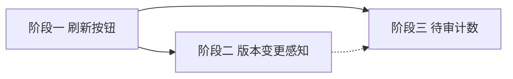

# 开发计划：AI 草稿审批与版本变更感知（plan-ai-draft-ux）

## 1. 概述

AI 通过 MCP 工具（`assemble_workflow`/`modify_workflow`）创建或修改工作流草稿后，用户需要：
- 感知到新草稿的到达（而非靠浏览器手动刷新）。
- 在编辑器中审查改动并确认/拒绝（review 模式已有，但入口在列表页，不够直接）。
- 编辑器打开期间若被 AI 外部修改，能感知到版本变更并加载新版。

本计划补齐这三段体验，让「MCP 装配 → 人类审查 → 确认执行」闭环流畅。

### 已有基础（代码已就绪，不重复开发）

| 能力 | 位置 |
|------|------|
| `StructuredDiff` 类型（op/nodeId/field/before/after） | `types/workflow.ts:127` |
| `DiffPanel` 组件（增删改连接 diff，颜色编码 + hover 高亮） | `components/ParameterPanel/DiffPanel.tsx` |
| `reviewMode`（画布只读 + 参数只读 + 显示审查面板） | `stores/workflowStore.ts` + 各组件条件渲染 |
| `confirmWorkflow` / `rejectDraft` API 与按钮 | `WorkflowEditorPage.tsx:100-121` |
| 列表页 "AI Draft·待审" badge | `WorkflowListPage.tsx:362-363` |
| `Workflow` 含 `diff`/`draftStatus`/`source` 字段 | `types/workflow.ts:150-166` |
| `WorkflowSummary` 含 `diff`/`draftStatus`/`source`/`version` | `types/workflow.ts:168-187` |
| `useRequest` 的 `refreshWorkflows` 方法 | `WorkflowListPage.tsx:105` |

## 2. 交付物清单

### 2.1 列表页刷新按钮

- `src/components/WorkflowList/WorkflowListPage.tsx`：在工具栏区新增"刷新"按钮（`RefreshCw` 图标），调用已有的 `refreshWorkflows()`。
- 刷新时显示加载态（`loading` 已由 `useRequest` 返回），防止重复点击。

### 2.2 编辑器版本变更感知

- `src/pages/WorkflowEditorPage.tsx` 或新建 hook `useWorkflowVersionPolling`：
  - 编辑器打开后以固定间隔（如 30s）调用 `getWorkflow(id)`（或 `api.ts` 已有封装）。
  - 比对返回的 `version` 值与当前 store 中的 `workflowVersion`。
  - 若检测到版本号变更，弹出 Banner/Notification：「此工作流已被外部修改（v{N} → v{M}），点击加载新版？」。
  - 用户确认后重新调用 `loadWorkflow(id)`，刷新整个编辑器状态。
- **仅在非 reviewMode、非 execution 进行中时启用轮询**，避免干扰审查和执行流程。
- 工作流未加载或 `id === "new"` 时不启动轮询。

### 2.3 待审计数

- `src/components/Layout/HeaderToolbar.tsx`：在「系统管理」菜单或 Header 单独区域，显示待审 AI 草稿数量。
- 使用 `useRequest` 拉取 `getWorkflows()`，前端过滤 `source === 'ai' && draftStatus === 'pending'`，取 `.length` 显示为 Badge。
- 可选：点击跳转到工作流列表或审批视图。

### 2.4 （本期不做）专用审批页

- 暂不创建 `/admin/approvals` 页面。
- 当前通过工作流列表 + 编辑器 review 模式完成审查闭环。
- 等草稿量大后再做独立审批队列页。

## 3. 现有改造点（需修改的既有文件）

| 文件 | 改造内容 |
|------|----------|
| `src/components/WorkflowList/WorkflowListPage.tsx` | 新增刷新按钮（`RefreshCw` + `refreshWorkflows`） |
| `src/pages/WorkflowEditorPage.tsx` | 注入版本轮询 hook，检测变更后弹 Banner 提示加载新版 |
| `src/hooks/` | 新增 `useWorkflowVersionPolling.ts`（轮询检测版本变更） |
| `src/components/Layout/HeaderToolbar.tsx` | 新增待审计数 Badge（admin 可见，点进列表） |
| `src/services/api.ts` | 若 `getWorkflow` 对轻量版请求不理想，可考虑新增 `getWorkflowVersion(id)` 轻量端点（可选） |

## 4. 开发阶段

### 阶段一：列表页刷新按钮

- 目标：用户可一键刷新列表，无需浏览器刷新。
- 核心任务：
  - `WorkflowListPage` 工具栏区添加 `<ActionIcon>` 刷新按钮，`onClick={refreshWorkflows}`。
  - 刷新期间按钮显示旋转动画或 disabled。
- 输入：`useRequest` 的 `refreshWorkflows` 已在 `:105` 可用。
- 验收标准：
  - 点击刷新按钮，列表重新加载，加载期间按钮显示旋转动画。
  - 刷新后新增/删除的工作流正确反映。

### 阶段二：编辑器版本变更感知

- 目标：编辑器打开期间若被 AI 外部修改，用户能感知并加载新版。
- 核心任务：
  - 新建 `useWorkflowVersionPolling(workflowId, currentVersion)` hook：
    - 30s 间隔轮询 `getWorkflow(workflowId)`（或轻量版本号端点）。
    - 比对 `version`，检测到变更时返回 `{ changed: true, newVersion }`。
    - 编辑器组件消费该值，弹出 Banner：「此工作流已被修改（v{old} → v{new}），点击加载新版」。
    - 用户点击"加载新版"后调用 `loadWorkflow(workflowId)`。
  - 轮询仅在 `workflowId` 有效、非 `reviewMode`、非 executing 时启用。
  - 编辑器卸载时清除轮询定时器。
- 输入：`api.ts` 的 `getWorkflow`、`store` 的 `loadWorkflow`。
- 验收标准：
  - 模拟外部修改（手动改数据库或调 MCP），编辑器在 30s 内弹出 Banner。
  - 点击加载，编辑器状态刷新为最新版，旧版画布/参数不复现。
  - 执行中/审查中不触发轮询。

### 阶段三：待审计数

- 目标：Admin 在 Header 即可看到有待审的 AI 草稿。
- 核心任务：
  - `HeaderToolbar` 中「系统管理」菜单旁或邮箱下拉区显示待审计数 Badge。
  - 使用 `useRequest(getWorkflows)` 轻量拉取列表，前端过滤 `source === 'ai' && draftStatus === 'pending'`。
  - 点击跳转到工作流列表页（可考虑加 `?filter=pending-ai` 查询参数）。

## 5. 阶段依赖图

阶段一和阶段三无依赖，可并行。

## 6. 风险与待定项

| 风险/待定项 | 影响 | 应对策略 |
|------------|------|---------|
| 轮询开销 | 编辑器页面 30s 一次 GET 请求，多个标签页时加倍 | `getWorkflow` 已有服务端缓存（EF Core 二级缓存待实现）；轻量版本号端点可进一步优化 |
| 版本变更时用户未保存的本地修改丢失 | 用户可能正在编辑，重载后丢失 | 检测到变更时先提示「当前有未保存的修改，是否放弃并加载新版？」；保存后再重载 |
| 待审计数用 `getWorkflows` 拉取全量列表 | `WorkflowSummary` 数组较大时浪费带宽 | 增加 `GET /workflows?status=pending&source=ai` 轻量计数端点（后端可选） |

## 7. 验收总标准（含验证用例）

- 列表页有刷新按钮，点击后列表正确刷新。
- 编辑器打开期间感知到外部版本变更，弹 Banner 引导加载新版。
- 管理员在 Header 看到待审计数 Badge。

**具体验证用例**：
1. 在工作流列表页点击刷新按钮，列表重新加载；刷新期间按钮旋转。
2. AI 通过 MCP `modify_workflow` 修改一个你正在编辑器打开的工作流，30s 内弹出「此工作流已被修改」Banner；点击加载新版，编辑器内容更新为最新版本。
3. 执行中打开编辑器，不触发轮询（无多余请求）；关闭编辑器后轮询停止。
4. AI 通过 MCP `assemble_workflow` 创建草稿后，Admin 在 Header 看到待审计数 +1；点击跳转列表页，刷新后看到新条目。

## 8. 测试要求

- 组件测试：刷新按钮点击后调用 `refreshWorkflows`。
- Hook 测试：`useWorkflowVersionPolling` 在版本变更时返回 `{ changed: true, newVersion }`；编辑器未加载时不启动轮询。
- 集成测试：MCP 创建草稿 → 列表页刷新后显示新条目。

## 变更记录

| 日期 | 修改人 | 修改内容 | 关联任务/PR |
|------|--------|----------|------------|
| 2026-07-15 | Agent | 初版 | 前端 UX 评审 |
