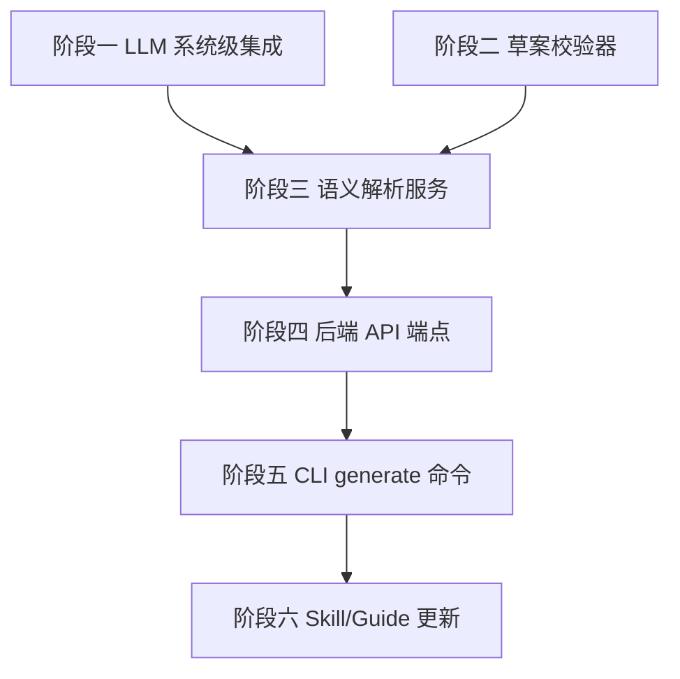

# AI 驱动 DSL 生成实施计划

> **⚠️ 已退役**：本计划实现的后端 DSL 生成能力（PromptTemplates / WorkflowGenerationService / `POST /api/v1/workflows/generate` / 全局 `AiOptions`）已由 [task-007-agent-ide-driven-dsl.md](task-007-agent-ide-driven-dsl.md) 移除。DSL 生成职责现转移到 **Agent IDE**（通过 CLI skill 掌握 DSL schema 与节点类型，直接生成 JSON，再由 CLI 校验/提交）。本文件仅作历史记录保留，不再反映当前架构。

> **目标（原）**：让 AI 通过自然语言描述自动生成 Flow Engine 工作流 DSL，经校验-纠错循环后通过 CLI 创建并执行。

**架构**：后端新增语义解析服务，将节点类型清单 + DSL Schema + Few-shot 示例构造为系统 Prompt，调用 LLM 生成工作流 JSON，经结构化校验后通过纠错循环修正。CLI 新增 `workflow generate` 命令调用后端 API，支持交互式确认后直接创建。

**技术栈**：C# / ASP.NET Core / OpenAI SDK / TypeScript CLI

## 全局约束

- LLM 配置通过 `appsettings.json` 的 `Ai` 节点管理，不硬编码
- 复用已有的 `ILlmClient` 接口（Core/Abstractions）和 `OpenAiLlmClient` 实现
- 生成的 DSL 必须通过结构化校验才能返回给用户
- 不自动创建工作流，需用户确认
- 复用 `INodeRegistry` 获取实时节点类型清单
- 遵循 EF Core LINQ 约束、RBAC 鉴权、审计日志规范

---

## 1. 概述

### 解决什么

当前 AI（如 TRAE 中的 AI 助手）要创建工作流，需完全理解 DSL 格式并手动编写 JSON。本计划实现语义解析层，让 LLM 根据自然语言描述 + 节点类型清单自动生成合法 DSL，经校验-纠错循环保证质量。

### 覆盖范围

- 后端：LLM 系统级集成、语义解析服务、校验-纠错循环、API 端点
- CLI：`workflow generate` 命令、交互式确认
- Prompt 工程：系统 Prompt 模板、节点类型序列化、Few-shot 示例
- Skill/Guide 更新：暴露 AI 生成能力

### 不覆盖范围

- 前端对话式编辑器（Enterprise 阶段）
- MCP 协议（Enterprise 阶段）
- Git 版本管理（Enterprise 阶段）
- JSON Config Agent（Enterprise 阶段）
- 钉钉专用节点（不做，用通用 OAuth2 + HTTP 组装）

---

## 2. 交付物清单

| 交付物 | 文件位置 | 说明 |
|--------|----------|------|
| LLM 配置选项 | `Core/Configuration/AiOptions.cs` | ApiKey / Model / Temperature / MaxTokens / BaseEndpoint |
| 系统级 LLM 客户端工厂 | `Infrastructure/Ai/SystemLlmClientFactory.cs` | 从配置创建 `ILlmClient` 实例并注册到 DI |
| 工作流草案校验器 | `Application/Workflows/WorkflowDraftValidator.cs` | 校验 DSL 结构、节点类型、端口方向、连接完整性、必填参数 |
| 语义解析服务 | `Application/Workflows/WorkflowGenerationService.cs` | Prompt 构造 + LLM 调用 + 校验纠错循环 |
| Prompt 模板 | `Application/Workflows/PromptTemplates.cs` | 系统 Prompt + 纠错 Prompt + Few-shot 示例 |
| 后端 API 端点 | `Host/Controllers/WorkflowsController.cs` | `POST /api/v1/workflows/generate` |
| CLI generate 命令 | `cli/src/commands/workflows.ts` | `workflow generate --description "..."` |
| 单元测试 | `tests/FlowEngine.Application.Tests/Workflows/` | 校验器 + 生成服务测试 |
| CLI 测试 | `cli/src/__tests__/workflows-commands.test.ts` | generate 命令测试 |
| Skill/Guide 更新 | `cli/src/commands/skill.ts` / `guide.ts` | 新增 generate 命令描述 + 生成能力说明 |

---

## 3. 前置依赖

| 依赖 | 状态 | 说明 |
|------|------|------|
| `ILlmClient` 接口 | 已存在 | `Core/Abstractions/ILlmClient.cs`，含 `ChatAsync` / `ChatStreamAsync` |
| `OpenAiLlmClient` 实现 | 已存在 | `Plugins.Standard/OpenAiLlmClient.cs`，支持自定义 BaseEndpoint |
| `INodeRegistry` | 已存在 | 运行时节点注册表，可获取所有已注册节点类型 |
| CLI 基础架构 | 已存在 | 认证、API 客户端、错误处理已完备 |
| `workflow validate` | 已存在 | CLI 端已有基础结构校验（可复用逻辑） |
| `WorkflowDryRunService` | 已存在 | 可用于验证生成的 DSL 是否可执行 |

### 并行修复项（影响端到端稳定运行）

| 编号 | 问题 | 影响 | 关联 |
|------|------|------|------|
| S2 | 钉钉取 token 形态与通用 OAuth2 不兼容 | 标准 client_credentials 无法请求钉钉 `gettoken`（GET+query appkey/appsecret+errcode 判定），`$credentials.dingtalk.accessToken` 取不到 | task-003 / plan-runtime-stability 阶段零 |
| S3 | ~~表达式无法引用 `$credentials.<name>.<field>`~~ | **已解决**：`PreloadCredentialsAsync` 已加载全部字段，`$credentials.<name>.<field>` 可用 | task-003 |
| S9 | ~~表达式变量模型不一致~~ | **基本解决**：变量模型已统一（expression-system.md §2.2.1）；SetNode 不支持表达式是残留问题（plan-runtime-stability 阶段一） | task-003 |

> S2 不阻塞 DSL 生成功能开发，但影响生成的钉钉工作流能否稳定运行。建议与本计划并行推进，S2（钉钉令牌适配）是钉钉场景端到端跑通的最高优先级前置。S3/S9 已解决或基本解决，不阻塞本计划。

---

## 4. 架构设计

### 4.1 数据流

```
用户自然语言描述
    │
    ▼
CLI: workflow generate --description "..."
    │
    ▼
POST /api/v1/workflows/generate
    │
    ▼
WorkflowGenerationService
    ├── 1. 从 INodeRegistry 获取节点类型清单
    ├── 2. 构造系统 Prompt（DSL Schema + 节点类型 + 示例 + 约束）
    ├── 3. 调用 ILlmClient.ChatAsync()
    ├── 4. 解析 LLM 响应为 JSON
    ├── 5. WorkflowDraftValidator 校验
    ├── 6. 校验失败 → 构造纠错 Prompt（错误列表 + 上次输出）→ 回到步骤 3
    └── 7. 达到最大重试次数 → 返回最后草案 + 错误清单
    │
    ▼
返回 { draft, valid, errors, attempts }
    │
    ▼
CLI 展示草案 → 用户确认 → workflow create
```

### 4.2 Prompt 设计

**系统 Prompt 结构**：

```
你是 Flow Engine 工作流编排助手。根据用户描述生成合法的工作流 JSON。

## DSL 结构
- 顶层字段：name, projectId?, nodes[], connections?[], styleSettings?
- 节点：id, typeName, name, parameters{}, ports[], positionX, positionY, isEntry?
- 连接：id, sourceNodeId, sourcePortName, targetNodeId, targetPortName

## 可用节点类型
[从 INodeRegistry 动态生成，含 typeName/displayName/category/parameters/ports]

## 约束
1. 至少一个 isEntry=true 的入口节点
2. typeName 必须来自上述列表
3. 连接的 sourcePortName 必须是 Output 端口，targetPortName 必须是 Input 端口
4. 必填参数不能缺失
5. Credential 类型参数传入凭据名称（字符串），不是 Guid
6. 表达式使用 $json / $input / $credentials 等变量

## Few-shot 示例
[HelloHttp + 钉钉同步示例]

## 输出要求
仅返回 JSON，不要 markdown 包裹，不要解释。
```

**纠错 Prompt 结构**：

```
你上次生成的工作流存在以下错误：
1. 节点 "n3" 使用了未知的节点类型 "dingtalkGetToken"
2. 连接 conn-2 的源端口 "Result" 不存在
请修正并重新生成完整的工作流 JSON。
```

**Few-shot 钉钉配方（必须固化，避免 LLM 生成错误取 token 方案）**：

```
1. 凭据：type=oauth2，引擎按"钉钉策略"GET `gettoken?appkey&appsecret`，自动缓存/刷新；
   下游在 URL query 中引用 `$credentials.dingtalk.accessToken`，【不要】自建 dingtalk 专用节点。
2. 拉取：用 `paginate` 节点，url 含 `?access_token=$credentials.dingtalk.accessToken`，
   body `{dept_id, cursor, size}`，itemsPath=`result.list`，nextCursorPath=`result.next_cursor`，
   terminateWhen=`$nextCursor == ''`，cursorType=`string`。
3. 映射：轻量字段重命名优先用 `set`（S5 完成后字段值支持表达式）；复杂映射用 `script`。
4. 写库：用 `dbUpsert`，connection=`$credentials.db.connectionString`，mode=upsert，keyColumns 设主键。
```

> 该配方须与 `plan-runtime-stability.md` 阶段零的钉钉令牌策略、S5 的 SetNode 表达式保持同步，避免 Prompt 与引擎实际能力脱节。

### 4.3 校验逻辑

`WorkflowDraftValidator` 复用 CLI `validateWorkflow` 的逻辑，用 C# 实现：

| 校验项 | 说明 |
|--------|------|
| 结构校验 | 顶层字段存在；nodes 是非空数组；connections 可选，若存在须为数组（单节点工作流可为空） |
| 节点类型校验 | typeName 在 INodeRegistry 中存在 |
| 端口方向校验 | sourcePort 是 Output、targetPort 是 Input |
| 连接完整性 | source/target 节点存在、无悬空连接 |
| 必填参数 | Required=true 的参数有值 |
| 入口节点 | 至少一个 isEntry=true |
| 引用凭据存在性 | DSL 中 `$credentials.<name>` 引用的凭据必须已存在（通过 `ICredentialService` 查询），缺失则报错并提示先 `credential create` |

**新增依赖**：`WorkflowDraftValidator` 注入 `ICredentialService`（或接收已存在的凭据名清单），在结构校验通过后做凭据存在性校验。该检查是"生成后能否真跑通"的第一道关口——LLM 可能生成引用了尚未创建的凭据的 DSL。

**关键接口**：

```csharp
public sealed record DraftValidationResult(
    bool Valid,
    IReadOnlyList<string> Errors,
    IReadOnlyList<string> Warnings);

public sealed class WorkflowDraftValidator(INodeRegistry nodeRegistry, ICredentialService credentialService)
{
    public DraftValidationResult Validate(WorkflowDraftDto draft);
}
```

---

## 5. 开发阶段

### 阶段一：LLM 系统级集成

**目标**：让后端能通过配置调用 LLM，不依赖插件层。

| 任务 | 文件 | 验收标准 |
|------|------|---------|
| 新增 `AiOptions` | `Core/Configuration/AiOptions.cs` | 含 ApiKey/Model/Temperature/MaxTokens/BaseEndpoint |
| 新增 `SystemLlmClientFactory` | `Infrastructure/Ai/SystemLlmClientFactory.cs` | 从 AiOptions 创建 OpenAiLlmClient 实例 |
| 注册 DI | `Host/ServiceCollectionExtensions.cs` | `ILlmClient` 以 Singleton 注册（系统级） |
| 配置项 | `Host/appsettings.json` | 新增 `Ai` 节点 |
| 单元测试 | `tests/FlowEngine.Application.Tests/` | 工厂创建成功 + 配置缺失时友好报错 |

**注意**：`OpenAiLlmClient` 当前在 `Plugins.Standard` 项目中。系统级使用有两种方案：
- 方案 A（推荐）：将 `OpenAiLlmClient` 移至 `Infrastructure` 层，Plugins 引用 Infrastructure
- 方案 B：Infrastructure 直接引用 Plugins.Standard（破坏分层）
- 方案 C：在 Infrastructure 新建独立的 LLM 客户端实现（代码重复）

建议方案 A，移动后不影响插件层使用。

---

### 阶段二：工作流草案校验器

**目标**：C# 实现的 DSL 结构校验，供生成服务复用。

| 任务 | 文件 | 验收标准 |
|------|------|---------|
| 实现 `WorkflowDraftValidator` | `Application/Workflows/WorkflowDraftValidator.cs` | 校验结构/节点类型/端口/连接/必填参数 |
| 注入 `INodeRegistry` | 同上 | 从注册表获取节点类型 schema |
| 单元测试 | `tests/FlowEngine.Application.Tests/Workflows/WorkflowDraftValidatorTests.cs` | 合法 DSL 通过、各类非法 DSL 报对应错误 |

**关键接口**：

```csharp
public sealed record DraftValidationResult(
    bool Valid,
    IReadOnlyList<string> Errors,
    IReadOnlyList<string> Warnings);

public sealed class WorkflowDraftValidator(INodeRegistry nodeRegistry, ICredentialService credentialService)
{
    public DraftValidationResult Validate(WorkflowDraftDto draft);
}
```

---

### 阶段三：语义解析服务

**目标**：构造 Prompt、调用 LLM、解析响应、纠错循环。

| 任务 | 文件 | 验收标准 |
|------|------|---------|
| 实现 `PromptTemplates` | `Application/Workflows/PromptTemplates.cs` | 系统模板 + 纠错模板 + Few-shot 示例 |
| 节点类型序列化 | 同上 | 从 INodeRegistry 生成紧凑的节点类型描述文本 |
| 实现 `WorkflowGenerationService` | `Application/Workflows/WorkflowGenerationService.cs` | 调用 LLM → 解析 JSON → 校验 → 纠错循环 |
| 最大重试次数 | `AiOptions.MaxRetries` | 默认 3 次 |
| 单元测试 | `tests/FlowEngine.Application.Tests/Workflows/WorkflowGenerationServiceTests.cs` | Mock ILlmClient，验证生成/校验/纠错/重试/超限 |

**关键接口**：

```csharp
public sealed record WorkflowGenerationRequest(
    string Description,
    Guid? ProjectId = null,
    int? MaxRetries = null);

public sealed record WorkflowGenerationResponse(
    bool Valid,
    JsonNode? Draft,
    IReadOnlyList<string> Errors,
    int Attempts);

public sealed class WorkflowGenerationService(
    ILlmClient llmClient,
    INodeRegistry nodeRegistry,
    WorkflowDraftValidator validator,
    AiOptions options,
    ILogger<WorkflowGenerationService> logger)
{
    public async Task<WorkflowGenerationResponse> GenerateAsync(
        WorkflowGenerationRequest request,
        CancellationToken cancellationToken = default);
}
```

**纠错循环逻辑**：
1. 构造初始系统 Prompt + 用户 Prompt → 调用 LLM
2. 解析响应为 JSON → 校验
3. 校验通过 → 返回 `{ valid: true, draft }`
4. 校验失败 → 构造纠错消息（错误列表 + 上次输出）→ 回到步骤 1
5. 达到 MaxRetries → 返回 `{ valid: false, draft: 最后一次, errors }`

**LLM 响应解析**：
- 去除可能的 markdown 包裹（```json ... ```）
- JSON.parse 失败时作为校验错误处理
- LLM 返回空内容或非文本时重试

---

### 阶段四：后端 API 端点

**目标**：暴露 HTTP 接口供 CLI 调用。

| 任务 | 文件 | 验收标准 |
|------|------|---------|
| 新增 `Generate` action | `Host/Controllers/WorkflowsController.cs` | `POST /api/v1/workflows/generate` |
| 请求/响应 DTO | `Application/Dtos/WorkflowGenerationDtos.cs` | 请求含 description + projectId?；响应含 draft + valid + errors |
| 鉴权 | 同上 | `AuthorizePermission(Scope.Workflow, Operation.Write)` |
| 集成测试 | `tests/FlowEngine.Host.Tests/` | 端到端调用，Mock LLM |

**API 契约**：

```
POST /api/v1/workflows/generate
Authorization: Bearer <token> 或 X-API-Key
Content-Type: application/json

Request:
{
  "description": "从钉钉拉取员工信息并写入数据库",
  "projectId": "optional-guid"
}

Response (200):
{
  "valid": true,
  "draft": { "name": "...", "nodes": [...], "connections": [...] },
  "errors": [],
  "attempts": 1
}

Response (200, 校验失败):
{
  "valid": false,
  "draft": { ... },
  "errors": ["节点 n3 使用了未知的节点类型 ...", ...],
  "attempts": 3
}
```

---

### 阶段五：CLI generate 命令

**目标**：用户通过 CLI 生成工作流 DSL。

| 任务 | 文件 | 验收标准 |
|------|------|---------|
| 新增 `workflow generate` 命令 | `cli/src/commands/workflows.ts` | `--description` 必填，`--output` 可选，`--create` 可选 |
| 命令注册 | `cli/src/index.ts` | 注册到 commander |
| 交互式确认 | 同上 | 非 `--create` 时显示草案、询问是否创建 |
| 输出 | 同上 | 默认输出 JSON，`--json` 模式输出结构化结果 |
| CLI 测试 | `cli/src/__tests__/workflows-commands.test.ts` | Mock API 响应，验证输出 + 交互 |

**CLI 用法**：

```bash
# 仅生成草案
flowengine workflow generate --description "从钉钉拉取员工信息并写入数据库"

# 生成并保存到文件
flowengine workflow generate --description "..." --output dingtalk-sync.json

# 生成并直接创建（需确认）
flowengine workflow generate --description "..." --create

# JSON 模式（供 AI 调用）
flowengine workflow generate --description "..." --json
```

**交互式流程**：
1. 调用 `POST /api/v1/workflows/generate`
2. 显示生成的 DSL（格式化 JSON）
3. 如校验失败，显示错误列表
4. 如 `--create` 且结构校验通过 → 直接询问"是否创建工作流？" → 确认后调用 `POST /api/v1/workflows` 创建（**本期实现不带 dry-run 强制校验的 --create**）。
   - **增强项（待 plan-runtime-stability 阶段四 dry-run 端点完成后补）**：`--create` 时先调用 `POST /api/v1/workflows/dry-run` 验证可运行性，dry-run 失败则拒绝创建，形成"生成→修正→再 dry-run"闭环。该增强跨计划依赖 Plan 2 阶段四，不阻塞本期 --create 基础能力。
5. 非 `--create` 模式：显示草案后提示用户可加 `--dry-run` 预演、`--create` 创建

---

### 阶段六：Skill / Guide 更新

**目标**：让 AI 工具知道 Flow Engine 支持 DSL 生成。

| 任务 | 文件 | 验收标准 |
|------|------|---------|
| `skill.ts` 新增 generate 命令 | `cli/src/commands/skill.ts` | cliCommands 列表包含 `workflow generate` |
| `guide.ts` 新增生成能力说明 | `cli/src/commands/guide.ts` | 说明可用 `workflow generate` 从自然语言生成 DSL |
| `guide.ts` 新增钉钉同步示例 | 同上 | 在 examples 中添加完整的钉钉同步工作流示例 |
| 测试更新 | `cli/src/__tests__/` | skill/guide 测试覆盖新命令 |

---

## 6. 阶段依赖图



阶段一与阶段二可并行。阶段五依赖阶段四。阶段六依赖阶段五。

> 注：阶段五 `--create` 的 **dry-run 增强**依赖 plan-runtime-stability 阶段四（Dry-Run 端点）；基础版 `--create`（仅结构校验后创建）不依赖，可并行开发。

---

## 7. 风险与待定项

| # | 风险/待定项 | 影响 | 应对策略 |
|---|------------|------|---------|
| 1 | LLM 生成 DSL 质量不稳定 | 草案不可用、纠错循环耗尽 | Few-shot 示例优化 + 降低 temperature（0.3-0.5）+ 最大重试次数可配置 |
| 2 | LLM 输出非 JSON（含 markdown 包裹/解释文本） | 解析失败 | 预处理：去除 markdown 围栏、提取第一个 JSON 对象 |
| 3 | OpenAiLlmClient 移至 Infrastructure 的分层影响 | Plugins.Standard 引用变更 | 评估方案 A/B/C，优先不破坏插件独立性 |
| 4 | 节点类型清单过大导致 Prompt 过长 | Token 超限、费用高 | 紧凑序列化 + 按分类折叠 + 可选只传核心字段 |
| 5 | LLM API Key 配置安全 | 泄露风险 | appsettings 不提交到 Git；支持环境变量覆盖 |
| 6 | S3（$credentials 表达式引用）已解决 | 表达式 plumbing 已通，但依赖 S2 钉钉 token 适配才能真正取到钉钉 accessToken | 并行推进 S2（plan-runtime-stability 阶段零）；Prompt 中固化 `$credentials.<name>.<field>` 用法 |
| 7 | S9（表达式变量模型不一致）基本解决 | 变量模型已统一，但 LLM 仍可能生成不存在变量 | 在 Prompt 中明确列出可用变量清单（§4.2 / plan-runtime-stability 阶段三） |
| 8 | 提示注入风险 | 用户描述中的恶意指令影响 LLM | 用户描述仅作为 user message，不混入 system prompt；输出去敏 |
| 9 | 自定义 BaseEndpoint 兼容性 | 私有化部署 LLM 端点不兼容 | OpenAiLlmClient 已支持 BaseEndpoint，测试主流兼容端点 |
| 10 | 端到端文档曾误写触发命令为 `execution run` | AI/用户按文档执行找不到命令 | 实际 CLI 根级触发命令为 `execute [workflow-id]`；`execution` 子命令组仅用于查询/取消执行记录。Prompt/Guide/文档统一使用 `execute [workflow-id]` |

---

## 8. 验收总标准

### 功能验收

- [ ] `POST /api/v1/workflows/generate` 端点可用，接受自然语言描述返回 DSL 草案
- [ ] 校验-纠错循环工作：首次生成失败时自动重试，错误信息正确回传 LLM
- [ ] CLI `workflow generate --description "..."` 可生成并展示 DSL
- [ ] CLI `workflow generate --description "..." --create` 可生成并创建工作流
- [ ] `flowengine skill` 输出包含 `workflow generate` 命令
- [ ] `flowengine guide` 包含 AI 生成能力说明和钉钉同步示例

### 质量验收

- [ ] `dotnet build FlowEngine.sln` 通过，无新增警告
- [ ] `dotnet test FlowEngine.sln` 全部通过，新增测试覆盖：
  - WorkflowDraftValidator：合法/非法 DSL 各类场景
  - WorkflowGenerationService：生成成功 / 校验失败 / 纠错成功 / 重试耗尽 / LLM 异常
  - API 端点：鉴权 / 正常生成 / 校验失败响应
- [ ] CLI `npm run build` / `npm run test` 通过
- [ ] 后端新增端点符合 RBAC、审计、EF Core LINQ 约束

### 端到端验收

- [ ] 通过 CLI `workflow generate --description "从钉钉拉取部门用户列表并写入数据库"` 生成合法 DSL
- [ ] 生成的 DSL 通过 `workflow validate` 结构校验
- [ ] 生成的 DSL 通过 `workflow generate --dry-run` 真试运行（阶段零钉钉令牌适配后，能取到真实 accessToken 并跑通分页）
- [ ] 试运行通过后，DSL 可通过 `workflow create` 创建为工作流
- [ ] 创建的工作流可通过 `execute [workflow-id]`（CLI 根级触发命令；`execution` 子命令组仅用于查询/取消执行记录）执行成功

---

## 9. 相关文档

- [natural-language-to-dsl.md](../architecture/natural-language-to-dsl.md) — 语义解析层架构设计
- [plan-enterprise-05-ai-builder.md](enterprise/plan-enterprise-05-ai-builder.md) — AI Builder 完整计划（5 阶段）
- [task-003-dingtalk-sync-via-cli.md](task-003-dingtalk-sync-via-cli.md) — 钉钉同步场景短板清单
- [expression-system.md](../architecture/expression-system.md) — 表达式语法与变量

---

## 10. 实施状态

| 阶段 | 状态 | 任务文档 | 备注 |
|------|------|---------|------|
| 阶段一：LLM 系统级集成 | 已完成 | task-001 | 方案 A：OpenAiLlmClient 下沉 Infrastructure + AiOptions + SystemLlmClientFactory + DI + appsettings；6 项工厂测试通过 |
| 阶段二：工作流草案校验器 | 已完成 | task-001 | 校验结构/类型/端口/连接/必填参数 + 凭据存在性；13 项测试通过 |
| 阶段三：语义解析服务 | 已完成 | task-001 | PromptTemplates + WorkflowGenerationService（校验-纠错循环，6 项测试通过） |
| 阶段四：后端 API 端点 | 已完成 | task-001 | `POST /api/v1/workflows/generate` + RBAC + 4 项集成测试通过 |
| 阶段五：CLI generate 命令 | 已完成 | task-001 | `workflow generate --description/--output/--create` + 4 项 CLI 测试通过 |
| 阶段六：Skill/Guide 更新 | 已完成 | task-001 | skill 含 `workflow generate`；guide 含 AI 生成能力 + 变量参考 + 钉钉示例 |
| **整体能力退役** | **已退役** | **task-007** | 后端生成能力（PromptTemplates / WorkflowGenerationService / `generate` 端点 / `AiOptions` / 系统级 `ILlmClient`）全部移除；DSL 生成改由 Agent IDE 经 CLI skill 完成。运行时 `LlmNode`/`AgentNode` 凭据化能力不变。 |

---

## 11. 变更记录

| 日期 | 修改人 | 修改内容 |
|------|--------|---------|
| 2026-07-11 | Agent | 初版：基于 natural-language-to-dsl.md 架构 + task-003 短板调研制定实施计划 |
| 2026-07-11 | Agent | 评审补充：并行修复项加 S2（钉钉令牌适配）；WorkflowDraftValidator 加凭据存在性校验；Few-shot 固化钉钉配方；generate→dry-run→create 强制闭环；端到端对齐 `execution run` |
| 2026-07-11 | Agent | 代码复核修正：① 触发命令统一为 `execute [workflow-id]`（非 `execution run`）；② S3 标已解决、S9 标基本解决，与 plan-runtime-stability 对齐；③ WorkflowDraftValidator 阶段二签名统一为含 ICredentialService 版；④ --create 基础版不强制 dry-run，dry-run 闭环列为待 Plan 2 阶段四的增强项 |
