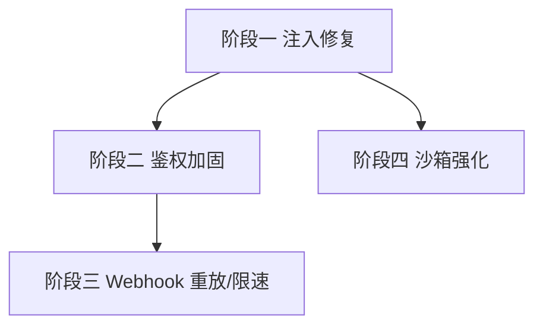

# 开发计划：安全加固（plan-audit-01-security-hardening）

> 关联审计：code-audit-report-2026-07-24.md（SEC-0/SEC-1/SEC-2/S-4/SEC-3/SEC-7、EX-2/EX-4）

## 1. 概述

本模块修复审计中确认的高危/中危安全缺口：DbRead 节点 SQL 注入、Shell 节点命令注入、全局鉴权兜底缺失、Cookie 认证 CSRF、Webhook 重放与限速缺失、JS 沙箱黑名单可绕过、执行错误堆栈泄露客户端。

覆盖范围：

- SEC-0：DbRead 节点参数化（消除字符串拼接 SQL）。
- SEC-1：`ShellToolNode.RunInShell` 命令注入门禁。
- SEC-2：全局鉴权兜底 `FallbackPolicy`。
- S-4：Cookie 认证 CSRF 防护。
- SEC-3：Webhook 重放保护 + 速率限制。
- SEC-7：JS 沙箱黑名单绕过加固。
- EX-2：`NodeError` 不再向客户端泄露 `StackTrace`/原始 `ex.Message`。
- EX-4：Webhook 同步模式改用事件通知，消除 DB 轮询（与 SEC-3 协同）。

不覆盖范围：

- Webhook 生产化整体方案（密钥管理、部署）不在本计划，本计划仅补其重放/限速缺口。
- SSO/认证体系重构不在本计划，本计划仅补 Cookie CSRF 与全局鉴权兜底。
- 凭据加密（AES-GCM）、RBAC、CORS 默认拒绝等已具备，不在本计划。

## 2. 交付物清单

| 类别 | 交付物 |
|------|--------|
| 代码 | DbRead 绑定参数路径；RunInShell 权限门禁；`FallbackPolicy` 注册；Antiforgery/自定义防伪造头；Webhook timestamp+nonce 校验与限速中间件；沙箱白名单/隔离改造；`NodeError` 安全化 |
| 配置 | CSRF 头名称、Webhook 重放窗口/限速阈值、Shell 门禁角色 |
| 测试 | DbRead 注入用例（含上游 `$input` 拼接场景）、RunInShell 拦截用例、匿名端点拦截用例、防伪造头用例、Webhook 重放拒绝用例、沙箱绕过尝试用例 |
| 文档 | 安全加固说明、Shell 门禁配置说明 |

## 3. 开发阶段

### 阶段一：注入类 Critical/High 修复

- 目标：消除 SQL 注入与命令注入可利用路径。
- 核心任务：
  - SEC-0：DbRead 节点提供绑定参数（从 `$input`/`$json` 解析为 `@p0..`），与 DbUpsert 统一参数化；禁止将上游值字符串拼入 SQL 文本。
  - SEC-1：`RunInShell=true` 置于管理员权限门后；开启时对命令做严格校验/白名单，LLM 可控命令默认禁用。
  - EX-2：`NodeError` 仅保留安全错误码与脱敏消息，移除 `StackTrace`/`ex.Message` 透传。
- 输入：审计报告 SEC-0/SEC-1/EX-2。
- 输出：参数化 DbRead、Shell 门禁、安全化 `NodeError`。
- 验收标准：
  - DbRead 以绑定参数执行，审计用例中"上游值拼入 SQL"场景被拒绝或参数化。
  - `RunInShell` 非管理员角色请求被拒；LLM 工具开启 RunInShell 被拦截。
  - 执行结果/事件中不含 `StackTrace` 与原始异常消息（仅安全错误码）。
- 依赖：无。

### 阶段二：鉴权加固

- 目标：杜绝遗漏 `[Authorize]` 导致的匿名暴露与 CSRF。
- 核心任务：
  - SEC-2：注册 `FallbackPolicy = RequireAuthenticatedUser()`（或程序集级 `[Authorize]`）。
  - S-4：Cookie 认证设 `SameSite=Strict` 或要求自定义防伪造请求头；收紧 CORS origin 白名单。
- 输入：审计报告 SEC-2/S-4。
- 输出：全局鉴权兜底、CSRF 防护。
- 验收标准：
  - 新增未标注 `[Authorize]` 的端点默认返回 401。
  - 跨站伪造变更请求（无防伪造头）被拒；同源正常请求不受影响。
- 依赖：阶段一。

### 阶段三：Webhook 重放与限速 + 同步模式改造

- 目标：Webhook 抗重放、限流，消除同步轮询。
- 核心任务：
  - SEC-3：HMAC 绑定 `timestamp`+`nonce`，拒绝过期/已见 nonce；按路由/IP 加 `AspNetCoreRateLimit`。
  - EX-4：`IsSync` 模式改由执行完成事件（WebSocket/内部事件）通知，移除 DB 轮询循环。
- 输入：审计报告 SEC-3/EX-4；协同 Webhook 生产化方案。
- 输出：重放保护、限速、事件驱动同步。
- 验收标准：
  - 捕获并重放的历史 Webhook 请求被拒（nonce 已见/超时）。
  - 单 IP/路由超阈值被限流。
  - Webhook 同步调用不再周期性查询 `ExecutionRecords`。
- 依赖：阶段二。

### 阶段四：JS 沙箱强化

- 目标：消除标识符黑名单绕过。
- 核心任务：
  - SEC-7：在黑名单基础上引入白名单（仅放行必要 API），或改用 V8 Isolate 强隔离；黑名单仅作纵深防御。
- 输入：审计报告 SEC-7。
- 输出：沙箱白名单/隔离改造。
- 验收标准：
  - 沙箱逃逸用例（`this['cons'+'tructor']`、Unicode 同形、`obj['pro'+'cess']`）被阻断。
  - 既有合法节点脚本仍能执行。
- 依赖：阶段一（脚本执行路径）。

## 4. 阶段依赖图

## 5. 风险与待定项

| 风险/待定项 | 影响 | 应对策略 |
|-------------|------|----------|
| DbRead 参数化破坏既有工作流 SQL 表达式 | 中 | 提供参数绑定语法并保留兼容；迁移脚本/文档说明 |
| `FallbackPolicy` 误伤合法匿名端点（如 `/health`、Webhook 接收） | 中 | 匿名端点显式 `[AllowAnonymous]` 标注 |
| `SameSite=Strict` 影响合法跨页跳转登录 | 低 | 评估用防伪造头替代；保留关键跳转白名单 |
| V8 Isolate 引入新依赖/体积 | 中 | 待定：优先白名单模式，隔离作为后续评估 |

## 6. 验收总标准

- [ ] DbRead 节点以绑定参数执行，无字符串拼接注入路径（SEC-0）。
- [ ] `RunInShell` 受角色门禁，LLM 可控命令默认禁用（SEC-1）。
- [ ] 全局 `FallbackPolicy` 生效，遗漏 `[Authorize]` 的端点返回 401（SEC-2）。
- [ ] Cookie 认证具备 CSRF 防护（S-4）。
- [ ] Webhook 具备 timestamp+nonce 重放保护与按路由/IP 限速（SEC-3）。
- [ ] Webhook 同步模式改为事件驱动，无 DB 轮询（EX-4）。
- [ ] JS 沙箱绕过用例全部阻断（SEC-7）。
- [ ] `NodeError` 不向客户端泄露堆栈/原始异常（EX-2）。
- [ ] 上述各项均有对应单元测试/集成测试通过。
- [ ] `dotnet build` 与全量测试通过。

## 变更记录

| 日期 | 修改人 | 修改内容 | 关联任务 |
|------|--------|----------|----------|
| 2026-07-24 | Agent | 由审计报告派生安全加固计划，去重既有 webhook/SSO 计划 | code-audit-report-2026-07-24 |
