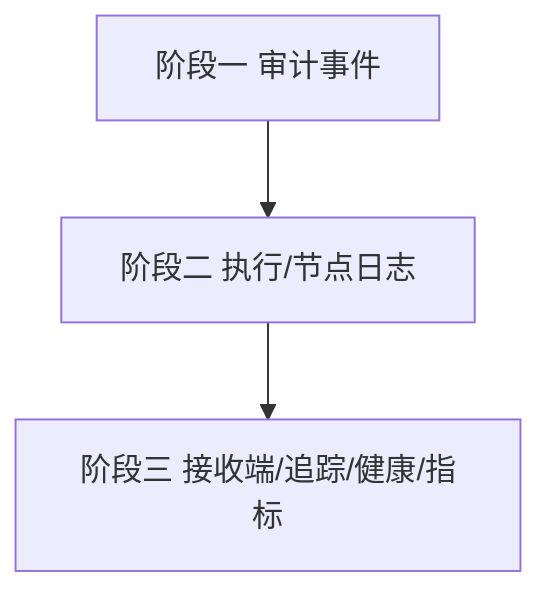

# 开发计划：可观测性补齐（plan-audit-02-observability-hardening）

> 关联审计：code-audit-report-2026-07-24.md（OBS-1/OBS-2/OBS-3/OBS-7、O-1/O-2/O-6、E-1/E-4）

## 1. 概述

本模块补齐审计确认的可观测性缺口：审计事件未完整发布（凭据访问、执行开始/节点完成/节点错误）、DB 节点执行零日志、无结构化日志接收端/分布式追踪/健康检查探针、审计序列化失败静默丢事件、无请求日志中间件、WebSocket 推送日志不足。

覆盖范围：

- OBS-1：发布 `CredentialAccessedEvent`（凭据访问入审计）。
- OBS-2：发布 `WorkflowStartedEvent`/`NodeExecutedEvent`/`NodeErrorEvent`。
- OBS-3：DB 节点执行日志（脱敏 SQL/行数/耗时，失败含 SQL 文本）。
- OBS-7：`WebSocketEventPushService` 结构化日志。
- O-1：结构化日志接收端（Serilog → Seq/ES）。
- O-2：OpenTelemetry 基础追踪（ASP.NET Core + HttpClient 仪表）。
- O-6：真实健康检查（`AddHealthChecks` + liveness/readiness + DB 探针）+ 执行/节点/失败 Meter。
- E-1：`AuditLogFileSink` 序列化失败不再静默丢事件。
- E-4：请求日志中间件（方法/路径/状态码/耗时）。

不覆盖范围：

- Sentry 错误上报、Agent/LLM token 追踪等更广义可观测能力，按需另立计划。

## 2. 交付物清单

| 类别 | 交付物 |
|------|--------|
| 代码 | 审计事件发布点、`DbExecutor` 日志、`WebSocketEventPushService` 日志、`Serilog` 接收端、`OpenTelemetry` 初始化、`AddHealthChecks` 探针、`Meter`、请求日志中间件、`AuditLogFileSink` 死信 |
| 配置 | 日志接收端地址、OTel 导出器、健康检查探针配置 |
| 测试 | 审计事件发布验证、DB 日志含脱敏 SQL、健康检查探针、OTel Span 生成、死信落盘验证 |
| 文档 | 可观测性配置说明、指标清单 |

## 3. 开发阶段

### 阶段一：审计事件完整性

- 目标：闭合审计链，消除静默丢事件。
- 核心任务：
  - OBS-1：凭据运行时解析路径 `PublishAsync(new CredentialAccessedEvent(...))`。
  - OBS-2：`WorkflowExecutor` 发布 `WorkflowStartedEvent`/`NodeExecutedEvent`/`NodeErrorEvent`。
  - E-1：`AuditLogFileSink.SerializeEvent` 失败 `LogError` + 写死信队列。
- 验收标准：
  - 解析凭据、启动执行、节点完成/错误均在审计日志中可见。
  - 序列化失败事件进入死信而非消失。
- 依赖：无。

### 阶段二：执行与节点日志

- 目标：DB 节点与 WS 推送可观测。
- 核心任务：
  - OBS-3：`DbExecutor` 记脱敏 SQL + 影响行数 + 耗时，失败含 SQL 文本（不泄露参数值）。
  - OBS-7：`WebSocketEventPushService` 结构化日志 + 广播成功/失败计数。
- 验收标准：
  - DB 节点执行产生日志且参数值脱敏。
  - WS 广播失败可被检索。
- 依赖：阶段一。

### 阶段三：日志接收端 / 追踪 / 健康检查 / 指标 / 请求日志

- 目标：生产可观测基础设施。
- 核心任务：
  - O-1：集成 Serilog → Seq/ES（保留 Console）。
  - O-2：集成 OpenTelemetry，ASP.NET Core + HttpClient 仪表，导出 Jaeger/Tempo。
  - O-6：`AddHealthChecks` + liveness/readiness + DB 探针；`Meter` 暴露执行/节点/失败计数。
  - E-4：请求日志中间件（排除 `/health`）。
- 验收标准：
  - 日志可发送至接收端并检索。
  - 执行链路可在追踪后端查询。
  - `/health/ready` 反映 DB 探针状态；指标端点可抓取。
  - HTTP 请求产生结构化访问日志。
- 依赖：阶段二。

## 4. 阶段依赖图

## 5. 风险与待定项

| 风险/待定项 | 影响 | 应对策略 |
|-------------|------|----------|
| DB 日志泄露参数值 | 高 | 仅记 SQL 文本与行数/耗时，参数值脱敏 |
| OTel 数据量爆炸 | 中 | 采样率配置 |
| 健康检查探针误判 | 低 | 探针仅查关键依赖，超时独立 |

## 6. 验收总标准

- [ ] 凭据访问、执行开始、节点完成/错误均入审计（OBS-1/OBS-2）。
- [ ] 审计序列化失败进入死信而非静默丢失（E-1）。
- [ ] DB 节点执行产生脱敏日志（OBS-3）。
- [ ] WS 推送具备结构化日志（OBS-7）。
- [ ] 日志可发送至接收端（O-1）。
- [ ] 分布式追踪可用（O-2）。
- [ ] 真实健康检查 + 指标端点可用（O-6）。
- [ ] 请求日志中间件生效（E-4）。
- [ ] 全量测试通过，`dotnet build` 无错。

## 变更记录

| 日期 | 修改人 | 修改内容 | 关联任务 |
|------|--------|----------|----------|
| 2026-07-24 | Agent | 由审计报告派生可观测性计划 | code-audit-report-2026-07-24 |
