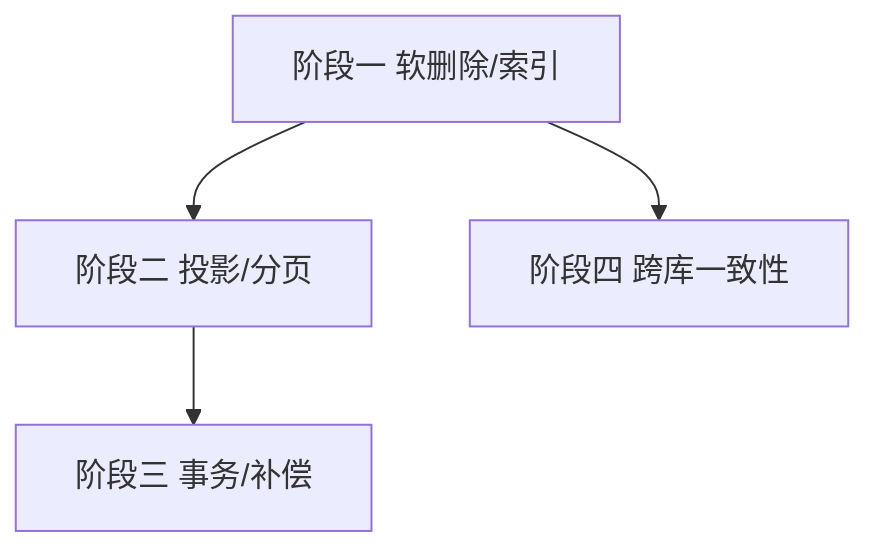

# 开发计划：数据层优化（plan-audit-03-data-layer）

> 关联审计：code-audit-report-2026-07-24.md（D-1/D-2/D-3/D-4/D-6/D-10/D-11/D-12/D-13/D-14/D-15、EX-3）

## 1. 概述

本模块修复审计确认的数据层缺陷：缺软删除全局过滤器、关键索引缺失、列表查询拉取大 JSON 列、事务跨外部 await、OFFSET 深翻页退化、`SaveChangesAsync` 每次额外查询、凭据唯一索引 NULL 跨库不一致、触发器调度补偿不完整。

覆盖范围：

- D-1：软删除全局 `HasQueryFilter`。
- D-2/D-3/D-4：`triggers`/`stored_files` 索引。
- D-6：`WorkflowService.GetAllAsync` 投影瘦身。
- D-10：事务拆分（先提交 DB 再调外部调度）。
- D-11：`ExecutionService` 列表查询投影 + `NodeRecords` 上限。
- D-12：keyset 分页替代 OFFSET。
- D-13：`ExecutionRecord.StartedAt` 索引。
- D-14：`SaveChangesAsync` 凭据用量增量维护。
- D-15：凭据唯一索引 NULL 跨库语义统一。
- EX-3：触发器调度补偿（提交后 Quartz 注册失败需补偿/告警）。

不覆盖范围（列为未来计划）：

- D-5：Schema 统一为 `flow`（独立小计划）。
- D-7：`NodeRecords` 拆子表（大改，独立评估）。
- D-8：多数据库迁移目录。
- D-9：自动迁移环境检查。

## 2. 交付物清单

| 类别 | 交付物 |
|------|--------|
| 代码 | `HasQueryFilter`、迁移（索引）、列表投影、`BeginTransaction` 拆分、keyset 分页、凭据用量增量维护、唯一索引条件化、触发器补偿 |
| 配置 | 分页默认大小、补偿重试/告警配置 |
| 测试 | 软删除过滤用例、索引生效验证、投影不加载大列、事务回滚用例、深翻页性能、跨库唯一索引行为（SQLite/PG）、触发器补偿用例 |
| 文档 | 数据层改造说明 |

## 3. 开发阶段

### 阶段一：软删除与索引

- 目标：一致性过滤与查询性能基线。
- 核心任务：
  - D-1：`OnModelCreating` 为 `Entity` 派生类型加 `HasQueryFilter(e => !e.Deleted)`；需访问已删数据处 `IgnoreQueryFilters()`。
  - D-2/D-3/D-4：迁移补 `triggers.workflow_definition_id`/`triggers.project_id`/`stored_files.project_id` 索引。
  - D-13：`ExecutionRecord.StartedAt` 索引。
- 验收标准：
  - 漏标 `!Deleted` 的查询不再返回已删数据。
  - 相关查询计划使用新索引。
- 依赖：无。

### 阶段二：查询投影与分页

- 目标：列表查询不拉大列、深翻页不退化。
- 核心任务：
  - D-6/D-11：`.Select()` 投影到 Summary DTO，不物化 `Nodes`/`Connections`/`NodeRecords`。
  - D-12：执行列表改 keyset 分页（`WHERE StartedAt < lastSeen ORDER BY StartedAt DESC`）。
- 验收标准：
  - 列表查询不读取 `NodeRecords` 大列。
  - 深翻页耗时稳定。
- 依赖：阶段一。

### 阶段三：事务边界与补偿

- 目标：消除事务跨外部 await 与静默失效。
- 核心任务：
  - D-10：`WorkflowService` 先提交 DB 写，再调 `RegisterTriggersAsync`；或走 outbox。
  - EX-3：`TriggerService` 调度注册失败进入补偿/告警，杜绝"Active 但调度未恢复"。
  - D-14：`SaveChangesAsync` 凭据用量增量维护，仅处理当前变更 Workflow。
- 验收标准：
  - 外部调度慢时不长期持有 DB 行锁。
  - 调度注册失败有补偿/告警，状态可恢复。
  - 批量改 Workflow 不再触发 N 次额外查询。
- 依赖：阶段二。

### 阶段四：跨库一致性

- 目标：开发/生产行为一致。
- 核心任务：
  - D-15：凭据唯一索引 `(Name, ProjectId)` 用 sentinel 值替代 NULL，或按提供方条件化索引；集成测试覆盖 SQLite/PG。
- 验收标准：
  - SQLite 与 PostgreSQL 下唯一约束行为一致。
- 依赖：阶段一。

## 4. 阶段依赖图

## 5. 风险与待定项

| 风险/待定项 | 影响 | 应对策略 |
|-------------|------|----------|
| `HasQueryFilter` 误伤需读已删数据处 | 中 | 显式 `IgnoreQueryFilters()` 白名单 |
| keyset 分页破坏现有前端分页协议 | 低 | 分页参数兼容；前端同步 |
| 事务拆分引入 outbox 复杂度 | 中 | 先采用"先提交后调度"，outbox 作为后续评估 |
| sentinel 值影响现有查询 | 低 | 迁移脚本回填 sentinel |

## 6. 验收总标准

- [ ] 软删除全局过滤生效（D-1）。
- [ ] 关键索引存在并生效（D-2/D-3/D-4/D-13）。
- [ ] 列表查询投影瘦身、不读大列（D-6/D-11）。
- [ ] 深翻页使用 keyset（D-12）。
- [ ] 事务不再跨外部 await（D-10）。
- [ ] 触发器调度失败可补偿/告警（EX-3）。
- [ ] `SaveChangesAsync` 增量维护凭据用量（D-14）。
- [ ] 凭据唯一索引跨库一致（D-15）。
- [ ] 全量测试通过，`dotnet build` 无错。

## 变更记录

| 日期 | 修改人 | 修改内容 | 关联任务 |
|------|--------|----------|----------|
| 2026-07-24 | Agent | 由审计报告派生数据层计划 | code-audit-report-2026-07-24 |
