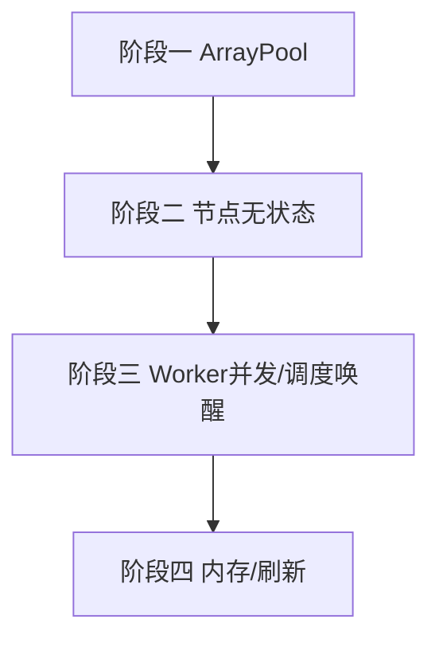

# 开发计划：并发与性能（plan-audit-04-concurrency-perf）

> 关联审计：code-audit-report-2026-07-24.md（CON-1/CON-2/CON-3/CON-4/CON-5/CON-6/CON-7）

## 1. 概述

本模块修复审计确认的并发正确性与性能缺陷：ArrayPool 双重归还（正确性 bug）、工作流全局串行执行（吞吐瓶颈）、节点类型实例为可变单例（并行化隐患）、OAuth2 刷新惊群、大批次输出内存无界、调度空闲 500ms 轮询、WS 广播迭代。

覆盖范围：

- CON-1：`ExecutionWebSocketHandler` ArrayPool 双重归还修复。
- CON-2：`WorkflowExecutionWorker` 并发消费队列（有界 `SemaphoreSlim`/`Task.WhenAll`）。
- CON-3：节点类型实例无状态化（并行化前置）。
- CON-4：`OAuth2TokenService` 刷新去重（per-key `SemaphoreSlim`/lazy-cache）。
- CON-5：`SuccessfulOutputs`/`OncePerItem` 内存限流/增量落盘。
- CON-6：调度空闲轮询改事件驱动唤醒。
- CON-7：`WebSocketEventPushService` 广播路径加锁/快照。

不覆盖范围：

- 评估性优化（HttpClient 池化、超时配置化）见 C-2/C-4，按需另立。

## 2. 交付物清单

| 类别 | 交付物 |
|------|--------|
| 代码 | ArrayPool 修复、Worker 并发、节点类型无状态、OAuth2 去重、输出分块、事件驱动调度、WS 广播加锁 |
| 配置 | Worker 并发度上限、输出保留上限、调度唤醒配置 |
| 测试 | ArrayPool 归还单测、并发执行幂等/隔离用例、节点无状态用例、OAuth2 单飞用例、大批次内存上限用例 |
| 文档 | 并发模型说明 |

## 3. 开发阶段

### 阶段一：正确性 Bug 修复（优先）

- 目标：消除内存正确性缺陷。
- 核心任务：
  - CON-1：移除 `ExecutionWebSocketHandler.cs:131,158` 提前 `Return`，由 `finally` 独占归还（或加 `returned` 标志）。
- 验收标准：
  - ArrayPool 同一 buffer 仅归还一次；压力测试无池污染。
- 依赖：无。

### 阶段二：节点无状态化（并行前置）

- 目标：解并行化隐患。
- 核心任务：
  - CON-3：节点类型实例无状态，或按执行克隆；执行中禁止改共享单例字段（`SwitchNode.Cases`/`Ports` 等）。
- 验收标准：
  - 并发执行同一节点类型互不篡改状态。
- 依赖：阶段一。

### 阶段三：Worker 并发化 + 调度唤醒

- 目标：提升吞吐、消除忙等。
- 核心任务：
  - CON-2：有界并发消费队列（每执行独立 Scope 已具备）。
  - CON-6：调度循环改 `SemaphoreSlim`/`TaskCompletionSource` 事件驱动，移除 500ms `Task.Delay`。
- 验收标准：
  - 多执行并发处理且不互相阻塞。
  - 空闲时不空轮询，有任务即时唤醒。
- 依赖：阶段二。

### 阶段四：内存与刷新优化

- 目标：稳定大批次与 token 刷新。
- 核心任务：
  - CON-5：`SuccessfulOutputs`/`OncePerItem` 限制保留项数或增量落盘。
  - CON-4：`OAuth2TokenService` per-key 信号量去重刷新，丢弃过期条目。
  - CON-7：WS 广播加锁/快照，避免迭代期不一致。
- 验收标准：
  - 大批次工作流内存有上限。
  - 并发令牌刷新仅一次。
  - 广播在高并发下一致。
- 依赖：阶段三。

## 4. 阶段依赖图

## 5. 风险与待定项

| 风险/待定项 | 影响 | 应对策略 |
|-------------|------|----------|
| 并发化引入竞态 | 高 | 阶段二先于三；充分并发测试 |
| 节点克隆开销 | 低 | 仅克隆可变状态，复用静态定义 |
| 输出落盘增延迟 | 中 | 阈值触发，异步刷盘 |

## 6. 验收总标准

- [ ] ArrayPool 双重归还修复（CON-1）。
- [ ] 节点类型无状态/按执行隔离（CON-3）。
- [ ] 执行 Worker 并发处理（CON-2）。
- [ ] 调度事件驱动唤醒，无 500ms 空轮询（CON-6）。
- [ ] 大批次输出内存有上限（CON-5）。
- [ ] OAuth2 刷新去重（CON-4）。
- [ ] WS 广播一致（CON-7）。
- [ ] 全量测试通过，`dotnet build` 无错。

## 变更记录

| 日期 | 修改人 | 修改内容 | 关联任务 |
|------|--------|----------|----------|
| 2026-07-24 | Agent | 由审计报告派生并发/性能计划 | code-audit-report-2026-07-24 |
