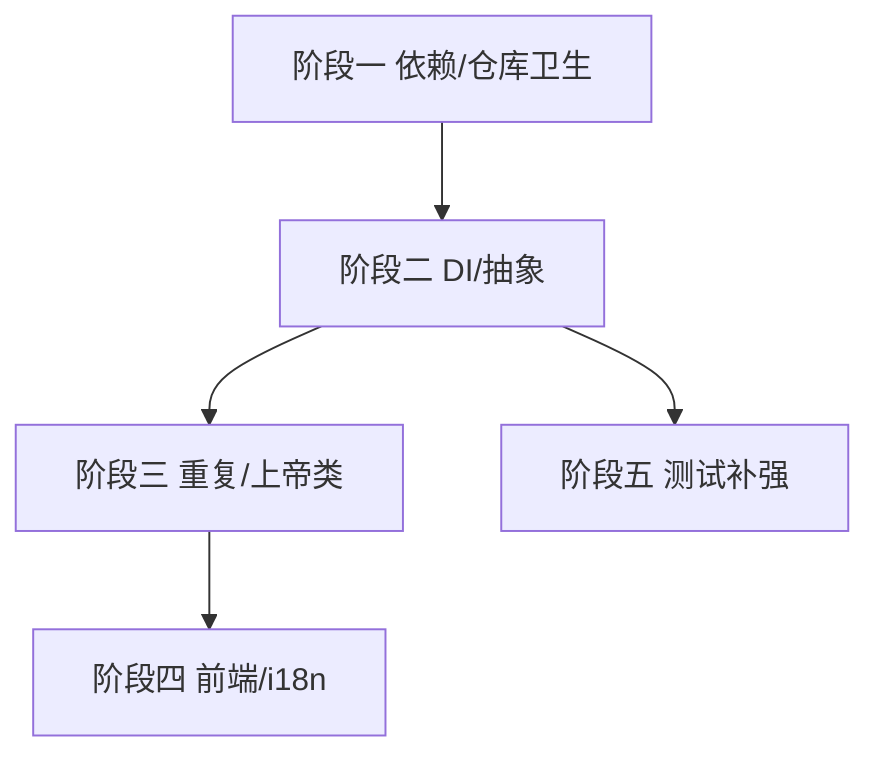

# 开发计划：架构与代码质量清理（plan-audit-05-architecture-cleanup）

> 关联审计：code-audit-report-2026-07-24.md（DEP-1~DEP-7、A-1~A-6、CQ-1~CQ-7、Q-1~Q-7、EX-1、TST-5）

## 1. 概述

本模块清理审计确认的架构与代码质量债务：构建产物（DLL）入库、MediatR 进入 Core、双 JSON 框架、插件并行 DB 栈、前端版本异常、预发布依赖、`ServiceCollectionExtensions` 膨胀、Application 冗余接口、`NodeExecutionContext` 上帝对象、DbRead SQL 扫描器复制、前端硬编码 URL、TriggerService 事务模板重复、`WorkflowSchedulerKernel` 上帝类、47 处 i18n TODO、反馈服务残留 TODO、前端 CSS/ErrorBoundary/行内样式、缺 `DomainException` 基类、大 Service 测试缺口。

覆盖范围：

- 依赖治理：DEP-1（DLL 入库）、DEP-2（MediatR 入 Core）、DEP-3（双 JSON）、DEP-4（插件并行 DB 栈）、DEP-5（前端版本异常）、DEP-6（预发布依赖）、DEP-7（`ServiceCollectionExtensions` 膨胀）。
- 分层与抽象：A-1（Application→Runtime 具体引用）、A-2（接口位置）、A-3（Jint 重复）、A-4（`NodeExecutionContext` 上帝对象）、A-6（Factory 参数爆炸）、CQ-1（14 冗余 Application 接口）。
- 代码质量：CQ-2（DbRead 扫描器复制）、CQ-3（前端硬编码 URL）、CQ-4（TriggerService 事务重复）、CQ-5（SchedulerKernel 上帝类）、CQ-6（i18n TODO）、CQ-7（反馈服务 TODO）、Q-1（CSS Modules）、Q-2（行内样式）、Q-3（Error Boundary）、Q-4（`cancelExecution` 缩进）、Q-5（Props 命名）、Q-6（useEffect 依赖）、Q-7（ScriptCache 竞态）。
- 异常体系：EX-1（`DomainException` 基类）。
- 测试：TST-5（`WorkflowService`/`WorkflowModificationService` 测试缺口）。

不覆盖范围：

- 测试专项（IfNode 分支、事务回滚、插件加载）见各功能计划测试交付物；前端全量测试体系见独立评估。

## 2. 交付物清单

| 类别 | 交付物 |
|------|--------|
| 代码 | `.gitignore` 修正、依赖收敛、`ServiceCollectionExtensions` 拆分、冗余接口去除、`NodeExecutionContext` 拆分、DbRead 扫描器抽取、前端 URL 集中、事务模板抽取、SchedulerKernel 拆分、i18n 接入骨架、`DomainException` 基类、前端 CSS Modules/ErrorBoundary |
| 配置 | `.gitignore`、`NuGet` 版本策略 |
| 测试 | `WorkflowService`/`WorkflowModificationService` 分支与端到端测试、ScriptCache 竞态测试 |
| 文档 | 依赖治理说明、前端样式规范 |

## 3. 开发阶段

### 阶段一：依赖治理与仓库卫生（高优先）

- 目标：消除供应链与依赖风险。
- 核心任务：
  - DEP-1：`.gitignore` 加 `plugins/*.dll`、`*.pdb`、`bin/`、`obj/`；清理已提交 DLL；轮换泄露的 dev 密钥。
  - DEP-5/DEP-6：校正前端版本、确认/升级预发布依赖。
  - DEP-2/DEP-3/DEP-4：评估 MediatR 入 Core、双 JSON、插件并行 DB 栈的收敛方案（优先事件总线下沉、统一 JSON、DB 抽象）。
- 验收标准：
  - 仓库无提交的三方 DLL；构建产物被忽略。
  - 依赖版本一致、无预发布入库。
- 依赖：无。

### 阶段二：DI 与抽象清理

- 目标：降低维护成本、明确边界。
- 核心任务：
  - DEP-7：`ServiceCollectionExtensions` 按模块拆分为 `AddFlowEngineWorkflow()` 等。
  - CQ-1：去除单一实现且无需 mock 的 Application 服务接口。
  - A-1/A-2/A-3/A-6：跨层接口位置统一；Jint 传递引用；`NodeExecutionContextFactory` 用 Options 聚合。
  - A-4：`NodeExecutionContext` 仅保留数据载体，工具方法提取。
  - EX-1：引入 `DomainException : Exception`，中间件按基类映射。
- 验收标准：
  - DI 注册模块化；冗余接口去除；异常经统一基类映射。
- 依赖：阶段一。

### 阶段三：重复与上帝类拆分

- 目标：可维护性。
- 核心任务：
  - CQ-2：抽取 DbRead SQL 扫描器复用。
  - CQ-4：抽取 `SaveChangesInTransactionAsync()`。
  - CQ-5：拆分 `WorkflowSchedulerKernel`（调度/节点执行/路由/等待区）。
  - CQ-7/Q-4：反馈服务 NodeName 解析、`cancelExecution` 缩进修复。
- 验收标准：
  - 无重复事务模板；SchedulerKernel 单类行数显著下降。
- 依赖：阶段二。

### 阶段四：前端质量与 i18n 骨架

- 目标：前端规范与国际化基础。
- 核心任务：
  - Q-1/Q-2：CSS Modules 迁移、静态样式提取。
  - Q-3：Error Boundary 包裹高风险区。
  - Q-5/Q-6：Props 命名统一、useEffect 依赖修正。
  - Q-7：ScriptCache 竞态修复（锁范围）。
  - CQ-3：前端 URL 集中 `services/api.ts`。
  - CQ-6：i18n 骨架（`IStringLocalizer` 接入，47 处 TODO 分批替换）。
- 验收标准：
  - 全局 CSS 冲突风险下降；高风险组件有 Error Boundary；错误消息可本地化。
- 依赖：阶段三。

### 阶段五：测试补强（TST-5）

- 目标：大 Service 分支覆盖。
- 核心任务：
  - `WorkflowService` 补草稿确认/拒绝、统计、触发器同步分支测试。
  - `WorkflowModificationService` 独立测试。
  - 增 `WebApplicationFactory` 端到端覆盖核心 API。
- 验收标准：
  - 大 Service 分支有测试；端到端 happy/异常路径通过。
- 依赖：阶段二。

## 4. 阶段依赖图

## 5. 风险与待定项

| 风险/待定项 | 影响 | 应对策略 |
|-------------|------|----------|
| `.gitignore` 误删合法 DLL | 中 | 仅忽略 `plugins/*.dll` 与构建产物，保留源码 |
| 去除冗余接口破坏测试桩 | 中 | 逐个接口评估，保留需 mock 的 |
| SchedulerKernel 拆分引入回归 | 高 | 充分单元+集成测试护航 |
| i18n 全量替换工作量大 | 中 | 先骨架后分批；不影响功能 |

## 6. 验收总标准

- [ ] 仓库无提交三方 DLL，构建产物被忽略（DEP-1）。
- [ ] 依赖收敛、无预发布入库（DEP-5/DEP-6）。
- [ ] DI 注册模块化（DEP-7）。
- [ ] 冗余 Application 接口去除（CQ-1）。
- [ ] `NodeExecutionContext` 仅数据载体（A-4）。
- [ ] `DomainException` 基类就位（EX-1）。
- [ ] 无重复事务模板、SchedulerKernel 拆分（CQ-4/CQ-5）。
- [ ] 前端 CSS Modules/Error Boundary/URL 集中（Q-1/Q-3/CQ-3）。
- [ ] i18n 骨架就位（CQ-6）。
- [ ] `WorkflowService`/`WorkflowModificationService` 测试补齐（TST-5）。
- [ ] 全量测试通过，`dotnet build`/`npm run build` 无错。

## 变更记录

| 日期 | 修改人 | 修改内容 | 关联任务 |
|------|--------|----------|----------|
| 2026-07-24 | Agent | 由审计报告派生架构/质量清理计划 | code-audit-report-2026-07-24 |
