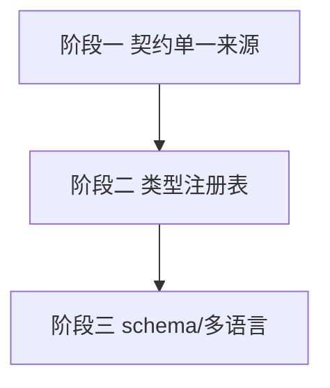

# 开发计划：迭代扩展性（plan-audit-06-extensibility）

> 关联审计：code-audit-report-2026-07-24.md（EXT-1/EXT-2/EXT-3/EXT-4/EXT-5/EXT-6）

## 1. 概述

本模块修复审计确认的扩展性瓶颈：前后端枚举漂移、Core 硬编码凭据/触发类型、节点目录实体直出、字段组件双 map 注册、Workflow JSON 列 schema 演进困难、脚本仅支持 JS。

覆盖范围：

- EXT-1：前后端 `ParameterType`/`PresentationHint` 单一来源 + CI 一致性测试。
- EXT-2：凭据类型/触发类型改为注册表或插件驱动（移出 Core 硬编码）。
- EXT-3：`NodeTypesController` 返回 DTO 而非 Core 实体。
- EXT-4：新 `ParameterType`/`PresentationHint` 改为按枚举键注册表，去双 map。
- EXT-5：Workflow `Nodes`/`Connections` JSON 列 schema 版本化/高频字段抽取。
- EXT-6：脚本语言抽象 `IScriptEngine` 注册表（若需多语言）。

不覆盖范围：

- 插件节点热插拔机制本身已具备，不在本计划。

## 2. 交付物清单

| 类别 | 交付物 |
|------|--------|
| 代码 | 枚举生成/共享契约、类型注册表、凭据/触发类型注册 API、NodeTypeDescriptor DTO、字段注册表、JSON schema 版本迁移、脚本引擎抽象（可选） |
| 配置 | 凭据/触发提供方注册配置 |
| 测试 | 前后端枚举一致性测试、类型注册表用例、schema 迁移用例 |
| 文档 | 扩展点设计说明 |

## 3. 开发阶段

### 阶段一：前后端契约单一来源

- 目标：消除枚举漂移。
- 核心任务：
  - EXT-1：由 Core 枚举生成 TS `ParameterType`/`PresentationHint`（或共享契约文件）；加 CI 一致性测试。
- 验收标准：
  - 后端新增枚举前端自动同步或 CI 报错。
- 依赖：无。

### 阶段二：类型注册表化

- 目标：新增凭据/触发类型不改 Core。
- 核心任务：
  - EXT-2：凭据类型/触发类型改为注册表或插件驱动；OAuth2 提供方数据化。
  - EXT-3：`NodeTypesController` 映射 `NodeTypeDescriptorDto`。
  - EXT-4：字段组件改为按枚举键注册表，去 `hintFieldMap`/`typeFieldMap` 双注册。
- 验收标准：
  - 新增凭据/触发类型无需改 Core 枚举。
  - 节点目录返回 DTO；新字段类型单点注册。
- 依赖：阶段一。

### 阶段三：Schema 演进与多语言（可选）

- 目标：长期可演进。
- 核心任务：
  - EXT-5：Workflow JSON 列加 schema 版本；高频查询字段评估抽取关系列；提供迁移脚本。
  - EXT-6（可选）：抽象 `IScriptEngine` 注册表，按语言加载隔离引擎。
- 验收标准：
  - 节点结构变更有兼容迁移路径。
  - （可选）多脚本语言可插拔。
- 依赖：阶段二。

## 4. 阶段依赖图

## 5. 风险与待定项

| 风险/待定项 | 影响 | 应对策略 |
|-------------|------|----------|
| 枚举代码生成破坏前端手改 | 低 | 生成文件禁止手改，CI 校验 |
| 类型注册表改现有内置类型 | 中 | 内置类型首批注册，兼容迁移 |
| JSON schema 迁移历史数据 | 高 | 版本化 + 双写/回填脚本 |

## 6. 验收总标准

- [ ] 前后端枚举单一来源 + CI 校验（EXT-1）。
- [ ] 凭据/触发类型可注册式扩展（EXT-2）。
- [ ] 节点目录返回 DTO（EXT-3）。
- [ ] 字段组件注册表化（EXT-4）。
- [ ] Workflow JSON 列 schema 版本化/迁移可用（EXT-5）。
- [ ] （可选）多脚本语言可插拔（EXT-6）。
- [ ] 全量测试通过，`dotnet build`/`npm run build` 无错。

## 变更记录

| 日期 | 修改人 | 修改内容 | 关联任务 |
|------|--------|----------|----------|
| 2026-07-24 | Agent | 由审计报告派生扩展性计划 | code-audit-report-2026-07-24 |
