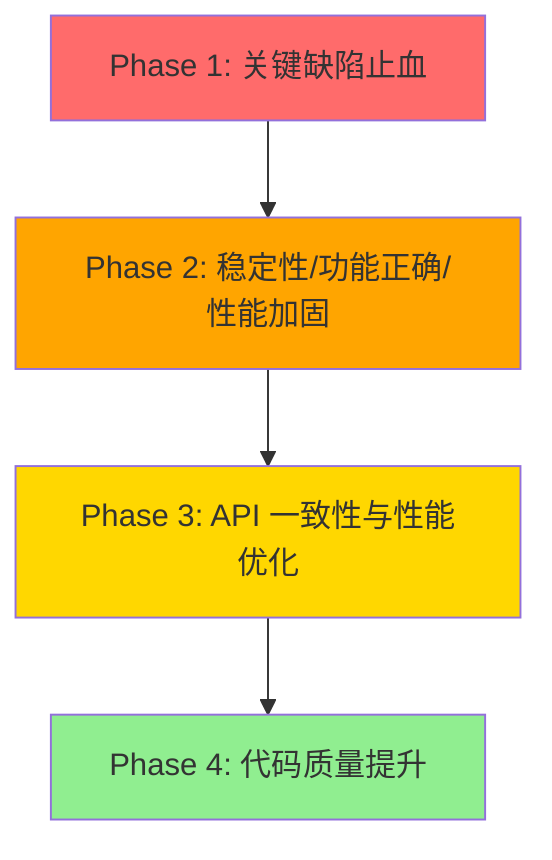

# 全面代码审查问题修复计划

## 1. 概述

本计划整合两次代码审查的发现，分阶段修复前后端的功能缺陷、性能瓶颈、架构耦合与接口一致性问题：

- **千问审查（安全/规范向）**：聚焦安全漏洞、资源泄露、并发安全、RESTful 规范、前后端 DTO 对齐。
- **2026-07-20 全面审查（功能/性能/架构/接口向）**：聚焦执行引擎功能缺陷、性能瓶颈、前端重渲染与状态管理、前后端契约断裂（含 3 个 Critical 级列表接口不可用）。

> **重要：代码状态校正**。本计划原始版本（千问撰写）基于较早的代码状态，经核对当前代码，**Phase 1 中至少 4 项已修复**（见 Phase 1 各项"状态"标注）：JWT 已仅经 HttpOnly Cookie 下发、响应体不再含 Token；全局异常中间件系统异常已返回通用消息；幂等去重唯一约束冲突已重试/重查；SSE 推送已含 `Sequence` 字段。请实施前以当前代码为准，避免重复劳动。

### 覆盖范围

- 前后端接口契约断裂（列表响应形态、枚举大小写、对象/字符串类型错位）—— 直接导致界面不可用
- 执行引擎功能缺陷（取消空操作、版本不递增、Switch 端口缓存错位、Loop 迭代未接入、OncePerItem 输出覆盖、数值精度丢失、子工作流多输入丢数据、凭据解密忽略 KeyVersion）
- 前端功能/性能（effect 依赖错误清空执行态、重渲染、状态管理、类型往返）
- 性能瓶颈（执行器每节点重写整列 JSON、热查询缺索引、全表凭据扫描、重复加载、无分页/投影）
- 架构耦合（Runtime 直依赖 DbContext、Host 层直持 DbContext、worker 长生命周期 scope 捕获 DbContext、画布状态全局化）
- 安全与规范（HttpClient 资源、OAuth2 租户隔离、RESTful 状态码、授权、DTO 对齐）

### 不覆盖范围

- 新功能开发
- 大规模架构重构（仅做必要的局部优化与解耦）
- 测试覆盖率提升（另有专门计划覆盖）

## 2. 交付物清单

- 修复后的后端代码（Core、Runtime、Application、Host 层）
- 修复后的前端代码（components、hooks、stores、types）
- 前端类型定义更新（与后端 DTO 对齐，含枚举大小写、RetryPolicy 对象、CredentialFieldDefinition 字段名、validationRules 对象）
- 新增或补充的单元测试（针对关键修复，遵循 TDD：先写失败用例再实现）

## 3. 开发阶段

### Phase 1：关键缺陷止血（Critical 级别，部分已由千问实施中）

**目标**：修复所有 Critical 级别问题，消除界面不可用、数据静默丢失与资源泄露风险。

**状态说明**：标 `【已修复·待核对】` 的项为当前代码已包含对应修复，实施前请核对避免重复；标 `【待验证】` 的项需先确认当前代码是否仍需修改。

**核心任务**：

1. **【已修复·待核对】JWT 双重暴露修复**
   - 文件：`backend/FlowEngine.Host/Controllers/AuthController.cs:67-86`
   - 现状：`Response.Cookies.Append("fe_auth", token, ...)` 经 HttpOnly Cookie 下发；响应体仅含 `Success/UserId/User/ErrorMessage`，不含 `Token`。
   - 验收：登录接口响应体不包含 JWT，Cookie 正确设置（Secure 在生产启用）。

2. **【已修复·待核对】异常消息泄露修复**
   - 文件：`backend/FlowEngine.Host/Middlewares/GlobalExceptionHandlerMiddleware.cs:47-49`
   - 现状：系统异常（非 `BusinessException`/`ArgumentException`）返回通用消息 `"系统内部错误，请稍后重试。"`，不泄露堆栈/表名。
   - 验收：`NullReferenceException` 等系统异常不泄露内部细节。

3. **【待验证】OAuth2 令牌缓存租户隔离**
   - 文件：`backend/FlowEngine.Runtime/Credentials/OAuth2TokenService.cs:108-125`
   - 现状：`GetOrRefreshTokenAsync(string cacheKey, ...)` 的 `cacheKey` 由调用方传入，缓存键是否含租户/用户标识取决于调用方。需先确认调用方传入的 `cacheKey` 是否已租户/用户隔离；若已隔离则无需修改。
   - 验收：不同租户使用相同凭据配置时获取独立令牌（或确认现有 key 已满足隔离）。

4. **【已修复·待核对】幂等性竞态条件修复**
   - 文件：`backend/FlowEngine.Application/Executions/ExecutionIdempotencyService.cs:46-80`
   - 现状：已捕获 `DbUpdateException` 唯一约束冲突，重试插入并最终回退查询，处理了并发注册。
   - 验收：并发请求下幂等键正确注册，无重复执行。

5. **HttpClient 资源泄露修复（仍有效）**
   - 文件：`backend/FlowEngine.Runtime/Http/HttpClientPool.cs:29-38`
   - 修改：`GetClient` 每次 `new HttpClient(_handler, disposeHandler: false)`，`Dispose` 仅释放 `_handler`，创建的 HttpClient 不被追踪 → Socket 耗尽风险。建议改为接入 `IHttpClientFactory`（`AddHttpClient(...).ConfigurePrimaryHttpMessageHandler(() => ssrfGuardHandler with Timeout)`），淘汰自定义池；或追踪并复用单例 `HttpClient`。
   - 验收：长期运行无 Socket 耗尽。

6. **【已修复·待核对】WebSocket/SSE sequence 字段对齐**
   - 文件：`backend/FlowEngine.Host/Controllers/SseController.cs:81,91-93,274`
   - 现状：SSE 推送已通过 `Interlocked.Increment(ref _sequenceCounter)` 补充 `Sequence`，与 WebSocket 一致。
   - 验收：前端 `WebSocketPushMessage` 接口与后端消息格式一致（前端类型已含 `sequence` 则无需改动）。

7. **【新增·Critical】列表接口响应形态与前端不符（项目/文件/用户）**
   - 后端：`ProjectsController.cs:22-26`（`Ok(IReadOnlyList<ProjectDto>)` 裸数组）、`FilesController.cs:130-138`（裸数组）；`UsersController.cs` 仅有 `{userId}/roles`，**无** `GET /api/v1/users` 列表端点。
   - 前端：`api.ts:228-231` `getProjects()` 读 `res.data.items` → `undefined`；`api.ts:369-372` `listFiles()` 读 `res.data.items` → `undefined`；`api.ts:302-305` `listUsers()` 调不存在端点 → 404。
   - 修改：统一列表响应为 `PagedResult<T>`（`{items,totalCount,page,pageSize}`）并保持前后端一致；为 `UsersController` 实现 `GetAll`（或前端移除调用）。
   - 验收：`getProjects()`/`listFiles()`/`listUsers()` 能正确返回数据，UI 列表/下拉正常渲染。
   - 注：合并原 Phase 2 的"用户列表接口对齐"与"分页响应格式统一"并提升为 Critical。

8. **【新增·Critical】`WorkflowEditorPage` effect 在每次执行更新时清空执行态并重拉工作流**
   - 文件：`frontend/src/pages/WorkflowEditorPage.tsx:43-51`
   - 问题：`useEffect` 依赖含 `clearExecution`（`useExecution` 内其 `useCallback` 身份随 `executionMeta` 变化），每次 WebSocket/轮询更新都触发 `clearExecution()` + `loadWorkflow(id)`，打断实时执行可视化、可能丢弃未保存编辑。
   - 修改：工作流加载仅依赖 `[id, ready]`；清空执行态改用 `useEffect(() => clearExecution(), [id])`，不把 `clearExecution` 放入加载 effect 依赖。
   - 验收：执行进行中执行面板不被清空、工作流不被重拉；切换工作流时仍正确清空。

**验收标准**：
- 所有 Critical 问题修复（含本计划标注"仍有效"的项）
- 已修复项经核对确认，无重复实现
- 相关单元测试通过

**依赖**：无

---

### Phase 2：稳定性、功能正确性与性能加固（High 级别）

**目标**：修复 High 级别的执行引擎功能缺陷、前端正确性/性能、并发安全与认证安全问题。

**核心任务**：

1. **【新增·High】取消执行是空操作**
   - 文件：`ExecutionsController.cs:59-62`（空 404 亦不规范）、`Executions/ExecutionService.cs:120-145`、`Runtime/Executor/WorkflowSchedulerKernel.cs:106`、`WorkflowSchedulerKernel` 完成覆盖 `session.Execution.Status`
   - 问题：`CancelAsync` 仅写库 `Status=Cancelled`；后台 worker 仅用进程关闭 token，无每执行 `CancellationTokenSource`；worker 取任务即覆盖为 `Running`，完成后又覆盖为终态 → 取消被静默撤销。
   - 修改：引入按 executionId 索引的 `CancellationTokenSource` 注册表；`CancelAsync` 取消该源，worker 循环检测到 `IsCancellationRequested` 后 `StateMachine.Cancel()`；仅当 worker 尚未进入终态时才落库 Cancelled。`ExecutionsController` 不存在执行时返回统一错误形状 `NotFound(new {success=false,errorCode="ExecutionNotFound",...})`。
   - 验收：运行中执行可被真正取消并进入 Cancelled 终态。

2. **【新增·High】`UpdateAsync`/`ModifyAsync` 从不递增 `Version`**
   - 文件：`Workflows/WorkflowService.cs:138-175`（仅拷贝 Name/IsActive/StyleSettings/Nodes/Connections/UpdatedAt，无 `Version++`）；`Workflows/WorkflowModificationService.cs:49-116`（基于 DeepClone 无跟踪加载后二次加载 tracked 实体覆盖，存在丢失更新）
   - 修改：内容真正变更时 `existing.Version = existing.Version + 1` 后 `SaveChangesAsync`；`ModifyAsync` 改为单 tracked 加载做 read-modify-write（或加乐观并发/行版本）防丢失更新。
   - 验收：`GetVersionsAsync` 返回多条历史版本；并发更新不被静默覆盖。

3. **【新增·High】`SwitchNode` 端口缓存按 `TypeName` 错位**
   - 文件：`Runtime/Executor/WorkflowSchedulerKernel.cs:645-665`（`OutputPortCache`/`InputPortCache` 按 `nodeType.TypeName` 缓存）；`plugins/.../SwitchNode.cs:62-73`（Ports 依赖每实例 Cases）
   - 问题：case 数不同的两个 switch 节点碰撞，路由用错的（更短）端口列表，导致数据路由错误/越界。`SubWorkflowExecutor.ResolveSourcePortName` 直接读 `nodeType.Ports`，与主内核不一致。
   - 修改：缓存 key 改为节点实例身份（如 `(TypeName, 端口签名哈希)`），或直接读 `nodeType.Ports`（与子工作流路径一致）。
   - 验收：不同 case 数的 switch 节点路由正确。

4. **【新增·High】`LoopNode` 迭代机制从未接入执行器**
   - 文件：`plugins/FlowEngine.Plugins.Standard/LoopNode.cs:54-142`
   - 问题：`IsNextBatchCall` 检查 `context.ResolvedParameters["nextBatch"]`，执行器从不设置 → `HandleNextBatch` 不可达；节点永远只发首批 `BatchSize` 项（静默丢数据）；若 `loop` 输出回连本节点输入则死循环。
   - 修改：实现真实迭代状态（位置持久化到 `session.Memory`/`ExecutionSession` 并在内核回灌），或移除失效的 `nextBatch/position` 契约并明确 LoopNode 只发单窗口（同步更新文档/前端节点描述）。
   - 验收：Loop 节点要么完整迭代、要么明确单窗口语义，无死循环、无静默丢数据。

5. **【新增·High】`OncePerItem` 覆盖 session 输出，仅留最后一项**
   - 文件：`Runtime/Executor/WorkflowSchedulerKernel.cs:256-260`
   - 问题：逐项运行覆盖式赋值 `session.SuccessfulOutputs[node.Name]`，下游 `$node.<name>` 只看到最后一项，丢失其余。
   - 修改：追加到累积批（或存每运行输出列表）而非覆盖。
   - 验收：下游节点能拿到全部项输出。

6. **【新增·High】枚举 `DraftStatus`/`WorkflowSource` 大小写错位**
   - 后端：`Core/Enums/DraftStatus.cs`（`Pending/Rejected/Confirmed`）、`Core/Enums/WorkflowSource.cs`（`Human/Ai`），全局 `JsonStringEnumConverter` 默认序列化为成员名（PascalCase）。
   - 前端：`types/workflow.ts` 用 `'pending'|'rejected'|'confirmed'`、`'ai'|'human'`；比较 `workflow.draftStatus === 'pending'`、`workflow.source === 'ai'` 恒假 → AI 草稿/审阅模式逻辑失效。
   - 修改：二选一——前端 union 改 PascalCase，或后端统一 `JsonStringEnumConverter(JsonNamingPolicy.CamelCase)`（建议后者，并同步影响 `ExecutionStatus` 等，需全量评估前端改造成本）。
   - 验收：草稿审阅模式/来源徽标正确激活。

7. **【新增·High】`RetryPolicy` 后端对象 / 前端字符串错位**
   - 后端：`WorkflowDtos.cs:61` `RetryPolicy?`（类：MaxRetries/BaseDelay/MaxDelay/UseJitter/BackoffStrategy/RetryableErrorCodes）。
   - 前端：`types/workflow.ts:114` `retryPolicy: string | null`；序列化 `retryPolicy: data.retryPolicy ?? 'Terminate'` → 对象永不等于 `'Terminate'`，回写 `PUT` 模型绑定失败。
   - 修改：前端定义与后端对齐的 `RetryPolicyDto` 对象类型，序列化按对象读写（或后端改收简化字符串形式）。
   - 验收：节点重试配置可正确保存与回显。

8. **【新增·High】`CredentialFieldDefinition` 字段名错位**
   - 后端：`Credentials/CredentialFieldDefinition.cs:21,26` → `isRequired`/`secret`。
   - 前端：`types/workflow.ts:262-268` 用 `required`/`sensitive` → 读 `undefined`。
   - 修改：前端字段改名 `isRequired`/`secret`（或加别名），修正掩码/校验代码。
   - 验收：凭据表单正确强制必填并对敏感字段掩码。

9. **【新增·High】`validationRules` 后端对象列表 / 前端字符串数组错位**
   - 后端：`Entities/ParameterDefinition.cs:38` `List<ValidationRule>`（`{Type,Value}`）→ `[{type:"MinLength",value:5}]`。
   - 前端：`types/workflow.ts:63` `validationRules: string[]`；`validateParameters.ts` 按 `"rule:value"` 字符串 `split(':')` 解析 → 对象 `.split` 得乱码。
   - 修改：统一后端发 `{type,value}`、前端按对象解析（推荐）。
   - 验收：目录提供的校验规则在前端正确生效。

10. **静态缓存无界增长修复**
    - 文件：`Runtime/Executor/WorkflowSchedulerKernel.cs:645-647`
    - 修改：端口缓存改用 `MemoryCache`（带大小/过期上限）或提供清理机制；注意本计划已建议改用 `(TypeName, 端口签名)` 维度，需同步限制缓存规模。
    - 验收：长时间运行内存稳定。

11. **ScriptCache 竞态条件修复**
    - 文件：`Core/Scripting/ScriptCache.cs:91-128`
    - 修改：将 `_cache.GetOrAdd` 移入锁内确保原子性。
    - 验收：并发编译相同脚本时 `_order`/`_cache` 一致。

12. **CredentialService 性能优化**
    - 文件：`Application/Credentials/CredentialService.cs:297-310`
    - 修改：脱敏场景跳过解密操作。
    - 验收：列表接口响应时间降低。

13. **JsEngine 异步超时强制**
    - 文件：`Core/Scripting/JsEngine.cs:92-97`
    - 修改：使用 `CancellationTokenSource.CancelAfter` 强制超时，避免挂起脚本。
    - 验收：长时间挂起的异步脚本被正确终止。

14. **AuthenticationService 时序攻击防护**
    - 文件：`Application/Identity/AuthenticationService.cs:107-145`
    - 修改：统一处理用户不存在与密码错误场景、恒定时间比较、记录失败尝试。
    - 验收：无法通过响应时间判断邮箱是否存在。

15. **RESTful 状态码规范化**
    - 文件：`ExecutionsController.cs:48` 等创建资源端点
    - 修改：资源创建返回 `201 Created` + `Location` 头。
    - 验收：POST 创建资源返回 201。

16. **文件上传大小限制**
    - 文件：`FilesController.cs:30-36`
    - 修改：添加 `[RequestSizeLimit]`。
    - 验收：超大文件请求被拒（413）。

17. **节点目录授权**
    - 文件：`NodeCatalogController.cs`、`NodeTypesController.cs`
    - 修改：添加 `[Authorize]`。
    - 验收：未认证用户无法访问节点目录。

**验收标准**：
- 所有 High 问题修复
- 执行引擎功能正确（取消/版本/路由/迭代/输出）
- 前后端契约对齐（枚举/RetryPolicy/凭据字段/校验规则）
- 相关单元测试通过

**依赖**：Phase 1 完成

---

### Phase 3：API 一致性与性能优化（Medium 级别）

**目标**：修复 Medium 级别的 API 规范性、性能瓶颈与前后端对齐问题。

**核心任务**：

1. **【新增·Medium】执行器每节点 `SaveChangesAsync` 重写整列 JSON（O(N²) 写放大）**
   - 文件：`Runtime/Executor/WorkflowExecutor.cs:131-142`
   - 修改：节点记录改为独立子表 `NodeExecutionRecord` 行追加，或按执行阶段批量持久化、合并一次 `SaveChangesAsync`；`PersistFailedStateAsync` 传播真实 `cancellationToken`（当前用 `CancellationToken.None`）。
   - 验收：节点数增长时写库开销近似线性。

2. **【新增·Medium】热查询列缺索引**
   - 文件：`Core/Data/FlowEngineDbContext.cs:45-57`
   - 修改：补 `ExecutionRecords.WorkflowDefinitionId`、清理复合 `(Status, CompletedAt)`、`ProjectId`、`Workflows.ProjectId`；考虑 `WorkflowDefinitionId → Workflows` 外键+索引。
   - 验收：执行列表/清理/按工作流查询走索引。

3. **【新增·Medium】`FindReferencingCredentialAsync` 全表加载**
   - 文件：`Workflows/WorkflowRepository.cs:20-35`
   - 修改：建归一化 `WorkflowCredentialUsage` 关联表（或 JSON 列索引），按 `credentialId` 在 SQL 内查询，消除全表+全量 JSON 反序列化。
   - 验收：删除/更新凭据时不再全表扫描。

4. **【新增·Medium】执行列表无分页 / 工作流列表加载含 `Nodes` JSON**
   - 文件：`Executions/ExecutionService.cs:164-187`（无分页）；`Workflows/WorkflowService.cs:110-114`（投影完整实体含 Nodes JSON）
   - 修改：`GetByWorkflowAsync` 加分页返回 `PagedResult`；列表查询仅投影摘要列（`Select` 投影），不取 `Nodes`/`Connections` JSON。
   - 验收：大工作流/多执行场景内存与响应时间稳定。

5. **【新增·Medium】清理与删除先加载再删，未用 `ExecuteDelete`**
   - 文件：`ExecutionCleanup/ExecutionCleanupService.cs:61-72,119-125,172-178`；`Triggers/TriggerService.cs:315-323`
   - 修改：用 `ExecuteDeleteAsync` 子查询一次往返删除；Phase 2 清理按 `WorkflowDefinitionId` keyset 分页。
   - 验收：清理操作不物化整行实体。

6. **【新增·Medium】单次执行多次重复加载同一工作流**
   - 文件：`Executions/ExecutionService.cs:38,53,77` + `WorkflowExecutor.cs:58` + `WorkflowExecutionWorker.cs:57`
   - 修改：把已加载的 `Workflow`（或编译定义）透传 `StartAsync`/`ExecuteLoopAsync`，复用幂等结果避免重复读。
   - 验收：一次执行请求 DB 往返次数显著下降。

7. **【新增·Medium】`ParameterResolver` 数值精度丢失**
   - 文件：`Runtime/Expressions/ParameterResolver.cs:114-124`
   - 修改：先 `TryGetInt64` 再 `decimal`/`double` 兜底，或直接保留 `JsonElement` 交给 JS 引擎。
   - 验收：`long`/金额等数值不丢精度。

8. **【新增·Medium】`SubWorkflowExecutor` 多输入丢数据**
   - 文件：`plugins/.../SubWorkflowExecutor.cs:54-194`
   - 修改：复用 `WaitingArea` 做等待/合并；`ExecuteAsync` 前用 `ScriptParameterPreEvaluator` 预求值 `Script` 参数。
   - 验收：多入边子工作流数据完整合并。

9. **【新增·Medium】凭据解密忽略 `KeyVersion`**
   - 文件：`Application/Credentials/CredentialService.cs:37,187,281-295`
   - 修改：维护密钥环，按每条凭据 `KeyVersion` 选密钥；仅在确需时解密。
   - 验收：密钥轮换后历史凭据仍可解密。

10. **【新增·Medium】幂等可能返回"假成功"**
    - 文件：`Executions/ExecutionService.cs:50-85`
    - 修改：用真实 executionId 原子创建 `ExecutionRecord` 并注册去重；缺失记录视为"尚未完成"而非成功幂等。
    - 验收：并发/异常窗口下不返回未执行的合成成功。

11. **【新增·Medium】前端重渲染与状态管理**
    - `CustomNode.tsx:150` 每节点全边过滤 O(N×E) → 在 `WorkflowCanvas` 记忆化"节点→相连 handle"映射下传。
    - `ExecutionPanel.tsx:53,68-82` 订阅整 `nodes` → 经 props 传 `nodeNames` 或 store 派生映射。
    - `NumberField.tsx:31` 清空存 `''` → 存 `null`。
    - `ArrayField.tsx:87` / `KeyValueField.tsx:124` 索引 key → 稳定 `id` key。
    - `OptionsField.tsx`/`ResourceField.tsx` 选项值类型不一致 → `value: String(o.value)`。
    - `CredentialField.tsx:122-126` 存 `name` 非 `id` → 存 `id`。
    - `useWorkflowVersionPolling.ts:56-59` `dismiss` 不推进基线 → `latestVersionRef.current = newVersion ?? ...`。
    - `stores/workflowStore.ts:33-103` 画布状态全局化 → 抽到 `stores/canvasStore.ts`。
    - 验收：设计期与执行期重渲染显著减少，状态往返一致。

12. **【新增·Medium】前后端契约补充**
    - `ExecutionStatus` 前端 union 不全（缺 `Compensating/Compensated/CompensationFailed`）→ 补齐。
    - `PortInstance` 缺 `displayName/required/condition` → 扩展或前端区分目录/节点端口类型。
    - `ExecutionDto.error` 后端不生产 → 后端补 `Error` 或前端移除并改读节点记录。
    - `executeWorkflow` 不能传 inputs/幂等键（`api.ts:135-138` vs `ExecutionsController.cs:24-49`）→ 扩展参数。
    - 导入失败经 400 body 返回（`WorkflowsController.cs:196-214`）→ 文档说明读 `ApiError.details` 或改 200+`success:false`。
    - 验收：状态渲染、端口 UI、错误展示、带输入执行均正常。

13. **错误响应格式统一**
    - 文件：`RbacAuthorizationMiddleware.cs:50-54`
    - 修改：返回 `{ success, errorCode, message }`。
    - 验收：所有错误响应格式一致。

14. **HSTS 安全头添加**
    - 文件：`SecurityHeadersMiddleware.cs:13-26`
    - 修改：非开发环境添加 `Strict-Transport-Security`。
    - 验收：生产环境响应含 HSTS 头。

15. **删除操作权限统一**
    - 文件：`FilesController.cs:115`
    - 修改：`Operation.Delete` 替代 `Operation.Write`。
    - 验收：删除权限粒度一致。

16. **分页参数校验**
    - 文件：`WorkflowsController.cs:37-38`
    - 修改：`[Range]` 校验 `page`/`pageSize`。
    - 验收：非法分页参数返回 400。

17. **ConfigureAwait 补充**
    - 文件：`GlobalExceptionHandlerMiddleware.cs:62`
    - 修改：`WriteAsync` 后 `.ConfigureAwait(false)`。

18. **SSE 心跳异常观察**
    - 文件：`SseController.cs:84`
    - 修改：记录心跳任务异常日志。

19. **AuditEvents JSON 转换优化**
    - 文件：`AuditEventsController.cs:24-30,41-55`
    - 修改：`JsonNode.FromElement` 替代手动转换。

20. **WorkflowExecutionWorker scope 优化**
    - 文件：`WorkflowExecutionWorker.cs:35-37` + `ServiceCollectionExtensions.cs:258`
    - 修改：每个 per-item `executionScope` 内解析 `WorkflowExecutor`（其 scoped `DbContext` 随 scope 释放），避免长生命周期 scope 捕获 DbContext。
    - 验收：执行项之间无 DbContext 数据污染/线程安全隐患。

21. **SSRF 防护增强**
    - 文件：`Core/Http/SsrfGuard.cs:48-65`
    - 修改：移除预检查，完全依赖 `ConnectCallback` 防 DNS 重绑定。
    - 验收：DNS 重绑定攻击被阻止。

22. **正则表达式静态缓存**
    - 文件：`Runtime/Expressions/ParameterResolver.cs:35-36,48`
    - 修改：正则提取为静态只读字段。
    - 验收：正则仅编译一次。

23. **统计/授权批量查询优化**
    - 文件：`WorkflowService.cs:116-118`（`WorkflowStatisticsLoader` 防 N+1）；`Authorization/ResourceAuthorizationService.cs:64-76`（提供 `ResolveProjectsAsync` 批量）
    - 修改：确保批量查询。
    - 验收：无 N+1。

24. **TriggerService 事务补充**
    - 文件：`Triggers/TriggerService.cs:33-85`
    - 修改：关键操作显式事务。
    - 验收：中间步骤失败数据一致。

25. **WaitingArea 锁粒度优化**
    - 文件：`Runtime/WaitingArea/WaitingArea.cs:103-172`
    - 修改：`ConcurrentDictionary` 替代手动锁。
    - 验收：高并发性能提升。

26. **前端其他类型/选择器优化**
    - `NodeDefinition` 类型对齐（`retryPolicy`/`timeout` 与后端一致，见 Phase 2 #7）。
    - `Enum` 大小写统一（见 Phase 2 #6）。
    - `ProjectDto.createdBy` 类型明确（GUID 字符串或用户名）。
    - `ParameterPanel` 状态订阅优化（`useShallow` 合并 selector、`handleParameterChange` 引用稳定）。
    - `LayoutContext` 重渲染优化（zustand store 或 `useContextSelector`）。
    - 验收：前后端类型一致、非必要重渲染减少。

**验收标准**：
- 所有 Medium 问题修复
- 性能瓶颈消除（写放大/缺索引/全表扫描/重复加载/重渲染）
- API 一致性提升

**依赖**：Phase 2 完成

---

### Phase 4：代码质量提升（Low 级别）

**目标**：修复 Low 级别的代码质量问题，提升可维护性和规范性。

**核心任务**：

1. **AuthController.Register 状态码语义**
   - 文件：`AuthController.cs:42`
   - 修改：`410 Gone` 替代 `403`（若业务语义为注册已关闭）。
   - 验收：语义准确。

2. **CredentialsController.Ensure 方法语义**
   - 文件：`CredentialsController.cs:60`
   - 修改：改为 `PUT`。
   - 验收：符合 RESTful。

3. **NodeTypesController 死代码清理**
   - 文件：`NodeTypesController.cs:28`
   - 修改：删除多余 `ArgumentNullException.ThrowIfNull`。
   - 验收：代码简洁。

4. **AiWorkflowsController 错误响应统一**
   - 文件：`AiWorkflowsController.cs:45-51,72-78`
   - 修改：用 `ControllerExtensions.BadRequestError`。
   - 验收：错误响应格式一致。

5. **WebhookHandler 轮询间隔配置化**
   - 文件：`WebhookHandler.cs:181`
   - 修改：轮询间隔提取为配置项。
   - 验收：可按业务调整。

6. **NodeRegistry 注册竞态修复**
   - 文件：`Runtime/Registry/NodeRegistry.cs:36-53`
   - 修改：`Lazy<T>` 确保描述符只创建一次。
   - 验收：并发注册安全。

7. **SecretMasker 深拷贝优化**
   - 文件：`Runtime/Security/SecretMasker.cs:14-34`
   - 修改：提供可选深拷贝参数。
   - 验收：性能提升。

8. **【新增】`Middleware` 三元表达式为空操作清理**
   - 文件：`GlobalExceptionHandlerMiddleware.cs`（原 `var message = ... ? exception.Message : exception.Message`）
   - 现状：当前代码已是正确条件分支（见 Phase 1 #2），无此问题；此项撤销。
   - 验收：无死代码。

9. **前端其他优化**
   - `CustomNode` `computePortLayouts` 用 `useMemo`；`WorkflowCanvas` 键盘事件增强；`ParameterPanel` `retryPolicy` 解析用 `useMemo`。
   - `useWorkflowVersionPolling` `dismiss` 用 `useCallback`（与 Phase 3 #11 合并）。
   - `useWorkflowHistory` `pushSnapshot` 简化。
   - `ExecutionDto.error` 字段后端补充或前端移除（与 Phase 3 #12 合并）。
   - `CreateWorkflowDto` 补充 `styleSettings`；`ValidateWorkflowResult` 补缺失字段；`CreateApiKeyResult` 补 `id`。
   - `NodeTypeDescriptor.displayTemplate` 后端无此成员、前端恒 `undefined`（可选，非致命）；`StoredFileDto` 前端缺 `projectId/uploadedBy`（可选）；`NodeExecutionRecordDto.startedAt` 前端 `string|null` 收紧为 `string`。

**验收标准**：
- 所有 Low 问题修复
- 代码质量提升、无回归

**依赖**：Phase 3 完成

## 4. 阶段依赖图

## 5. 风险与待定项

### 风险

1. **枚举大小写统一影响范围大**
   - 改 `JsonStringEnumConverter(JsonNamingPolicy.CamelCase)` 会影响所有枚举序列化（含 `ExecutionStatus` 等），需全量评估前端比较逻辑与已存储数据。
   - 应对：优先仅对齐受影响枚举，或前端统一改大写 union，做兼容期核对。

2. **列表响应形态统一可能破坏前端**
   - 后端改 `PagedResult` 需前端同步改读 `res.data.items`/`totalCount`。
   - 应对：前后端同步修改（见 Phase 1 #7）。

3. **执行器持久化改造风险**
   - 每节点 JSON 重写改为子表/批量，涉及 `WorkflowExecutor` 与 `IExecutionStore` 抽象。
   - 应对：配套回归测试覆盖节点记录读写。

### 待定项

1. **OAuth2 租户隔离是否仍需修改**（Phase 1 #3，待验证调用方 `cacheKey`）。
2. **`LoopNode` 迭代：真实迭代 vs 单窗口语义**（Phase 2 #4），需与产品确认预期行为。
3. **`WorkflowEditorPage` 清空执行态的依赖拆分是否会改变"切换工作流"现有行为**（Phase 1 #8），需回归确认。

## 6. 验收总标准

### 功能验收

- 所有 Critical/High 问题修复，无界面不可用、无执行引擎静默丢数据
- 所有 Medium 问题修复，API 一致性提升、性能瓶颈消除
- 所有 Low 问题修复，代码质量提升
- 相关单元测试（TDD）通过，无回归

### 性能验收

- 内存稳定，无 Socket/HttpClient 泄露
- 关键接口（执行列表/工作流列表/凭据清理）响应时间无回退
- 执行器写库开销随节点数近似线性

### 安全验收

- JWT 仅经 HttpOnly Cookie 传递
- 异常信息不泄露内部细节
- OAuth2 令牌缓存租户隔离（或确认已隔离）
- SSRF 防护增强

### 代码质量验收

- 符合 `backend-code-rules.md` / `frontend-code-rules.md`
- 无新增 `as any`（前端）
- Code Review 通过

## 7. 执行流程

每个 Phase 执行流程：

1. **准备阶段**
   - 阅读本计划与代码规范
   - 创建 `docs/plans/task-xxx-phase-N-*.md` 任务文档
   - 先核对"已修复·待核对"项，避免重复劳动
   - 确认依赖已满足

2. **实施阶段**
   - 按核心任务顺序开发，每任务先写失败测试再实现（TDD）
   - 代码遵循前后端规范

3. **验证阶段**
   - 后端 `dotnet build` + `dotnet test`；前端 `npm run build` + `npm run typecheck` + 单测
   - 发起 SubAgent Code Review，以本计划与任务文档为依据

4. **收尾阶段**
   - 根据 Review 意见修改
   - 更新任务文档与本文档变更记录
   - 不主动提交代码，除非用户明确要求

## 8. 关联文档

- 代码规范：`.agents/rules/backend-code-rules.md`、`.agents/rules/frontend-code-rules.md`
- 架构文档：`docs/architecture/overview.md`
- 审查来源：千问安全/规范审查；2026-07-20 全面审查（功能/性能/架构/接口）

## 9. 变更记录

| 日期 | 修改人 | 修改内容 | 关联任务/PR |
|------|--------|----------|------------|
| 2026-07-20 | 千问 | 初始版本，基于安全/规范审查创建 | 代码审查 |
| 2026-07-20 | CodeBuddy | 核对当前代码：标注 Phase 1 中 4 项已修复（JWT/异常/幂等/SSE）、1 项待验证（OAuth2）；并入 2026-07-20 全面审查发现，新增 Critical（列表接口形态、WorkflowEditorPage effect）、High（取消空操作、Version 不递增、Switch 端口缓存、Loop 迭代、OncePerItem、枚举大小写、RetryPolicy/凭据字段/校验规则错位）、Medium（执行器 JSON 写放大、缺索引、全表凭据扫描、重复加载、前端重渲染与状态、契约补充）等任务，并更新风险与验收 | 代码审查 |
