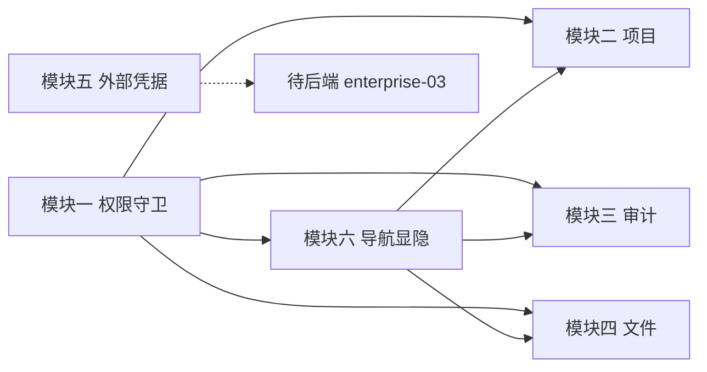

# 开发计划索引：前端管理后台 UI（plan-frontend-management-ui）

本文件为前端缺失「管理/企业级」界面的总索引。后端对应能力基本就绪，但前端缺页面、路由与权限控制。

各模块已拆分为独立子计划（按阶段目录存放，命名 `plan-{stage}-NN-frontend-*`），点击进入：

| 模块 | 子计划 | 阶段 | 状态 | 后端契约 |
|------|--------|------|------|----------|
| 一、用户与权限管理（RBAC） | [plan-beta-12-frontend-rbac.md](beta/plan-beta-12-frontend-rbac.md) | Beta | **后端阻塞**（缺 `GET /users`） | `UsersController` roles 子资源；`/auth/me` 返回 `Roles` |
| 二、项目分类管理 | [plan-beta-13-frontend-project-classification.md](beta/plan-beta-13-frontend-project-classification.md) | Beta | 待实施 | `ProjectsController` 全套 CRUD（api.ts 已封装） |
| 三、审计日志查看器 | [plan-alpha-10-frontend-audit-log.md](alpha/plan-alpha-10-frontend-audit-log.md) | Alpha | 待实施 | `AuditEventsController` `GET /audit-events`（`AuditQueryParameters`：EventType/From/To/ResourceType/ResourceId/Offset/Limit） |
| 四、文件存储管理 | [plan-beta-14-frontend-file-storage.md](beta/plan-beta-14-frontend-file-storage.md) | Beta | 待实施 | `FilesController` upload/list/download/delete（upload/list 需 `projectId`） |
| 五、外部凭据提供方配置 | [plan-enterprise-07-frontend-external-credentials.md](enterprise/plan-enterprise-07-frontend-external-credentials.md) | Enterprise | **暂缓** | 后端 `enterprise-03` 未落地 |
| 六、设置页与注册清理 | [plan-alpha-11-frontend-settings.md](alpha/plan-alpha-11-frontend-settings.md) | Alpha | 待实施 | `/auth/me`、`/auth/api-keys`（api.ts 缺 list/revoke 封装） |

## 现状基线（已实现，可复用）

- 路由：`/`、`/workflow/:id`、`/workflow/:id/history`、`/help`、`/login`、`/register`（`src/App.tsx`）。
- `api.ts` 已含 Credentials 全量 CRUD、Projects 全量 CRUD、Auth（login/logout/register/me）、`createApiKey`。
- `AuthContext` 仅暴露 `user`，**无 `roles` 字段**——这是**已知类型缺口**（后端 `UserDto.Roles` 已由 `/auth/me` 返回，前端 `UserDto` 未同步 `roles`），非待确认风险。
- **ahooks 已正式引入**：`AuthContext.tsx` 已使用 `useRequest`，可直接用于列表/请求场景（无需再决定是否引入）。
- `HeaderToolbar` 有死控件：Bell `ActionIcon`（第 99-101 行）无 `onClick`；导航仅「Workflows / Documents」。
- 后端已关闭自助注册（`AuthController.Register` 返回 403），但前端仍保留 `RegisterPage` 与 `/register` 路由。
- `api.ts` 已封装 `exportWorkflow`/`exportWorkflowsBatch`/`importWorkflow`/`importWorkflowsBatch`，属于工作流列表页操作（非管理后台功能），不在本计划范围内。

## 横向约定（所有模块共用）

- **路由与导航**：新增 `/admin/*` 管理分区（受权限控制）；`HeaderToolbar` 增加「系统管理」下拉菜单（`hasRole('Admin')` 显隐），菜单内子项列出所有 admin 页面（用户管理/项目分类/审计日志/文件管理）。
- **权限守卫（模块一，基于角色）**：`AuthContext` 暴露 `roles` 与 `hasRole(role)`；用 `<RequireRole role="Admin">` 守卫 `/admin/*`。**不做 scope/action 泛化判定**——前端只拿角色、不知道「哪些 scope/action 权限」，细粒度操作（如文件上传/下载）一律交由后端（`[AuthorizePermission]` / 403）+ 统一错误提示，前端不预判定。管理导航的「系统管理」菜单仅在 `hasRole('Admin')` 时显隐（见模块一）。
- **布局**：admin 页面复用现有 `MainLayout`（顶部 `HeaderToolbar` + 可选面板），不新建独立布局；「管理」入口放 Header 下拉，避免与现有 `navbar`/`aside` 语义混淆。
- **错误处理（真实链路）**：API 错误经 `api.ts` 的 `ApiError` 拦截器（401→登录、其余抛 `ApiError`），由调用方（`useRequest` 的 `onError` 或 `try/catch`）经 `notifications.show` 提示；`utils/globalErrorHandler.ts` 的 `setupGlobalErrorHandlers()` 仅兜底全局未捕获异常，不是 API 错误处理器。组件不直接 `catch` 网络层。
- **通用模式**：列表用 Mantine `Table`+`Pagination`+`useRequest`（ahooks，已引入）；增删改用 `Modal`+`useForm`；遵循 `frontend-code-rules.md`（API 在 `services/api.ts`、禁用 `any`、复用 Mantine）。
- **测试策略（Vitest + RTL）**：权限守卫 `RequireRole`、`useRoles` 必须有单元测试；角色分配、项目删除确认等关键交互应有组件测试；测试命名 `{函数/组件} - {场景} - {预期结果}`。

## 推荐实施路线（按依赖与优先级）

> 阶段倒挂说明：模块六（设置页）归属 Alpha，但其「权限相关导航」部分已移归模块一（RBAC，Beta），故模块六本期**仅交付不依赖权限的设置内容**（Alpha 可独立推进）。模块一（Beta）是管理分区与权限守卫的基础，需先行或并行落地。

1. **模块一 RBAC（角色守卫 + 管理导航/布局）** —— 基础：提供 `RequireRole` 守卫、Header「系统管理」菜单（`hasRole('Admin')` 显隐）、admin 布局。
2. **模块六 设置页与注册清理（Alpha）** —— 不依赖权限，可与管理员基础设施并行；交付自身设置 + 清理注册死代码。
3. **模块二 项目分类（Beta）** —— 依赖模块一导航显隐。
4. **模块三 审计日志（Alpha）** —— 依赖模块一守卫；作为「管理」入口首个实质页面。
5. **模块四 文件存储（Beta）** —— 依赖模块一守卫；注意 upload/list 需 `projectId`，交互上「先选项目再看文件」，无项目时 `FileField` 禁止上传并提示。
6. **模块五 外部凭据** —— **暂缓**，待 `enterprise-03` 后端落地后重启。

> 说明：模块间除模块一的守卫前置外，可并行推进；但建议按依赖逐个稳定落地。

## 阶段依赖图

## 风险与待定项（跨模块）

| 风险/待定项 | 影响 | 应对策略 |
|------------|------|---------|
| **【后端阻塞】`UsersController` 无 `GET /users` 列表端点** | 用户管理页无法列出全部用户 | 后端待补 `GET /api/v1/users`（字段至少 `id`/`email`/`userName`/`displayName`/`roles`/`isActive`/`createdAt`）；端点就绪前降级为「仅当前登录用户」 |
| 前端 `UserDto` 缺 `roles` 字段 | 权限无法判定 | **已知缺口**：扩展前端类型（后端 `Roles` 为 `IReadOnlyList<string>`，JSON 反序列化即数组，无需转换） |
| 文件 `upload`/`GetAll` 需 `projectId` | 无法全局列文件/上传 | 文件页「先选项目再看文件」；`FileField` 在工作流无项目时禁止上传并提示 |
| 审计 `events` 为动态 JSON | 表格渲染复杂 | 仅提取关键字段（eventType/resourceType/resourceId/时间），余下走详情 JSON |
| 审计筛选无 actor/keyword 字段 | 无法按操作人/关键词筛 | 前端仅用 eventType/resourceType/resourceId/from/to；操作人/关键词需后端补契约 |
| 外部凭据后端未落地 | 模块五无法实施 | 已暂缓，重启条件见子计划 |

## 关联计划

- **[plan-ai-draft-ux.md](plan-ai-draft-ux.md)** — AI 草稿审批 UX（列表刷新按钮、编辑器版本变更感知、待审计数）。不属管理后台范围，但与「管理导航/布局」共享 HeaderToolbar 改动，实施时注意协调。

## 验收总标准（总览）

- 管理分区存在且受权限守卫保护；非授权用户被拦截提示。
- 用户可分配/撤销角色，权限显隐正确。
- 项目可 CRUD、工作流可按项目筛选与归属（仅筛选不隔离）。
- 审计日志可筛选/分页/查看详情，敏感字段不展示明文，动态字段不报错。
- 文件可真实上传/下载/删除；`FileField` 保存文件 ID。
- 设置页可用（个人信息 + API Key 管理）；Header 无死控件；注册入口已清理。
- 全部新增页面遵循前端代码规范，`npm run build` + `npm run typecheck` 通过；关键守卫/交互有测试覆盖。
- 模块五待后端 `enterprise-03` 契约确认后细化验收。

## 变更记录

| 日期 | 修改人 | 修改内容 | 关联任务/PR |
|------|--------|----------|------------|
| 2026-07-15 | Agent | 创建前端管理后台 UI 汇总计划 | 前端功能缺口审计 |
| 2026-07-15 | Agent | 拆分为 6 个阶段子计划；本文件改为索引；外部凭据标记暂缓 | 用户决策 |
| 2026-07-15 | Agent | 按评审修订：子计划迁入阶段目录并规范命名；补推荐实施路线/测试策略/可量化验收/ahooks 基线；角色缺口改已知待办；mermaid 虚线语法修正 | 计划评审 P0-P3 |
| 2026-07-15 | Agent | 二轮修订（本轮）：#2 移除 hasPermission 改基于角色；#3 审计参数对齐后端；#4 错误链改 api.ts ApiError+notifications；#5 解决阶段倒挂（模块六仅设置内容，导航归 RBAC）；#6 GET /users 标后端阻塞+契约；#7 ApiKeyDto 仅 prefix；#8 projectId 已存在；#9 FileField 无项目禁上传；#10 管理布局；#11 更新 frontend-code-rules.md；#12 注册清理扩范围；#14 Bell 决策；#15 Roles 数组 | 计划评审第二轮 P0/P1/P2 |
| 2026-07-15 | Agent | P1：补充 import/export 归属说明（非管理后台范围）；更新横向约定 admin 导航（下拉子菜单列出子页面）；修复测试策略命名（RequirePermission→RequireRole，usePermissions→useRoles） | 源码评审 |
| 2026-07-15 | Agent | 管理入口改为「系统管理」下拉菜单，Bell 恢复原状不做管理入口 | 用户反馈 |
| 2026-07-15 | Agent | 关联 plan-ai-draft-ux.md，注明共享 HeaderToolbar 改动 | 源码评审 |
