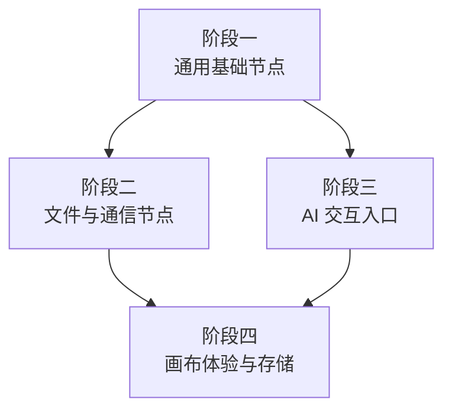

# 开发计划：核心节点补充（plan-node-essential-additions）

> **关联文档**：`docs/plans/plan-node-gap-analysis.md`（缺失节点调研基线）
> **目标**：补齐 Flow Engine 作为通用工作流引擎最紧缺的节点能力。本计划覆盖调研文档中 🔴 High 通用节点、AI 交互入口增强、以及 🟡 Medium 中画布体验与常见存储节点的高价值子集。
> **命名约定**：节点 `TypeName` 刻意不与 n8n 节点名完全一致（部分通用词如 `crypto`/`noOp`/`redis` 允许一致），避免概念绑定。所有名称见下表。

## 1. 概述

### 1.1 范围

本计划新增以下节点（分 4 阶段），均实现 `INodeType`，放置位置遵从 `plan-node-gap-analysis.md` §5 的放置策略：

| 阶段 | 节点 | 放置项目 |
|------|------|----------|
| 阶段一：通用基础节点 | `dbRead` `dateTime` `stopError` `crypto` `listOps` `batchSplit` | `FlowEngine.Plugins.Standard` |
| 阶段二：文件与通信节点 | `readFile` `writeFile` `compress` `spreadsheet` `sendEmail` | `FlowEngine.Plugins.Standard` |
| 阶段三：AI 交互入口 | `chatInput` `chatManual` `structuredOutput` | `FlowEngine.Plugins.Standard`（或新建 `FlowEngine.Plugins.AI`） |
| 阶段四：画布体验与存储 | `noOp` `note` `errorTrigger` `objectStorage` `redis` `mongoDb` | `Standard` + 新建 `FlowEngine.Plugins.Storage` |

### 1.2 节点命名对照（n8n → 我们的 TypeName）

| n8n 节点 | 我们的 TypeName | 说明 |
|----------|----------------|------|
| MySQL/Postgres Read | `dbRead` | 读写分离：`dbUpsert` 已覆盖写 |
| DateTime | `dateTime` | 通用词，保留一致 |
| StopAndError | `stopError` | 语序调整，规避完全一致 |
| Crypto | `crypto` | 通用词，保留一致 |
| ItemLists | `listOps` | 语义等价，命名更短 |
| SplitInBatches | `batchSplit` | 语序调整 |
| ReadBinaryFile | `readFile` | 简化 |
| WriteBinaryFile | `writeFile` | 简化 |
| Compression | `compress` | 名词转动词 |
| SpreadsheetFile | `spreadsheet` | 简化 |
| EmailSend | `sendEmail` | 语序调整 |
| ChatTrigger | `chatInput` | 强调"输入入口"语义 |
| ManualChatTrigger | `chatManual` | 简化 + 强调手动 |
| OutputParserStructured | `structuredOutput` | 描述输出形态 |
| NoOp | `noOp` | 通用词，保留一致 |
| StickyNote | `note` | 简化 |
| ErrorTrigger | `errorTrigger` | 通用词，保留一致 |
| S3 | `objectStorage` | 强调 S3 兼容对象存储，不绑定厂商 |
| Redis | `redis` | 保留一致 |
| MongoDb | `mongoDb` | 保留一致 |

### 1.3 不覆盖范围

- 🔴 AI 生态中的向量库（PGVector/Chroma/Pinecone 等）、Embeddings、检索器、Chain、Guardrails、MCP Client/Server：整条 RAG 基建投入大、依赖多，建议单独立 `plan-*` 在 `FlowEngine.Plugins.AI` 阶段规划，不混在本计划。
- 🟡 Medium 其余第三方集成（Airtable/Supabase/GraphQL/Kafka/MQTT/SSH/FTP/Git 等）与 🟢 Low 全部 SaaS 集成：按需开发，归入 `FlowEngine.Plugins.Integration`，不在此计划。
- 前端节点面板（ParameterPanel）对每个新节点的字段渲染：随节点实现同步完成，不单列。

## 2. 交付物清单

- 各节点实现类（`.cs`），实现 `INodeType`，含 `///` 文档注释与 `[Description]`。
- 节点注册到对应插件项目（自动发现或显式注册）。
- 每个节点在 `tests/FlowEngine.Runtime.Tests/Plugins/` 的单元测试，覆盖：正常路径、空/缺参、类型转换、异常路径（遵循 `backend-code-rules.md` §12）。
- 需要新凭据类型的（`sendEmail` 的 SMTP、`objectStorage`/`redis`/`mongoDb` 的连接凭据）：在凭据系统注册对应类型。
- 需要前端配合的（`chatInput` 聊天窗、`note` 画布便签渲染、`errorTrigger` 入口）：前端 PR 与后端并行。
- 全部 `dotnet build` + `dotnet test` 通过。

## 3. 开发阶段

### 阶段一：通用基础节点（零/低依赖，DbExecutor 已就绪）

> 目标：补齐几乎每个工作流都会用到、且不依赖外部服务（或基础设施已就绪）的底座节点。

#### 3.1.1 `dbRead` — 数据库查询节点

- **对标**：n8n MySQL/Postgres Read；现有 `dbUpsert` 仅覆盖写。
- **Category**：`Data`；**Ports**：Input / Output（Main）。
- **复用**：`Data/DbExecutor.cs`、`Data/ConnectionStringBuilderFactory.cs`、`Data/DbDialectResolver.cs`、`Data/IdentifierValidator.cs`（与 `DbUpsertNode` 同套）。
- **参数**：
  - `Connection`：`[Credential("connectionString")]`（与 `dbUpsert` 一致）。
  - `Sql`：`[Hint(Script)]` JS 表达式，支持 `$input`/`$json` 注入参数。
  - `Timeout`：可选超时（秒），默认沿用 `DbExecutor` 默认。
- **行为**：仅执行只读语句（`SELECT` / `WITH` 开头），禁止 `INSERT/UPDATE/DELETE/DROP/TRUNCATE` 等（校验失败返回 `DbError`）；用参数化查询防注入；`DbDataReader` 读取为 `DataBatch`。无输入时以空批执行（触发器直连场景）。
- **验收**：返回 `DataBatch`（每行一 `DataItem`）；空结果返回空批；缺凭据/表名错误返回 `ErrorResult`；非 SELECT 语句被拒绝；SQL 异常返回 `DbError` 且不抛未处理异常。

#### 3.1.2 `dateTime` — 日期时间节点

- **Category**：`Data`；**Ports**：Input / Output（Main）。
- **参数**：`Operation`（`now` | `format` | `add` | `diff` | `convertTz`）、`Input`（表达式，可选，`now`/`format` 可省略）、`Format`（输出格式串）、`AddUnit`/`AddValue`（add 用）、`Timezone`（目标时区）。
- **行为**：基于 `System.DateTimeOffset` 与 `TimeZoneInfo`；`now` 返回当前时间戳；`add` 按单位增减；`diff` 返回两时间差（毫秒/秒可选）；`convertTz` 做时区换算。输出为单 `DataItem`，字段含 `value`（字符串）与 `timestamp`（Unix 毫秒）。
- **验收**：各 Operation 正常；默认 `now` 无输入可用；非法格式串返回 `ErrorResult`；时区名无效返回 `ErrorResult`。

#### 3.1.3 `stopError` — 停止并报错节点

- **Category**：`Flow`；**Ports**：仅 Input（无 Output 端口）。
- **参数**：`ErrorMessage`（字符串/表达式）、`ErrorCode`（可选，默认 `StopAndError`）。
- **行为**：执行时返回 `context.ErrorResult(errorCode, message)`，主动中止当前执行分支。
- **验收**：执行即以指定消息/码中止；下游不执行；消息不泄露敏感凭据（遵循 `backend-code-rules.md` §10）。

#### 3.1.4 `crypto` — 加密/解密节点

- **Category**：`Data`；**Ports**：Input / Output（Main）。
- **参数**：`Operation`（`hash` | `base64Encode` | `base64Decode` | `aesEncrypt` | `aesDecrypt` | `hmacSign`）、`Input`、`Algorithm`（`SHA256`/`SHA1`/`MD5`/`AES`）、`Key`（AES/HMAC 必填）、`Encoding`（输入/输出编码）。
- **行为**：哈希/Base64 用 BCL（`System.Security.Cryptography`）；AES 用 `AesGcm` 或 `Aes` + 随机 IV；HMAC 用 `HMACSHA256` 等。输出单 `DataItem` 含 `value`。
- **验收**：`base64Encode`→`base64Decode` 往返一致；AES 加解密往返一致；密钥长度非法返回 `ErrorResult`；MD5 等弱算法可用但文档标注不推荐用于安全场景。

#### 3.1.5 `listOps` — 列表操作节点

- **Category**：`Data`；**Ports**：Input / Output（Main）。
- **参数**：`Operation`（`summarize` | `fieldToItems` | `itemsToField` | `groupBy`）、聚合字段/分组字段、汇总函数（`sum`/`count`/`avg`/`min`/`max`）。
- **行为**：
  - `summarize`：对指定数值字段做聚合，输出单 `DataItem`。
  - `fieldToItems`：将某数组字段拆分为多行（每行含该元素）。
  - `itemsToField`：将多行的某字段合并为数组，输出单 `DataItem`。
  - `groupBy`：按字段分组并各自聚合。
- **验收**：各 Operation 输出形态正确；输入为空批返回空批；非数值字段做 `sum`/`avg` 返回 `ErrorResult`。

#### 3.1.6 `batchSplit` — 分批处理节点

- **Category**：`Flow`；**Ports**：`Output`（每批 N 条）、`Done`（全部批次处理完成后，可选）。
- **参数**：`BatchSize`（每批条数，≥1）。
- **行为**：将输入 items 按 `BatchSize` 切片，对每批以 `Output` 端口向下游推送（每批一个 `DataBatch`）。**依赖引擎支持"对同一下游重复执行多批"**——需先确认/扩展 `LoopNode` 已有的批循环机制（见风险 GAP-B1）。
- **验收**：N 条输入按批输出；`BatchSize=1` 退化为逐条；空输入不触发下游；批次数正确。

### 阶段二：文件与通信节点

#### 3.2.1 `readFile` — 文件读取节点

- **Category**：`File`；**Ports**：Input / Output（Main）。
- **参数**：`Source`（磁盘路径或 URL）、`BinaryField`（默认 `data`）、`Encoding`（文本场景）。
- **行为**：从磁盘/URL 读取为二进制放入 item 的 binary 字段；可选文本模式直接转字符串。
- **验收**：文件不存在返回 `ErrorResult`；返回含 binary 的 `DataItem`；大文件以流式读取避免内存溢出。

#### 3.2.2 `writeFile` — 文件写入节点

- **Category**：`File`；**Ports**：Input / Output（Main）。
- **参数**：`BinaryField`（取自输入）、`FileName`、`Path`、`WriteMode`（`overwrite` | `append`）。
- **行为**：将输入 binary 写入磁盘文件。
- **验收**：写入成功返回路径；缺 binary 字段返回 `ErrorResult`；`overwrite`/`append` 语义正确。

#### 3.2.3 `compress` — 压缩/解压节点

- **Category**：`File`；**Ports**：Input / Output（Main）。
- **参数**：`Operation`（`zip` | `unzip` | `gzip` | `gunzip` | `tar` | `untar`）、`Input`（binary）、`OutputFormat`。
- **行为**：用 `System.IO.Compression`（Zip/Gzip）；Tar 用轻量实现或库。解压后输出多文件二进制。
- **验收**：zip↔unzip、gzip↔gunzip 往返一致；损坏压缩包返回 `ErrorResult`。

#### 3.2.4 `spreadsheet` — 电子表格读写节点

- **Category**：`File`；**Ports**：Input / Output（Main）。
- **参数**：`Operation`（`read` | `write`）、`Format`（`csv` | `xlsx` | `ods`）、`FilePath` 或 binary、`SheetName`（xlsx）、`HasHeader`。
- **行为**：`read` 将表格转为 `DataBatch`；`write` 从 `DataBatch` 生成文件。**CSV 可用轻量解析器；XLSX/ODS 需引入库**（如 `MiniExcel` / `Sylvan.Data.Excel` / `ClosedXML`，待定，见风险 GAP-B2）。
- **验收**：CSV 读写往返一致；XLSX 多 sheet 读取按 `SheetName` 选择；表头开关生效；空表返回空批。

#### 3.2.5 `sendEmail` — 发送邮件节点

- **Category**：`Communication`；**Ports**：Input / Output（Main）。
- **参数**：`Connection`：`[Credential("smtp")]`（**需新增 `smtp` 凭据类型**：host/port/user/password/useSsl）；`To`（可多个）、`Subject`、`Body`（纯文本或 HTML）、`IsHtml`、`Attachments`（binary 字段列表，可选）。
- **行为**：经 `System.Net.Mail.SmtpClient` 发送；凭据经凭据系统注入，禁止硬编码。
- **验收**：成功发送返回 `success`；认证失败/连接失败返回 `ErrorResult`；附件正确附带；不向日志输出密码。

### 阶段三：AI 交互入口增强

> 目标：打通现有 `LlmNode` + `AgentNode` 的对外交互闭环，不做整条 RAG 链路。

#### 3.3.1 `chatInput` — 聊天触发入口节点

- **Category**：`Trigger`；**DefaultIsEntry**：`true`；**Ports**：Output（Main）。
- **参数**：`ResponseMode`（`streaming` | `full`，可选）、`WelcomeMessage`（可选）。
- **行为**：作为工作流入口，接收外部聊天消息并触发执行，消息作为首条 `DataItem` 进入上下文（字段如 `message`/`sessionId`）。**需前端嵌入式聊天窗 + 后端接收端点**启动执行（跨前后端，见风险 GAP-B3）。
- **验收**：聊天消息触发一次执行；消息内容在 `LlmNode`/`AgentNode` 上下文可见；`streaming` 模式经 WebSocket/SSE 推送（复用 `plan-beta-09` 已实现的流式能力）。

#### 3.3.2 `chatManual` — 手动聊天触发节点

- **Category**：`Trigger`；**DefaultIsEntry**：`true`。
- **行为**：`chatInput` 的调试版，编辑器内手动输入消息触发，不暴露对外端点。
- **验收**：编辑器内手动触发可用；其余语义同 `chatInput`。

#### 3.3.3 `structuredOutput` — 结构化输出解析节点

- **Category**：`AI`；**Ports**：Input / Output（Main）。
- **参数**：`Schema`（JSON Schema 字符串/表达式）、`Input`（上游 LLM 文本）、`Strict`（严格模式）。
- **行为**：解析 LLM 文本为符合 `Schema` 的结构化 `DataItem`；失败时返回 `ErrorResult`（可选自动重试由调用方决定）。是 `LlmNode` 提示词手写格式的升级，不调用 LLM。
- **验收**：合法 JSON 按 Schema 映射为 `DataItem`；缺失必填字段返回 `ErrorResult`；输入非 JSON 文本返回 `ErrorResult`。

### 阶段四：画布体验与存储/传输

#### 3.4.1 `noOp` — 空操作节点

- **Category**：`Flow`；**Ports**：Input / Output（Main）。
- **行为**：输入原样透传到输出，用于调试/占位/分支布线。
- **验收**：输出等于输入；无副作用。

#### 3.4.2 `note` — 画布便签节点

- **Category**：`Utility`；**DefaultIsEntry**：`false`；**运行时跳过**。
- **参数**：`Content`（便签文本）。
- **行为**：仅画布显示，**运行时引擎须跳过该节点**（不产生执行记录/不占端口）。**需引擎支持"跳过特定 Category/标记节点"**（见风险 GAP-B4）。
- **验收**：运行时被跳过；编辑器内可编辑/显示文本。

#### 3.4.3 `errorTrigger` — 错误触发器节点

- **Category**：`Trigger`；**DefaultIsEntry**：`true`。
- **行为**：作为工作流入口，当其他工作流执行产生错误事件时触发，错误上下文（workflowId/errorMessage）作为首条 `DataItem`。**需错误事件总线已存在**（见风险 GAP-B5）。
- **验收**：被错误事件触发；错误上下文字段可用。

#### 3.4.4 `objectStorage` — 对象存储节点（S3 兼容）

- **放置**：新建 `FlowEngine.Plugins.Storage`。
- **Category**：`Storage`；**Ports**：Input / Output（Main）。
- **参数**：`Connection`：`[Credential("s3")]`（endpoint/accessKey/secretKey/bucket/region）、`Operation`（`upload` | `download` | `delete` | `list`）、`Key`、`LocalPath` 或 binary。
- **依赖**：`AWSSDK.S3` 或 `Minio` 客户端（待定，见风险 GAP-B6）。
- **验收**：上传/下载/删除/列举正常；MinIO/R2 等 S3 兼容端点可用；凭据错误返回 `ErrorResult`。

#### 3.4.5 `redis` — Redis 节点

- **放置**：`FlowEngine.Plugins.Storage`。
- **Category**：`Storage`；**Ports**：Input / Output（Main）。
- **参数**：`Connection`：`[Credential("redis")]`（host/port/password/db）、`Operation`（`get` | `set` | `del` | `expire`）、`Key`、`Value`、`Ttl`。
- **依赖**：`StackExchange.Redis`。
- **验收**：set/get 往返一致；`expire` 生效；连接失败返回 `ErrorResult`。

#### 3.4.6 `mongoDb` — MongoDB 节点

- **放置**：`FlowEngine.Plugins.Storage`。
- **Category**：`Storage`；**Ports**：Input / Output（Main）。
- **参数**：`Connection`：`[Credential("mongo")]`（connectionString/database）、`Collection`、`Operation`（`insert` | `find` | `update` | `delete`）、`Filter`（表达式）、`Document`。
- **依赖**：`MongoDB.Driver`。
- **验收**：增查改删正常；`find` 返回 `DataBatch`；连接失败返回 `ErrorResult`。

## 4. 阶段依赖图

- 阶段一无外部依赖（基础设施已就绪），可最先落地。
- 阶段三 `chatInput`/`chatManual` 依赖阶段三流式能力（已在 `plan-beta-09` 实现），不阻塞阶段一/二。
- 阶段四存储节点依赖新建插件项目 `FlowEngine.Plugins.Storage`。

## 5. 风险与待定项

| 编号 | 风险 / 待定项 | 影响 | 应对 |
|------|--------------|------|------|
| GAP-B1 | `batchSplit` 依赖引擎"对下游重复执行多批"能力，需确认 `LoopNode` 现有机制是否可复用 | 功能无法实现 | 先探查 `LoopNode` 执行逻辑；若缺则作为前置任务扩展引擎 |
| GAP-B2 | `spreadsheet` 的 XLSX/ODS 需引入第三方库 | 依赖膨胀/许可 | 评估 `MiniExcel`（轻量、MIT）优先；CSV 用内置解析 |
| GAP-B3 | `chatInput` 需前端聊天窗 + 后端接收端点，跨前后端 | 工作量较大 | 先定义接口契约，前后端并行；MVP 可先仅 `chatManual` |
| GAP-B4 | `note` 需引擎显式跳过特定节点 | 便签参与执行 | 引擎按 `Category == "Utility"` 或节点 `IsRuntimeSkip` 标记跳过 |
| GAP-B5 | `errorTrigger` 依赖错误事件总线 | 无法触发 | 确认现有执行错误事件是否已可订阅；否则新增错误事件发布 |
| GAP-B6 | 存储节点引入 `AWSSDK.S3`/`StackExchange.Redis`/`MongoDB.Driver` | 新插件依赖 | 统一放 `FlowEngine.Plugins.Storage`，独立 `AssemblyLoadContext` 加载 |
| GAP-B7 | 新增凭据类型 `smtp`/`s3`/`redis`/`mongo` 需注册 | 节点不可用 | 在凭据系统注册类型并补充凭据 UI 字段 |

## 6. 验收总标准

- **阶段一**：6 个节点全部实现并注册；单元测试覆盖正常/空参/异常路径；`dotnet build` + `dotnet test` 通过；`dbRead` 复用 `DbExecutor` 且只读校验生效。
- **阶段二**：5 个节点全部实现；`spreadsheet` 至少 CSV 往返与 XLSX 读取通过；`sendEmail` 经测试 SMTP 发送成功（或 Mock 验证调用）。
- **阶段三**：`chatManual` 可用；`chatInput` 端到端打通（前端聊天窗触发 → 执行 → `LlmNode` 收到消息）；`structuredOutput` 按 Schema 解析通过。
- **阶段四**：`noOp`/`note`/`errorTrigger` 行为正确（含引擎跳过便签）；`objectStorage`/`redis`/`mongoDb` 在 `FlowEngine.Plugins.Storage` 中实现并通过集成测试（可用本地/容器实例或 Mock）。
- 全部节点遵循 `backend-code-rules.md`（命名、注释、`///` + `[Description]`、异常不抛未处理、凭据不硬编码/不落日志）。

## 变更记录

| 日期 | 修改人 | 修改内容 | 关联任务 |
|------|--------|----------|----------|
| 2026-07-22 | Agent | 初版：基于 `plan-node-gap-analysis.md` 产出分阶段节点补充计划，节点名刻意区别于 n8n | 用户请求 |
