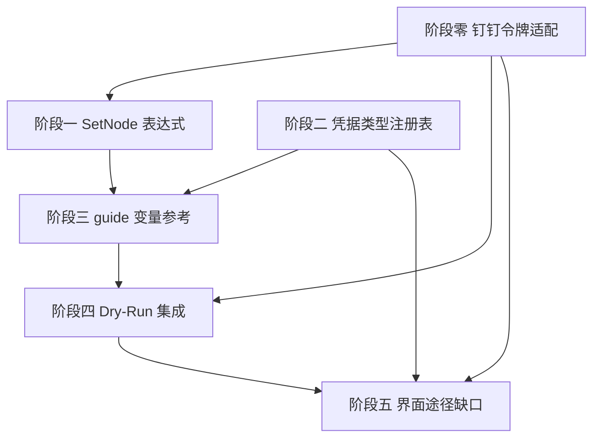

# 工作流稳定运行并行修复计划

> **目标**：补齐 Agent IDE 生成的工作流 DSL 能"完整稳定运行"所需的剩余短板。

**背景**：DSL 生成已转移到 Agent IDE（见 [task-007-agent-ide-driven-dsl.md](task-007-agent-ide-driven-dsl.md) 与已退役的 [plan-ai-dsl-generation.md](plan-ai-dsl-generation.md)）。Agent IDE 通过 CLI skill 直接产出 DSL JSON，本计划解决"生成后能不能跑通"。

## 调研结论：原短板状态更新

经过代码验证，task-003 中的部分短板已被 plan-004 实施**提前解决**：

| 编号 | 原问题 | 当前实际状态 | 证据 |
|------|--------|-------------|------|
| **S1** | 缺少数据库写入节点 | **已解决** | `DbUpsertNode` 已存在，支持 PG/MySQL/MSSQL/SQLite |
| **S2** | 通用 OAuth2 令牌管理 | **部分解决** | 标准 `client_credentials`（POST + `client_id`/`client_secret`）已实现；但钉钉 `gettoken` 为 `GET ?appkey&appsecret` 且响应带 `errcode`，当前 `OAuth2TokenService` 无法配置请求方法/参数位置/参数名/业务错误码，钉钉取 token 仍会失败（见阶段零） |
| **S3** | 凭据多字段无法引用 | **已解决** | `NodeExecutionContextFactory.PreloadCredentialsAsync` 已加载全部字段到 `$credentials.<name>.<field>`；表达式文档 §2.2.1 已记录 |
| **S4** | 游标分页循环 | **已解决** | `PaginateNode` 已实现，支持 `$cursor`/`$nextCursor`/`terminateWhen` |
| **S5** | SetNode 不支持表达式 | **未解决** | `SetNode.ParseValue` 仍只做 JSON/原始类型解析，无表达式求值 |
| **S6** | CLI 无离线校验 | **部分解决** | `workflow validate` 已实现基础校验，依赖后端节点清单 |
| **S7** | CLI 无法暴露能力缺口 | **部分解决** | `guide` 命令已添加 `knownGaps` 和 `recentProgress` |
| **S8** | 凭据 Type 无枚举 | **已解决** | 后端 `CredentialTypeRegistry` 已存在（apiKey/connectionString/basicAuth/oauth2 共 4 种），并在 `CredentialService.ValidateCredentialType` 接入创建/更新校验（`CredentialService.cs:52,66,228`）；仅前端下拉缺 `connectionString`（见阶段五 5.2） |
| **S9** | 表达式变量模型不一致 | **基本解决** | expression-system.md §2.2.1 已统一 `$` 前缀变量模型；但 SetNode 不支持表达式是残留问题 |

**结论**：核心短板（S1/S3/S4）已在 plan-004 中解决；S2 仅覆盖标准 `client_credentials`，钉钉的非标准取 token 形态仍未解决（阶段零补齐）；S8（凭据类型枚举）后端已解决，仅前端下拉缺 `connectionString`（阶段五 5.2）。剩余问题集中在钉钉令牌适配（阶段零）、SetNode 表达式支持（阶段一）、Dry-Run 集成验证（阶段四）。

---

## 1. 概述

### 覆盖范围

- SetNode 表达式支持（S5）
- 凭据类型枚举与校验（S8，后端已解决；仅前端下拉缺 `connectionString`，见阶段五 5.2）
- CLI guide 变量参考文档（S9 残留）
- Dry-Run 集成：Agent IDE 生成 DSL 后可一键试运行
- 界面途径缺口收口：Dry-Run 按钮、凭据类型/内联新建、节点超时等（见阶段五）

### 不覆盖范围

- Script 类型 Phase 6-7（前端 Script 编辑器，独立计划）
- MCP 协议（Enterprise 阶段）
- 钉钉专用节点（不做）
- 人在界面通过 AI 对话生成工作流（延期，由后续独立计划负责；plan-ai-dsl-generation 当前仅覆盖 CLI 生成途径）

---

## 2. 交付物清单

| 交付物 | 文件位置 | 说明 |
|--------|----------|------|
| SetNode 表达式支持 | `plugins/.../SetNode.cs` | `SetField.Value` 改为 `Script` 类型，支持表达式求值 |
| SetNode 测试 | `tests/.../SetNodeTests.cs` | 表达式值、静态值、混合场景测试 |
| 凭据类型注册表（已存在，收口） | `Core/Credentials/CredentialTypeRegistry.cs` | 已预置 4 种类型 + 字段 schema 并接入 `CredentialService` 校验；本计划仅做对齐与可选补全（不重新新建） |
| 后端凭据类型端点（新增，可选） | `Host/Controllers/CredentialsController.cs` | `GET /api/v1/credential-types` 暴露类型清单，供前端动态拉取（替代前端硬编码类型） |
| CLI credential types 命令（已存在） | `cli/src/commands/credentials.ts:492` | 已能列出已知类型；补测试断言输出 4 种预置类型 |
| CLI guide 变量参考 | `cli/src/commands/guide.ts` | 新增"表达式变量参考"章节 |
| Dry-Run 集成到 Agent IDE 生成流程 | `cli/src/commands/test.ts` / `workflow create --dry-run` | Agent IDE 生成 DSL 后通过 `test` 或 `workflow create --dry-run` 试运行 |

---

## 3. 开发阶段

### 阶段零：钉钉令牌请求策略适配（S2 真正收口）

**目标**：让通用 OAuth2 令牌服务支持钉钉等非标准取 token 形态，使 `$credentials.dingtalk.accessToken` 能真正取到值；并让 HTTP/Paginate 节点能识别业务错误（如钉钉 `errcode != 0` 但 HTTP 200）。

**当前问题**：`OAuth2TokenService.RequestTokenAsync` 硬编码 `POST` + `FormUrlEncodedContent`（`grant_type/client_id/client_secret`）。钉钉 `gettoken` 实际为 `GET ?appkey=...&appsecret=...`，且响应体带 `errcode`，出错时仍返回 HTTP 200。当前实现无法配置请求方法/参数位置/参数名，也不校验业务错误码，导致钉钉凭据取 token 必然失败——这是 AI 生成工作流"完整稳定运行"的头号缺口。

#### 0.1 令牌请求策略可配置化

| 任务 | 文件 | 验收标准 |
|------|------|---------|
| 扩展 `OAuth2TokenRequest` | `backend/FlowEngine.Runtime/Credentials/OAuth2TokenRequest.cs` | 新增 `HttpMethod`、`ParamLocation`(Query/Body)、`ParamNameMap`(如 `clientId→appkey`)、`ResponseErrorPath`(如 `errcode`)、`ResponseSuccessValues`(如 `{0}`) |
| 重写 `RequestTokenAsync` | `backend/FlowEngine.Runtime/Credentials/OAuth2TokenService.cs` | 按策略拼装 GET/POST、query 或 form/body 参数、按 `ResponseErrorPath` 判定业务错误 |
| 凭据字段映射 | `Application/Credentials/CredentialService.cs` 或 `OAuth2CredentialAccessor` | 凭据 `fields` 的 `clientId/clientSecret/grant/tokenPath` 映射到 `OAuth2TokenRequest`，并允许 `paramNameMap` 覆盖参数名 |
| 单元测试 | `tests/.../OAuth2TokenServiceTests.cs` | 标准 client_credentials 仍通过；GET+query(appkey/appsecret)+errcode 判定场景通过 |

**钉钉配方（作为内置默认策略之一）**：

| 项 | 值 |
|----|----|
| method | GET |
| url | `https://oapi.dingtalk.com/gettoken` |
| 参数位置 | Query |
| 参数名 | `appkey`=`clientId`，`appsecret`=`clientSecret` |
| 成功判定 | `errcode == 0`（响应体 `errcode` 字段，缺省视为成功） |
| token 路径 | `access_token` |

**设计决策：扩展字段归属（采用 provider 内置策略方案）**

阶段零新增的 5 个策略字段（`HttpMethod` / `ParamLocation` / `ParamNameMap` / `ResponseErrorPath` / `ResponseSuccessValues`）**不暴露为凭据的可填字段，也不作为节点参数**，而是作为 oauth2 的内置策略预设：

- 凭据类型细分为 `oauth2`（通用，默认 `standard` 策略：POST + form + client_id/client_secret）与 `oauth2:dingtalk`（内置钉钉策略：GET + query appkey/appsecret + errcode 判定）。
- 或在 oauth2 凭据 `fields` 中新增 `provider` 字段（`standard` / `dingtalk`），引擎按 `provider` 套用对应内置 `OAuth2TokenRequest` 策略模板（阶段零 0.1 的钉钉配方即 `dingtalk` 模板）。
- 用户创建钉钉凭据时只需填 `clientId`(→appkey) / `clientSecret`(→appsecret) / `tokenUrl`，策略细节由引擎内置，避免用户手填 5 个陌生参数。
- `OAuth2TokenRequest` 仍承载这 5 个可配置字段（供未来自定义 provider 扩展），但默认由内置模板填充。

#### 0.2 HTTP/Paginate 业务错误判定（successWhen）

| 任务 | 文件 | 验收标准 |
|------|------|---------|
| 新增 `successWhen` 表达式参数 | `HttpRequestNode` / `PaginateNode` | 节点执行后按表达式判定业务成功（如 `$json.errcode == 0`），失败则节点报错 |
| 缺省行为 | 同上 | 未配置时仅按 HTTP 状态码判定（保持向后兼容） |
| 测试 | 对应节点测试 | errcode!=0 但 HTTP 200 时节点标记为失败 |

**判定规则（明确优先级）**：
1. **先判 HTTP 状态码**：非 2xx → 节点直接失败（沿用现有行为，向后兼容）。
2. **HTTP 成功后再判 `successWhen`**：仅当配置了 `successWhen` 时执行；表达式求值非真（如 `$json.errcode != 0`）→ 节点失败。
3. **`successWhen` 失败 = 节点执行失败**：**不自动重试**；是否重试仅由节点 `retryPolicy` 决定（配置了才重试）。
4. **`successWhen` 配置位置**：节点参数（HttpRequestNode / PaginateNode 的 `parameters.successWhen`），非凭据策略。

---

### 阶段一：SetNode 表达式支持（S5）

**目标**：SetNode 的字段值支持 JS 表达式，可用于简单字段重命名/映射。

**当前问题**：`SetField.Value` 是 `string`，`ParseValue` 只做 JSON/原始类型解析，不解析表达式。用户只能用 JSNode 做字段映射，偏重。

#### 3.1.1 改造 SetField

| 任务 | 文件 | 验收标准 |
|------|------|---------|
| `SetField.Value` 改为 `Script` | `plugins/.../SetNode.cs` | `Script` 类型 + `Hint(Expression)` |
| `ParseValue` 改为表达式求值 | `SetNode.cs` | 使用 `script.EvaluateAsync<JsonNode>()` 逐项求值 |
| 保留静态值兼容 | `SetNode.cs` | 纯字符串/数字/布尔仍可直接使用（Script 隐式转换 + 空表达式快路径） |

**改造后用法**：

```json
{
  "typeName": "set",
  "parameters": {
    "fields": [
      { "name": "userId", "value": { "source": "$json.userid", "returnType": "String" } },
      { "name": "fullName", "value": { "source": "$json.name + ' (' + $json.dept + ')'", "returnType": "String" } },
      { "name": "active", "value": true }
    ],
    "include": "All"
  }
}
```

**关键设计**：
- `SetField.Value` 从 `string` 改为 `Script`，`ReturnType = String`（默认）
- 纯字面量值（如 `true`、`42`、`"hello"`）通过 `ScriptJsonConverter` 的字符串简写反序列化为 `Script { Source = "true", ReturnType = String }`，求值时 Jint 返回对应值
- 表达式值（如 `$json.userid`）通过 `Script { Source = "$json.userid", ReturnType = String }` 求值
- **逐项求值**：SetNode 是 `OnceForAll` 但内部遍历 items，需对每个 item 调用 `EvaluateAsync<JsonNode>(context, item.Data, index)`

#### 3.1.2 测试

| 测试用例 | 验证点 |
|----------|--------|
| 静态字符串值 | `fields: [{ name: "status", value: "active" }]` → 输出 `status: "active"` |
| 静态布尔值 | `fields: [{ name: "flag", value: true }]` → 输出 `flag: true` |
| 表达式值 | `fields: [{ name: "uid", value: { source: "$json.userid" } }]` → 输出 `uid: <userid>` |
| 表达式拼接 | `fields: [{ name: "label", value: { source: "$json.name + ' (' + $json.dept + ')'" } }]` |
| 混合静态+表达式 | 多个字段分别使用静态值和表达式 |
| 嵌套路径写入 | `fields: [{ name: "addr.city", value: { source: "$json.city" } }]` |
| 空 Source | `fields: [{ name: "x", value: "" }]` → 输出 `x: ""` |

---

### 阶段二：凭据类型注册表（S8）

**目标**：凭据 Type 从任意字符串变为有枚举、有字段 schema 的注册表。

**当前问题**：`CreateCredentialDto.Type` 是任意字符串，无校验，易拼错。

#### 3.2.1 凭据类型注册表（已存在，仅收口）

> 代码验证结论：后端 `CredentialTypeRegistry` **已实现**（`Core/Credentials/CredentialTypeRegistry.cs`），预置 **4 种**类型（apiKey / connectionString / basicAuth / oauth2），并通过 `CredentialService.ValidateCredentialType`（`CredentialService.cs:52,66,228`）在创建/更新时校验 Type 与必填字段（未知类型直接抛 `BusinessException`）。CLI `builtInCredentialTypes` 与之一致。因此本阶段**不再新建注册表**，仅做收口：

| 任务 | 文件 | 验收标准 |
|------|------|---------|
| 核对类型清单对齐 | `Core/Credentials/CredentialTypeRegistry.cs` + `cli/.../credentials.ts` | 后端 4 种与 CLI 完全一致（不再列 `http`，因其尚未实现） |
| （待定）`http` 类型 | 同上 | 如需通用 HTTP 配置类型，再评估新增；当前不在范围内 |
| （可选）`GET /credential-types` 端点 | `Host/Controllers/CredentialsController.cs` | 暴露类型清单供前端动态拉取（见 3.2.2） |
| 单元测试补全 | `tests/.../CredentialTypeRegistryTests.cs` | 已知类型查询、未知类型拒绝、字段校验、与 CLI 对齐断言 |

**预置凭据类型（代码实际，共 4 种）**：

| Type | 必填字段 | 可选字段 | 说明 |
|------|---------|---------|------|
| `oauth2` | `clientId`, `clientSecret`, `tokenUrl` | `scope`, `grant`, `tokenPath` | OAuth2 客户端凭据（阶段零支持钉钉 GET+query 策略） |
| `apiKey` | `apiKey` | — | API Key 鉴权 |
| `basicAuth` | `username`, `password` | — | Basic 认证 |
| `connectionString` | `connectionString` | — | 数据库连接串（DbUpsertNode 通过 `$credentials.db.connectionString` 引用） |

> 注：原草稿列了 5 种（含 `http`），但代码实际只有 4 种且无 `http`，此处以代码为准。

#### 3.2.2 CLI credential types 命令（已存在）

> `credential types` 命令已在 `cli/src/commands/credentials.ts:492` 实现，能列出已知类型 + 字段 schema。本阶段仅补测试断言。

| 任务 | 文件 | 验收标准 |
|------|------|---------|
| CLI 测试补全 | `cli/src/__tests__/credentials-commands.test.ts` | 输出包含 4 种预置类型（apiKey/connectionString/basicAuth/oauth2） |
| （可选）前端动态拉取 | `services/api.ts` + `CredentialListModal.tsx` | 前端不再硬编码类型，改为请求 `GET /credential-types`（见阶段五 5.2） |

---

### 阶段三：CLI guide 变量参考（S9 收尾）

**目标**：guide 命令输出完整的表达式变量参考，供 AI 和用户查阅。

**当前问题**：guide 不包含变量清单，AI 生成的表达式可能引用不存在的变量。

| 任务 | 文件 | 验收标准 |
|------|------|---------|
| 新增变量参考章节 | `cli/src/commands/guide.ts` | 列出所有 `$` 前缀变量、含义、示例 |
| 新增表达式语法说明 | 同上 | 说明 Script 类型 + source/returnType + 纯字符串简写 |
| 新增 SetNode 表达式示例 | 同上 | 在示例中加入使用 SetNode 表达式做字段映射的 workflow |
| 测试更新 | `cli/src/__tests__/guide-command.test.ts` | 输出包含变量参考章节 |

**变量参考内容**（从 expression-system.md §2.2.1 提取）：

| 变量 | 含义 | 示例 |
|------|------|------|
| `$json` | 当前 item 数据 | `$json.userid` |
| `$input` | 输入容器 | `$input.item().userid` / `$input.all()` |
| `$items(name?)` | 指定/当前节点全部 item | `$items('GetUser')` |
| `$node['Name']` | 指定节点输出对象 | `$node['GetUser'].json[0].name` |
| `$credentials.<name>.<field>` | 凭据字段值 | `$credentials.db.connectionString` |
| `$workflow` | 工作流元数据 | `$workflow.name` |
| `$execution` | 执行元数据 | `$execution.id` |
| `$env.VAR` | 白名单环境变量 | `$env.API_BASE_URL` |
| `$vars` | 工作流级状态 | `$vars.flag` |
| `$now` / `$today` | 当前时间 | `$now` |
| `$runIndex` / `$itemIndex` | 运行索引 | `$runIndex` |
| `$cursor` / `$nextCursor` | PaginateNode 游标 | `$cursor` |

---

### 阶段四：Dry-Run 集成到 Agent IDE 生成流程

**目标**：Agent IDE 生成 DSL 后可直接试运行验证可执行性。

**当前问题**：DSL 结构校验通过不代表能跑通（如凭据缺失、HTTP 404、表达式运行时错误）。后端 `POST /api/v1/workflows/dry-run` 与 CLI `test` 命令均已存在，只需在 Agent IDE 工作流中明确推荐该步骤。

| 任务 | 文件 | 验收标准 |
|------|------|---------|
| CLI `test` 命令能力 | `cli/src/commands/test.ts` | 接受 DSL JSON + 临时凭据，调用后端 dry-run 端点 |
| CLI `workflow create --dry-run` 能力 | `cli/src/commands/workflows.ts` | 结构校验后打印请求体，不创建真实工作流 |
| Skill 文档标注 Dry-Run 步骤 | `cli/skill/claude.md` / `cursor.md` / `skill.json` | Agent IDE 工作流中包含 dry-run 校验步骤 |
| 失败时保留草案 | 同上 | Dry-Run 失败仍输出 DSL 草案 + 错误信息，供用户修正 |

**Agent IDE 流程**：

```bash
# 1. Agent IDE 根据 skill/schema/节点类型直接生成 DSL JSON
# 2. 结构校验
flowengine workflow validate workflow.json

# 3. 试运行验证
flowengine test --file workflow.json --credentials '{"name":"api","type":"oauth2","fields":{...}}' --json

# 4. 创建
flowengine workflow create --file workflow.json --json
```

**实现要点**：
- Agent IDE 负责生成 DSL；CLI 不再提供 `workflow generate`。
- `test` 调用 `POST /api/v1/workflows/dry-run`，请求中 `nodes`/`connections` 直接使用生成的草案。
- 凭据参数：如 DSL 引用了 `$credentials.dingtalk`，用户需通过 `--credentials` 参数传入临时凭据（CLI 已有此能力）。

---

### 阶段五：界面途径缺口（与运行时稳定性协同）

> 范围说明：本计划聚焦"生成后能否跑通"，但人通过界面手动创建/编辑/查看流程时，界面与后端之间仍存在若干未闭环的缺口，会直接拖慢"完整稳定运行"目标的达成。这些缺口多数与前述阶段同源（钉钉凭据、Dry-Run、凭据类型枚举），故在此统一收口。
>
> **明确不在本期范围**：人在界面通过 AI 对话生成工作流（自然语言 → DSL 回填画布）。该能力延期，由后续独立计划负责——`plan-ai-dsl-generation.md` 当前仅覆盖 CLI 生成途径，不要据此推断界面也需 AI 生成。
>
> **必做 vs 增强**：5.1（界面 Dry-Run 按钮）与 5.2（前端补 `connectionString`）与"稳定运行"核心目标同源，属必做；5.3/5.4/5.5 为界面体验增强，标注"（非阻塞增强）"，不阻塞本计划"完整稳定运行"目标达成。

#### 5.1 界面 Dry-Run 试运行按钮（关联阶段四）

**当前问题**：`CanvasToolbar` 仅有 `Test Run`（真实执行，会真调外部 API），前端搜 `dry-run` 0 命中、`api.ts` 未封装 `dryRun`（`CanvasToolbar.tsx:113`、`services/api.ts`）。人编辑完流程无法在界面上"无副作用预演"，对钉钉场景意味着每次验证都得真请求外部。后端 `POST /api/v1/workflows/dry-run` 已实现，仅前端未接。

| 任务 | 文件 | 验收标准 |
|------|------|---------|
| 封装 `dryRun` API | `frontend/src/services/api.ts` | 新增 `dryRun(request)` → `POST /api/v1/workflows/dry-run` |
| 新增"试运行"按钮 | `frontend/src/components/Canvas/CanvasToolbar.tsx` | 与 `Test Run` 并列，调用 `dryRun` 并展示结果 |
| 结果展示 | `frontend/src/components/ExecutionPanel/ExecutionPanel.tsx` | 试运行结果以只读方式呈现每个节点状态/错误 |

#### 5.2 凭据类型补 `connectionString`（关联阶段二/S8）

**当前问题**：前端凭据创建弹窗的 Type 下拉只有 `apiKey`/`oauth2`/`basicAuth` 三种，缺 `connectionString`（`CredentialListModal.tsx:117-121`）。而后端 `CredentialTypeRegistry` 已计划纳入 `connectionString`（阶段二），前端不补会导致 `dbUpsert` 所需的连接串凭据无法在界面创建。

| 任务 | 文件 | 验收标准 |
|------|------|---------|
| 前端类型下拉补 `connectionString` | `frontend/src/components/CredentialPanel/CredentialListModal.tsx` | 下拉含 `connectionString`（建议改为从后端凭据类型注册表动态拉取，避免前后端类型不同步） |
| （可选）动态类型源 | `services/api.ts` + `CredentialListModal.tsx` | 前端不再硬编码类型列表，改为请求后端 `GET /credential-types` |

#### 5.3 凭据内联新建 + 列表自动刷新（非阻塞增强）

**当前问题**：节点参数里的 `CredentialField` 只是下拉框，无任何"新建"按钮（`CredentialField.tsx:49`）；且它只在挂载/`credentialType` 变化时加载，用户在顶部 `HeaderToolbar` 的 Credentials 弹窗新建凭据后，参数面板下拉**不会自动刷新**，需重开节点或刷新页面。

| 任务 | 文件 | 验收标准 |
|------|------|---------|
| `CredentialField` 加"新建凭据"入口 | `frontend/src/components/ParameterPanel/fields/CredentialField.tsx` | 下拉旁提供"新建"按钮，打开凭据创建（内联弹窗或跳转），创建后自动刷新本下拉 |
| 列表自动刷新 | 同上 | 凭据创建/删除后，`CredentialField` 重新拉取 `getCredentials` |

#### 5.4 节点超时（timeout）编辑暴露（非阻塞增强）

**当前问题**：`WorkflowNodeData` 已含节点 `timeout` 字段，但 `updateNodeSettings` 接口类型仅接受 `errorStrategy`/`retryPolicy`（`workflowStore.ts:61`），`ParameterPanel` 的 Settings 折叠也只暴露这两项（`ParameterPanel.tsx:214-289`），**无 timeout 编辑项**，用户无法在界面配置单节点超时。

| 任务 | 文件 | 验收标准 |
|------|------|---------|
| 扩展 `updateNodeSettings` 接收 timeout | `frontend/src/stores/workflowStore.ts` | 签名增加 `timeout?`，实现写入 `data.timeout` |
| Settings 折叠暴露 timeout 输入 | `frontend/src/components/ParameterPanel/ParameterPanel.tsx` | 在 Settings 折叠新增超时输入，调用 `updateNodeSettings(id, { timeout })` |
| 序列化校验 | `frontend/src/utils/workflowSerializer.ts` | 确认 `data.timeout` 经 `serializeWorkflow` 写入节点 `timeout` 字段 |

#### 5.5 节点复制/粘贴、单节点预览（可选增强）

**当前问题**：搜 `duplicateNode/copyNode/pasteNode` 全仓库 0 命中，编辑器无节点复制；也无"单节点测试/预览输出"能力（仅有整工作流 Test Run），对钉钉分页等调试不便。

| 任务 | 文件 | 验收标准 |
|------|------|---------|
| 节点复制/粘贴 | `frontend/src/stores/workflowStore.ts` + `WorkflowCanvas.tsx` | 选中节点可复制并在画布粘贴（含参数、重命名） |
| 单节点预览（可选） | `ExecutionPanel` / 新增端点 | 支持对单个 HTTP/Paginate 节点发测试请求并展示返回 |

---

## 4. 阶段依赖图



阶段一、二可并行。阶段三依赖前两者（guide 需引用新的 SetNode 用法和凭据类型）。阶段四依赖阶段三。

---

## 5. 风险与待定项

| # | 风险 | 影响 | 应对 |
|---|------|------|------|
| 1 | SetField.Value 从 string 改为 Script 是破坏性变更 | 旧工作流的 set 节点字段值需兼容 | ScriptJsonConverter 支持纯字符串简写，旧 JSON `"value": "hello"` 自动反序列化为 `Script { Source = "hello" }` |
| 2 | 凭据类型校验可能拒绝旧数据 | 已有无类型凭据创建失败 | 校验策略：已知类型严格校验，未知类型允许但 warning |
| 3 | Dry-Run 需要 HTTP/DB 等外部依赖 | 试运行可能因网络失败 | 提示用户 Dry-Run 结果受外部环境影响，失败不代表 DSL 结构错误 |
| 4 | guide 变量参考可能与代码实际不一致 | 误导 AI | 变量参考从 expression-system.md §2.2.1 直接提取，保持同步 |

---

## 6. 验收总标准

### 功能验收

- [ ] SetNode 字段值支持 JS 表达式（`$json.userid`、字符串拼接等）
- [ ] 钉钉 `oauth2` 凭据（GET+query appkey/appsecret + errcode 判定）能成功取到 `accessToken`
- [ ] HTTP/Paginate 节点支持 `successWhen` 业务错误判定（errcode!=0 判失败）
- [ ] `credential types` 命令列出 4 种预置凭据类型（apiKey/connectionString/basicAuth/oauth2）及字段 schema
- [ ] 创建凭据时 Type 为已知类型但缺必填字段 → 返回校验错误
- [ ] `flowengine guide` 输出包含完整的表达式变量参考
- [ ] Agent IDE 生成 DSL 后可通过 `flowengine test --file workflow.json` 或 `flowengine workflow create --file workflow.json --dry-run` 试运行
- [ ] 界面 `CanvasToolbar` 提供"试运行"按钮，调用 `POST /api/v1/workflows/dry-run` 展示结果（阶段五 5.1）
- [ ] 前端凭据创建弹窗含 `connectionString` 类型（或从后端动态拉取类型，阶段五 5.2）
- [ ] （非阻塞增强）节点参数面板 `CredentialField` 支持内联新建凭据并自动刷新（阶段五 5.3）
- [ ] （非阻塞增强）`ParameterPanel` Settings 折叠暴露节点 `timeout` 编辑项（阶段五 5.4）

### 质量验收

- [ ] `dotnet build` 通过，无新增警告
- [ ] `dotnet test` 全部通过，新增测试覆盖 SetNode 表达式、凭据类型校验
- [ ] CLI `npm run build` / `npm run test` 通过
- [ ] 旧工作流的 SetNode 字段值（纯字符串）仍能正常加载和执行

### 端到端验收

- [ ] Agent IDE 生成"第三方 API 分页同步到数据库"DSL → `test --file` 试运行 → 结构校验通过 → `workflow create` 成功 → `execute` 执行成功
- [ ] DSL 中使用 SetNode 做字段映射（`$json.userid` → `userId`）
- [ ] DSL 中使用 `$credentials.dingtalk.accessToken` 引用 OAuth2 令牌

---

## 7. 相关文档

- [task-003-dingtalk-sync-via-cli.md](task-003-dingtalk-sync-via-cli.md) — 原始短板清单
- [task-007-agent-ide-driven-dsl.md](task-007-agent-ide-driven-dsl.md) — Agent IDE 驱动 DSL 生成改造
- [plan-ai-dsl-generation.md](plan-ai-dsl-generation.md) — 原后端 DSL 生成计划（已退役）
- [expression-system.md](../architecture/expression-system.md) §2.2.1 — 变量参考
- [script-type.md](../architecture/script-type.md) — Script 类型设计

---

## 8. 实施状态

| 阶段 | 状态 | 任务文档 | 备注 |
|------|------|---------|------|
| 阶段零：钉钉令牌请求策略适配 | 已完成 | - | OAuth2TokenRequest/Service + OAuth2ProviderTemplates（钉钉 GET+query+errcode）+ successWhen 已实现并测试通过 |
| 阶段一：SetNode 表达式支持 | 已完成 | - | SetField.Value→Script、逐项表达式求值、ScriptJsonConverter 兼容旧值，测试通过 |
| 阶段二：凭据类型注册表 | 已完成 | - | CredentialTypeRegistry 4 种类型 + CredentialService 校验 + GET /api/v1/credentials/types 端点 + 测试通过 |
| 阶段三：CLI guide 变量参考 | 已完成 | - | guide.ts variableReference 章节 + 测试断言通过 |
| 阶段四：Dry-Run 集成 | 已完成 | - | CLI `test --file workflow.json` / `workflow create --file workflow.json --dry-run` + 后端 POST /api/v1/workflows/dry-run + Skill 文档标注 Dry-Run 步骤；`workflow generate` 已随 task-007 移除 |
| 阶段五：界面途径缺口 | 已完成 | - | 5.1 Dry-Run 按钮、5.2 connectionString 下拉、5.3 凭据内联新建+刷新、5.4 timeout 编辑、5.5 复制/粘贴均已落地（前端构建+新增 store 测试通过） |

> 注：路由以代码为准——凭据类型端点真实路由为 `GET /api/v1/credentials/types`（计划交付物表原写的 `/api/v1/credential-types` 缺复数 s，已按代码实现）。

---

## 9. 变更记录

| 日期 | 修改人 | 修改内容 |
|------|--------|---------|
| 2026-07-11 | Agent | 初版：基于代码验证更新短板状态（S1-S4 已解决），聚焦剩余 S5/S8/S9 + Dry-Run 集成 |
| 2026-07-11 | Agent | 评审补充：S2 降为"部分解决"，新增阶段零（钉钉令牌请求策略适配 + HTTP 业务错误判定 successWhen），凭据注册表补 connectionString |
| 2026-07-11 | Agent | 评审补充（界面途径）：新增阶段五（界面 Dry-Run 按钮、凭据类型补 connectionString、凭据内联新建+自动刷新、节点 timeout 编辑、节点复制/粘贴可选）；明确"UI+AI 生成"延期不在本期 |
| 2026-07-11 | Agent | 代码复核修正：S8 后端已解决（CredentialTypeRegistry 已存在并接入校验），阶段二重写为"仅收口"（删冗余新建项、类型以代码实际 4 种为准、补 GET /credential-types 可选端点）；阶段五 5.3/5.4/5.5 标注非阻塞增强；successWhen 判定优先级与 OAuth2 provider 策略字段归属澄清 |
| 2026-07-11 | Agent | 实施收口：经 code-explorer 子 agent 并行侦察确认阶段零/一/二/三/四 后端与 CLI 均已在工作区落地并测试通过；前端阶段五 5.1–5.5 全部实现（Dry-Run 按钮、connectionString 下拉、凭据内联新建+自动刷新、timeout 编辑、节点复制/粘贴），前端 `npm run build` 与新增 workflowStore 测试通过。凭据类型端点真实路由为 `/api/v1/credentials/types` |
| 2026-07-11 | Agent | 代码评审（requesting-code-review，3 个 code-reviewer 子 agent 分 backend/cli/frontend 并行）：后端 verdict With fixes（HttpNodeExecution 加 Output 空守卫、OAuth2TokenService 令牌提取改为安全 `ExtractStringToken` 且缺失时抛非重试业务异常，793 测试全绿）；CLI verdict 原 No→With fixes（修复 Stage 三 guide.ts 变量参考补全 $items/$node/$workflow/$env/$vars/$now/$today/$runIndex/$itemIndex/$cursor/$nextCursor + 新增 Script 类型语法说明与 SetNode 表达式示例、workflows.ts `--create`+dry-run 失败时仍输出草案、增 `--credentials` 选项）；前端 verdict With fixes（Dry Run 按钮改为不依赖 workflowId 可在未保存流程预演、alert 改 notifications、新建凭据名非空校验）。三端 build+test 全绿 |
| 2026-07-11 | Agent | 已知债务（非本期范围，未改）：前端 2 个既存失败测试 `useWebSocketExecution.sse.test.ts`、`FieldResolver.test.tsx`（文件未改动，属仓库原有红灯）。`LlmNode.cs` 实际仅依赖 `FlowEngine.Core.Abstractions` 中的 `ILlmClient`/`ILlmClientFactory`，不存在插件依赖 Infrastructure 的边界违规，该债务项不成立 |
