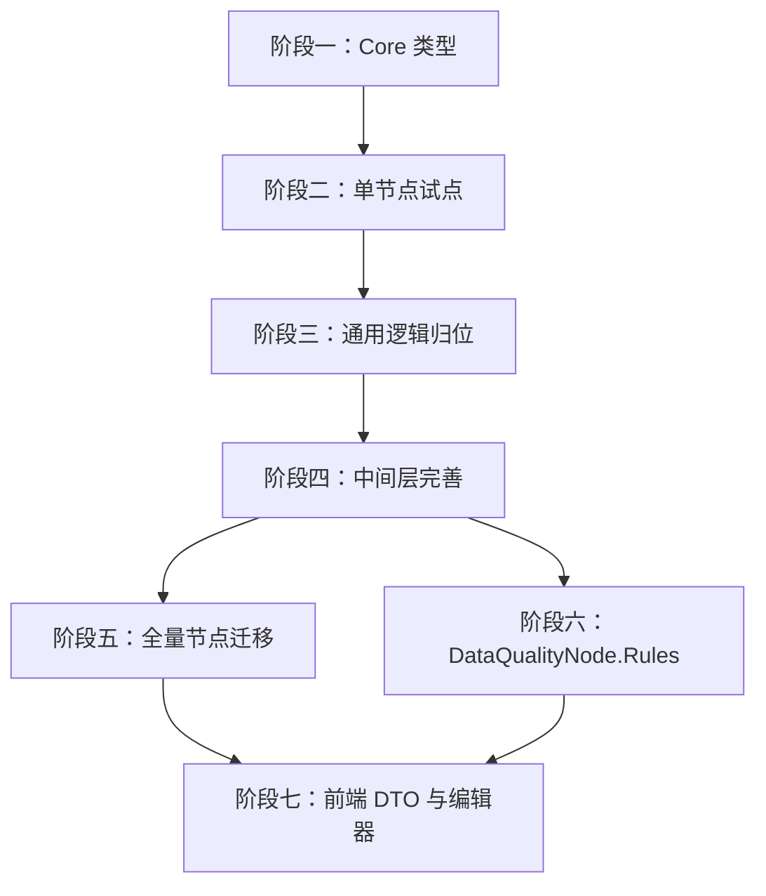

# Script 类型重构开发计划

## 1. 目标与范围

### 1.1 目标

基于 [docs/architecture/script-type.md](../architecture/script-type.md)，将 FlowEngine 中所有脚本/表达式节点属性从裸 `string` 迁移为带语义的 `Script` 类型，统一编译、求值、缓存与结果转换管线，消除 `ToBoolean` / `ToClrValue` 等通用逻辑在节点类中的重复实现。

### 1.2 范围

- **后端**：新增 `Script` / `PreparedScript` / `PreparedScriptSession` / `ScriptResult` / `ScriptContext` / `IScriptCache` / `ScriptJsonConverter`；改造 `ParameterDiscoverer` / `ParameterHydrator` / `NodeExecutionContextFactory` / `JsEngineOptions`；迁移 10+ 个标准节点。
- **前端**：扩展 `ParameterType` 与 `Script` DTO；改造 `ExpressionField` 支持对象值 `{ source, language?, returnType? }`。
- **数据**：本次不考虑自动向后兼容迁移；旧工作流需重新保存或离线迁移。
- **排除**：`ConnectionDto.Condition` 是否纳入 Script 改造需单独决策，本计划默认不纳入；`SetNode` 保留，不删除。

## 2. 总体时序与依赖

```
阶段一：Core 类型与序列化
    │
    ▼
阶段二：单节点试点（IfNode + FilterNode）
    │
    ▼
阶段三：通用逻辑归位
    │
    ▼
阶段四：中间层完善
    │
    ├──► 阶段五：全量节点迁移
    │
    └──► 阶段六：DataQualityNode.Rules 类型变更（可并行）
              │
              ▼
         阶段七：前端 DTO 与编辑器
```

## 3. 分阶段计划

### 阶段一：Core 类型与序列化

**目标**：建立 Script 类型体系、编译与缓存基础设施、JSON 序列化支持。

#### 3.1.1 新增枚举

| 任务 | 文件位置 | 验收标准 |
| ---- | -------- | -------- |
| 新增 `ScriptLanguage` 枚举 | `backend/FlowEngine.Core/Scripting/ScriptLanguage.cs` | 含 `JavaScript`，预留扩展 |
| 新增 `ScriptReturnType` 枚举 | `backend/FlowEngine.Core/Scripting/ScriptReturnType.cs` | 含 `String / Object / Bool / Number / Dictionary` |

#### 3.1.2 新增 `Script` 值类型

| 任务 | 文件位置 | 验收标准 |
| ---- | -------- | -------- |
| 实现 `Script` 类 | `backend/FlowEngine.Core/Scripting/Script.cs` | 含 `Source / Language / ReturnType`（init-only）、`ResolvedValue`（JsonIgnore）、`GetResult<T>()`、`WithResolvedValue`（internal 工厂）、无参构造函数、带参 internal 构造函数、Equals/GetHashCode（不含 ResolvedValue）、隐式转换 `string -> Script` |
| 新增 `ScriptJsonConverter` | `backend/FlowEngine.Core/Scripting/ScriptJsonConverter.cs` | 序列化为 `{ source, language?, returnType? }`；反序列化支持对象与纯字符串简写 |

#### 3.1.3 新增执行模型类型

| 任务 | 文件位置 | 验收标准 |
| ---- | -------- | -------- |
| 实现 `ScriptContext` | `backend/FlowEngine.Core/Scripting/ScriptContext.cs` | 含 `NodeExecutionContext` + `ExtraGlobals`，提供 `From(NodeExecutionContext)` 工厂 |
| 实现 `ScriptResult` | `backend/FlowEngine.Core/Scripting/ScriptResult.cs` | 含 `Success / Raw / Error`、`ToClr()`、`ToBoolean()`、`ToJson()`、`To<T>()`，失败时抛 `ScriptErrorException` |
| 实现 `PreparedScript` | `backend/FlowEngine.Core/Scripting/PreparedScript.cs` | 含 `Original / CacheKey`、两个 `RunAsync` 重载（自建引擎 / 复用引擎）、`CreateSession` |
| 实现 `PreparedScriptSession` | `backend/FlowEngine.Core/Scripting/PreparedScriptSession.cs` | 含 `RunAsync(PreparedScript)`、`RunForItemAsync(PreparedScript, JsonNode?, int)`、`IDisposable` |

#### 3.1.4 新增缓存

| 任务 | 文件位置 | 验收标准 |
| ---- | -------- | -------- |
| 实现 `IScriptCache` 与 `ScriptCache` | `backend/FlowEngine.Core/Scripting/IScriptCache.cs` | `GetOrPrepare(Script)` 基于 `SHA256(Source)` 缓存、`TrimIfNeeded`、通过构造函数注入 `IOptions<JsEngineOptions>` |
| 注册 DI | `backend/FlowEngine.Core/DependencyInjection/*.cs` 或 `backend/FlowEngine.Runtime/DependencyInjection/*.cs` | `IScriptCache` 以单例注册 |

#### 3.1.5 自动包裹与编译

| 任务 | 文件位置 | 验收标准 |
| ---- | -------- | -------- |
| 实现 AST 自动包裹判定 | `backend/FlowEngine.Core/Scripting/ScriptCompiler.cs`（内部） | 空 Source → no-op；单表达式 → `return (expr)`；多语句 → IIFE 包裹 |
| 接入 Jint `Prepared<Script>` | `ScriptCache.Compile` | 生成可复用的 Jint 编译产物 |
| 实现全局黑名单校验 | `ScriptCache.Compile` | 使用 `JsEngineOptions.ForbiddenIdentifiers` |

#### 阶段一验收标准

- `dotnet build` 通过，`Script` / `PreparedScript` / `ScriptResult` / `IScriptCache` 相关单元测试覆盖主要分支。
- `ScriptJsonConverter` 正反向序列化单测通过。
- `ScriptCache` 缓存命中/未命中、TrimIfNeeded 行为单测通过。
- 不改动任何现有节点，保证阶段一可独立合并。

---

### 阶段二：单节点试点（IfNode + FilterNode）

**目标**：在最小范围内验证 Script 类型、Hydrator、Factory 预求值、错误处理端到端可用。

#### 3.2.1 反射层适配

| 任务 | 文件位置 | 验收标准 |
| ---- | -------- | -------- |
| `ParameterDiscoverer` 识别 `Script` | `backend/FlowEngine.Runtime/Registry/ParameterDiscoverer.cs` | `Script` → `(ParameterType.Script, hint)`；`Dictionary<string, Script>` → `(ParameterType.Json, KeyValueEditor)` |
| `ParameterHydrator` 转换 `Script` | `backend/FlowEngine.Runtime/Registry/ParameterHydrator.cs` | `Script` 分支处理 `Script/string/JsonElement/JsonNode`；`Dictionary<string, Script>` 分支处理 JSON 对象反序列化 |

#### 3.2.2 工厂预求值

| 任务 | 文件位置 | 验收标准 |
| ---- | -------- | -------- |
| 改造 `NodeExecutionContextFactory` | `backend/FlowEngine.Runtime/Executor/NodeExecutionContextFactory.cs` | 对 `Hint=Expression` 的 `Script` 参数调用 `IScriptCache.GetOrPrepare(...).RunAsync(ctx, sharedEngine)`，失败时直接抛异常；对 `Hint=CodeEditor/Script` 跳过；支持 `Dictionary<string, Script>` 递归 |
| 注入 `IScriptCache` | `NodeExecutionContextFactory` | 构造函数接收 `IScriptCache` |

#### 3.2.3 试点节点迁移

| 任务 | 文件位置 | 验收标准 |
| ---- | -------- | -------- |
| 迁移 `IfNode` | `plugins/FlowEngine.Plugins.Standard/IfNode.cs` | `Condition` 改为 `Script` + `Hint(Expression)`；`ExecuteAsync` 使用 `Condition.GetResult<bool>()` |
| 迁移 `FilterNode` | `plugins/FlowEngine.Plugins.Standard/FilterNode.cs` | `Condition` 改为 `Script` + `Hint(Script)`；使用 `PreparedScriptSession.RunForItemAsync` + `ScriptResult.ToBoolean()`；脚本错误抛异常 |
| 移除试点节点重复逻辑 | `IfNode.cs` / `FilterNode.cs` | 删除私有 `ToBoolean`、删除 `JsEngine.PrepareExpression` 调用 |

#### 3.2.4 试点测试

| 任务 | 文件位置 | 验收标准 |
| ---- | -------- | -------- |
| IfNode 测试 | `tests/FlowEngine.Plugins.Standard.Tests/IfNodeTests.cs` | 覆盖字面量 true/false、表达式、表达式错误失败 |
| FilterNode 测试 | `tests/FlowEngine.Plugins.Standard.Tests/FilterNodeTests.cs` | 覆盖保留/过滤、逐项变量、脚本错误抛异常 |
| 集成测试 | `tests/FlowEngine.Runtime.Tests/ScriptIntegrationTests.cs`（新增） | 端到端验证 Hydrator + Factory 预求值 + ScriptCache |

#### 阶段二验收标准

- `IfNode` / `FilterNode` 全部测试通过。
- 工作流执行中 IfNode 条件、FilterNode 条件正确工作。
- 表达式错误时节点执行失败并返回结构化错误。
- `dotnet test` 通过。

---

### 阶段三：通用逻辑归位

**目标**：把分散在节点和 JsEngine 中的通用脚本能力迁移到 Core 脚本子系统。

#### 3.3.1 通用结果转换

| 任务 | 文件位置 | 验收标准 |
| ---- | -------- | -------- |
| `ScriptResult.ToBoolean()` 实现 | `ScriptResult.cs` | 替换 `FilterNode`/`IfNode` 的私有 `ToBoolean`，覆盖 bool/null/number/string/array/object |
| `ScriptResult.ToClr()` 实现 | `ScriptResult.cs` | 替换 `JsEngine.ToClrValue`；`JsEngine.ToClrValue` 内部委托给 `ScriptResult.ToClr()` 并标记 `[Obsolete]` |
| `ScriptResult.ToJson()` 实现 | `ScriptResult.cs` | 将 JsValue 转为 `JsonNode` |

#### 3.3.2 JSON 路径访问

| 任务 | 文件位置 | 验收标准 |
| ---- | -------- | -------- |
| 新增 `JsonPath` 工具 | `backend/FlowEngine.Core/Scripting/JsonPath.cs` | 提供 `GetValue(JsonNode?, string path)`，替换 `FilterNode.GetJsonValue` |
| 迁移 `FilterNode.GetJsonValue` | `FilterNode.cs` | 使用 `JsonPath` |

#### 3.3.3 ScriptEngine 废弃

| 任务 | 文件位置 | 验收标准 |
| ---- | -------- | -------- |
| 标记 `[Obsolete]` | `backend/FlowEngine.Core/Scripting/ScriptEngine.cs` | 所有 `Evaluate*` 方法标记 `[Obsolete("使用 PreparedScript / ScriptResult")]`，不物理删除 |
| 替换现有调用（试点节点阶段已替换部分） | 相关节点 | 试点节点不再调用 `ScriptEngine` |

#### 阶段三验收标准

- `ScriptResult` 单测覆盖所有 `To*` 方法。
- `JsonPath` 单测覆盖点号路径、数组索引、缺失路径。
- `ScriptEngine` 编译通过（仅标记 Obsolete，无调用点）。
- `dotnet test` 通过。

---

### 阶段四：中间层完善

**目标**：完成 `ParameterResolver` 简化、`JsEngineOptions` 安全策略迁移、`NodeExecutionContextFactory` 完整适配。

#### 3.4.1 `JsEngineOptions` 安全策略

| 任务 | 文件位置 | 验收标准 |
| ---- | -------- | -------- |
| 新增 `ForbiddenIdentifiers` | `backend/FlowEngine.Core/Scripting/JsEngineOptions.cs` | 类型为 `IReadOnlySet<string>`，默认值为当前 `ParameterResolver` 硬编码黑名单 |
| 移除 `ParameterResolver` 硬编码黑名单 | `backend/FlowEngine.Runtime/Expressions/ParameterResolver.cs` | 改为从 `IOptions<JsEngineOptions>` 读取 |

#### 3.4.2 `ParameterResolver` 简化

| 任务 | 文件位置 | 验收标准 |
| ---- | -------- | -------- |
| 删除/简化 `EvaluateExpression` | `ParameterResolver.cs` | 对 `Script` 类型参数不再做启发式求值；保留对旧字符串参数的最小兼容处理 |
| 删除本地缓存 | `ParameterResolver.cs` | 表达式缓存统一由 `IScriptCache` 承担 |

#### 3.4.3 Factory 完整适配

| 任务 | 文件位置 | 验收标准 |
| ---- | -------- | -------- |
| 确保所有 Script 类型参数走统一预求值 | `NodeExecutionContextFactory.cs` | 覆盖 `Script`、`Script?`、`Dictionary<string, Script>`、`Dictionary<string, Script>?` |
| 异常处理 | `NodeExecutionContextFactory.cs` | 预求值异常直接抛 `ScriptErrorException`，不吞异常 |

#### 阶段四验收标准

- `ParameterResolver` 不再包含硬编码黑名单。
- `NodeExecutionContextFactory` 单元测试覆盖 Expression / Script / Dictionary<string, Script> 三种参数。
- `dotnet test` 通过。

---

### 阶段五：全量节点迁移

**目标**：将剩余节点从 `string` 脚本属性迁移到 `Script`。

#### 3.5.1 待迁移节点清单

| 节点 | 字段 | 改动 |
| ---- | ---- | ---- |
| `JSNode` | `Code` | `Script` / `CodeEditor` / 显式 Session |
| `CodeSnippetToolNode` | `Code` | `Script` / `CodeEditor` / 显式 RunAsync |
| `HttpRequestNode` | `Url` | `Script` / `Expression` / 框架预求值 |
| `HttpRequestNode` | `HeadersExpression` | `Script?` / `Script` / 显式 Session |
| `HttpRequestNode` | `BodyExpression` | `Script?` / `Script` / 显式 Session |
| `HttpToolNode` | `Url` | `Script` / `Expression` / 框架预求值；补 Hint |
| `HttpToolNode` | `HeadersExpression` | `Script?` / `Script` / 显式 Session；修正 Hint |
| `HttpToolNode` | `BodyExpression` | `Script?` / `Script` / 显式 Session；修正 Hint |
| `ShellToolNode` | `Command` | `Script` / `Expression` / 框架预求值 |
| `SwitchNode` | `Expression` | `Script` / `Expression` / 框架预求值；修复未求值 bug |
| `DbUpsertNode` | `Connection` | `Script` / `Expression` / 框架预求值；移除 `ResolveConnection` |
| `DbUpsertNode` | `Columns` | `Dictionary<string, Script>` / `Script` / 显式 Session |

#### 3.5.2 节点改造通用步骤

1. 修改属性类型与 Hint。
2. 注入 `IScriptCache`（如节点显式执行脚本）。
3. 改写 `ExecuteAsync`：
   - Expression 字段使用 `.GetResult<T>()`。
   - Script/CodeEditor 字段使用 `_scriptCache.GetOrPrepare(...)` + `PreparedScriptSession`。
4. 删除节点内的 `JsEngine` / `ScriptEngine` 调用、私有 `ToBoolean` / `GetJsonValue`。
5. 更新/新增单元测试。

#### 阶段五验收标准

- 上述所有节点单元测试通过。
- 端到端工作流测试覆盖每个节点至少一个脚本场景。
- `dotnet test` 通过。

---

### 阶段六：DataQualityNode.Rules 类型变更

**目标**：将 `DataQualityNode.Rules` 从 `string` 改为 `JsonNode`，与 Script 改造解耦。

#### 3.6.1 后端改造

| 任务 | 文件位置 | 验收标准 |
| ---- | -------- | -------- |
| 修改属性类型 | `plugins/FlowEngine.Plugins.Standard/DataQualityNode.cs` | `Rules` 改为 `JsonNode`，Hint 改为 `JsonEditor` |
| 调整解析逻辑 | `DataQualityNode.cs` | 直接从 `JsonNode` 读取规则，不再做表达式求值 |

#### 3.6.2 前端改造

| 任务 | 文件位置 | 验收标准 |
| ---- | -------- | -------- |
| 调整编辑器 | `frontend/src/components/ParameterPanel/fields/JsonField.tsx` 或相关 | Rules 字段渲染为 JSON 编辑器 |

#### 阶段六验收标准

- DataQualityNode 原有功能不变。
- `dotnet test` 通过。

---

### 阶段七：前端 DTO 与编辑器

**目标**：让前端支持 `Script` 类型参数的序列化与编辑。

#### 3.7.1 类型扩展

| 任务 | 文件位置 | 验收标准 |
| ---- | -------- | -------- |
| 新增 `Script` 接口 | `frontend/src/types/workflow.ts` | 定义 `{ source, language, returnType }` |
| 扩展 `ParameterType` | `frontend/src/types/workflow.ts` | 新增 `'Script'` |

#### 3.7.2 编辑器改造

| 任务 | 文件位置 | 验收标准 |
| ---- | -------- | -------- |
| 改造 `ExpressionField`（或新建 `ScriptField`） | `frontend/src/components/ParameterPanel/fields/ExpressionField.tsx` | `value` 支持 `Script \| string`，`onChange` 输出完整 `Script` 对象；根据 `returnType` 和 `hint` 切换渲染模式 |
| 更新 `FieldResolver` | `frontend/src/components/ParameterPanel/FieldResolver.tsx` | `ParameterType.Script` 映射到 Script 编辑器 |

#### 3.7.3 序列化适配

| 任务 | 文件位置 | 验收标准 |
| ---- | -------- | -------- |
| 更新工作流序列化器 | `frontend/src/utils/workflowSerializer.ts` | Script 对象正确序列化/反序列化，纯字符串向后兼容 |

#### 阶段七验收标准

- 前端编译通过（`npm run build` 或 `npm run type-check`）。
- Script 类型参数可在 UI 中编辑并保存。
- 保存后的工作流 JSON 符合 script-type.md §5.1 线格式。

## 4. 跨阶段依赖图



## 5. 风险与回滚策略

| 风险 | 影响 | 应对 |
| ---- | ---- | ---- |
| Script 类型改造破坏现有工作流执行 | 高 | 阶段一到阶段四在新增类型和独立节点上验证，阶段五逐步迁移节点，每节点保留完整测试；任何问题可回滚该节点提交 |
| 前端字段格式变更导致旧工作流失效 | 中 | ScriptJsonConverter 支持纯字符串简写；旧工作流加载后需重新保存 |
| `FilterNode` 脚本错误从静默改为抛异常 | 中 | 在变更日志和前端提示中说明；提供迁移指南 |
| `IScriptCache` 静态依赖未完全消除 | 低 | 必须以注入式 `IScriptCache` 实现，单例生命周期 |
| Jint AST 自动包裹判定错误 | 中 | 单测覆盖空 Source、单表达式、多语句、return 语句、IIFE 边界 |

## 6. 验收标准汇总

1. 后端所有脚本属性完成 `string -> Script` 迁移，无编译警告或错误。
2. `ScriptEngine` 已标记 `[Obsolete]`，无新代码调用。
3. `ParameterResolver` 硬编码黑名单已迁移到 `JsEngineOptions.ForbiddenIdentifiers`。
4. 全部节点单元测试 + 集成测试通过，`dotnet test` 全绿。
5. 前端 `ParameterType` 包含 `'Script'`，`ExpressionField` 支持对象值编辑。
6. 前端构建通过，Script 参数可正常保存/加载。
7. `docs/architecture/script-type.md` 与 `docs/plans/plan-script-type-refactor.md` 保持一致。

## 7. 相关文档

- [docs/architecture/script-type.md](../architecture/script-type.md)
- [docs/architecture/expression-system.md](../architecture/expression-system.md)
- [docs/tasks/task-script-type-design-review.md](../tasks/task-script-type-design-review.md)

## 8. 实施状态

| 阶段 | 状态 | 任务文档 | 备注 |
| ---- | ---- | -------- | ---- |
| 阶段一：Core 类型与序列化 | 已完成 | - | 由前序任务交付 |
| 阶段二：单节点试点（IfNode + FilterNode） | 已完成 | [task-script-type-phase2.md](../tasks/task-script-type-phase2.md) | 由前序任务交付 |
| 阶段三：通用逻辑归位 | 已完成 | [task-script-type-phase3.md](../tasks/task-script-type-phase3.md) | `ScriptResult.ToClr()` / `JsonPath` / `ScriptEngine` Obsolete |
| 阶段四：中间层完善 | 已完成 | [task-script-type-phase4.md](../tasks/task-script-type-phase4.md) | `ParameterResolver` / `JsEngineOptions.ForbiddenIdentifiers` / `NodeExecutionContextFactory` 适配 |
| 阶段五：全量节点迁移 | 已完成 | [task-script-type-phase5.md](../tasks/task-script-type-phase5.md) | 全部节点已迁移，Code Review 修复项已完成，测试 724 个全部通过 |
| 阶段六：DataQualityNode.Rules 类型变更 | 未开始 | - | 待实施 |
| 阶段七：前端 DTO 与编辑器 | 未开始 | - | 待实施 |

## 9. 变更记录

| 日期 | 修改人 | 修改内容 |
|------|--------|----------|
| 2026-07-10 | Agent | 基于 script-type.md v7 制定分阶段开发计划 |
| 2026-07-10 | Agent | 更新实施状态：阶段三已完成 |
| 2026-07-10 | Agent | 完成阶段五 Code Review 修复项：统一脚本管线、补充工厂预求值集成测试，724 个测试全部通过 |
